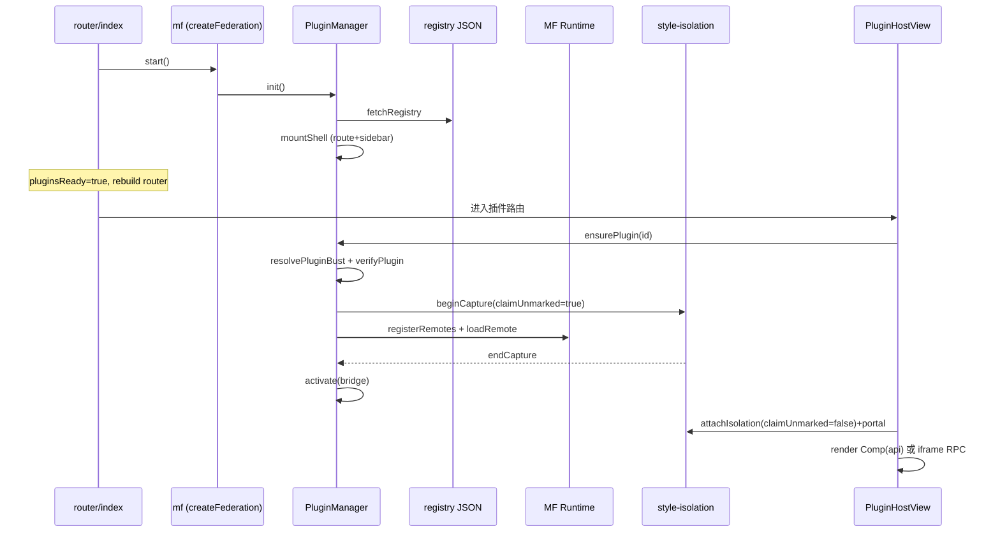

# 我们怎么做「可插拔」微前端（技术分享稿）

> **时长**：口播约 5–8 分钟（按「主链 + 3 个硬点」讲；附录可会后看）  
> **目标**：听完能说出 **启动 → 挂壳 → 加载 → 桥接 → 隔离** 每一步调了谁、为什么这么写  
> **对照源码**：  
> - 内核 `packages/federation-kit`  
> - 本仓接线 `apps/frontend/src/federation`  
> - 启动挂载 `apps/frontend/src/router/index.tsx`

---

## 0. 技术栈一句话（先对齐名词）

| 角色 | 技术 | 本仓落点 |
|------|------|----------|
| 加载协议 | **Module Federation 2.0 Runtime**（`@module-federation/enhanced/runtime`） | `federation-kit/src/mf/mf.ts` |
| 插件目录 | **运行时 registry JSON**（非构建期写死 remotes） | COS / 本地 `plugins-registry.json` |
| 通用运行时 | `@dnhyxc-ai/federation-kit` | `createFederation` / `PluginManager` / Bridge / 样式隔离 |
| 产品接线 | `@/federation`（**业务禁止直连 kit**） | `apps/frontend/src/federation/runtime/index.ts` |
| Remote 构建 | Vite + `@module-federation/vite`，产出 `mf-manifest.json` + `remoteEntry.js` | 独立 Remote 仓（如 `:9008`） |

**反直觉结论（开场 20 秒）**：  
构建配置里写死 `remotes: { x: '…/remoteEntry.js' }` **不等于**「Host 不发版就能热插拔」。  
我们成立条件是：**运行时 `registerRemotes` + registry 指针 + `version@manifestHash` 缓存破坏**。

---

## 1. 端到端主链（口播核心 · ~2 分钟）

听完这一节，脑子里要有这条链（函数名可对源码）：

```text
App 启动
  └─ router/index.tsx
       mf.start()
         └─ PluginManager.init()
              ├─ enabledStore.load()          // 账号上架偏好
              ├─ fetchRegistry({ force })     // 拉 plugins-registry.json（失败走 localStorage 缓存）
              ├─ 过滤 isPluginEnabled
              └─ 对每个已上架插件 mountShell()
                   ├─ routeInjector.inject   // 只挂「壳路由」，还不 loadRemote
                   └─ sidebarInjector.add    // 侧栏菜单壳

用户点进插件页 / Surface
  └─ <PluginHostPage> → <FederationPlugin> → PluginHostView
       ensurePlugin(id)
         ├─ resolvePluginBust(meta)          // 拉 mf-manifest，算 version@hash
         ├─ verifyPlugin(meta)               // origin / hostApiRange / integrity / trust
         ├─ trust===untrusted？→ 只激活 iframe 壳，不执行 Remote JS
         └─ 否则：
              registerRemote(meta, bust)     // MF registerRemotes，entry 带 ?v=bust
              beginPluginStyleCapture(..., claimUnmarked:true)  // 加载短窗：狠认领 CSS
              loadRemote(`${remoteName}/${expose}`)
              normalizePluginModule          // Vue → React 桥；React 原样
              activate?(bridge.api)
              attachPluginStyleIsolation(..., claimUnmarked:false) // 挂载长窗：稳，不误伤 Host
              渲染 Comp(bridge) 或 UntrustedIframe + postMessage RPC
```

### 1.1 Host 启动：为什么要 `pluginsReady` + `onRoutesChange`

```tsx
// apps/frontend/src/router/index.tsx（关键逻辑）
const [pluginsReady, setPluginsReady] = useState(false);
const [routeEpoch, setRouteEpoch] = useState(0);

mf.onRoutesChange(() => setRouteEpoch((n) => n + 1));
void mf.start().finally(() => {
  setPluginsReady(true);
  setRouteEpoch((n) => n + 1);
});

const router = useMemo(() => {
  const r = createBrowserRouter(buildRoutes(pluginsReady));
  mf.setNavigate((to) => void r.navigate(to)); // Bridge 的 navigate 接到真 router
  return r;
}, [routeEpoch, pluginsReady]);
```

**实现要点**：

1. **`mountShell` 异步** → 刷新深链可能先撞 catch-all 404 → `pluginsReady === false` 时先不渲染 404。  
2. **`onRoutesChange` → `routeEpoch++` → 重建 `createBrowserRouter`**：插件路由是运行时注入的，不是写死在 `routes.ts`。  
3. **`mf.setNavigate` 绑到当前 router 实例**：否则 Bridge 里 `api.navigate` 只能 `location.assign`，丢 SPA 状态。

### 1.2 壳与肉分离（`init` vs `ensurePlugin`）

```ts
// PluginManager.init（简化）
const enabled = registry.plugins.filter((p) => isPluginEnabled(p.id));
for (const meta of enabled) this.mountShell(meta); // 只 inject 路由/侧栏

const eager = enabled.filter((p) => p.preload === 'eager');
queueMicrotask(() => Promise.all(eager.map((p) => this.loadPlugin(p))));
```

| 阶段 | 做什么 | 不做什么 |
|------|--------|----------|
| `mountShell` | 路由表 + 侧栏入口出现 | **不**下载 `remoteEntry` |
| `ensurePlugin` / `loadPlugin` | `verify` → MF 加载 → `activate` | — |
| `preload: 'eager'` | 微任务后台预热，减首点白屏 | 不阻塞 `init` |

---

## 2. 硬点 A · 运行时 MF + 缓存破坏（~1.5 分钟）

文件：`packages/federation-kit/src/mf/mf.ts`

### 2.1 为什么自己拉一次 `mf-manifest.json`

```ts
// resolvePluginBust → fetchManifestMeta
const res = await fetch(withBust(entry, `t${Date.now()}`), { cache: 'no-store' });
const text = await res.text();
const remoteEntryUrl = resolveRemoteEntryUrl(entry, text); // 从 metaData.publicPath + remoteEntry.name 拼绝对地址
remoteEntryByManifest.set(entryKey(entry), remoteEntryUrl);
return { buildId: hashText(text), remoteEntryUrl }; // FNV-1a，仅作 bust
```

然后：

```ts
bust = `${version}@${buildId}`
registerRemotes([{ name, entry: withBust(remoteEntryUrl, bust), type: 'module' }], { force: true })
loadRemote(`${remoteName}/${exposeBase}`)  // 例：remotePlugins-myPlugin/MyPlugin
```

**三个工程决策**：

| 决策 | 原因 |
|------|------|
| Host **自己** fetch manifest，再 **直连 remoteEntry** | 避免 MF 再拉一次 manifest；WKWebView / 强缓存场景更可控 |
| bust = `version@manifestHash`，**不用** `registry.updatedAt` | Remote 只更自己 CDN 即可；Host 改清单不误触发全量 bust |
| Runtime Plugin `afterResolve` 再给 `remoteEntry.js` 补 `?v=` | snapshot 会把 entry 改写成无 query 的固定名；Tauri WKWebView 对固定 ESM **强缓存**，不 bust 就永远旧包 |

### 2.2 shared：只共享 React，故意不共享 Vue

```ts
instance.registerShared({
  react: { singleton: true, get: async () => () => React, … },
  'react-dom': { … },
  // 故意不 shared vue：Host 不装 Vue；Vue Remote 自带 runtime + createVueHostBridge
});
```

加载后 `normalizePluginModule`：React expose 原样；Vue expose 包一层 React 宿主桥。

### 2.3 registry 最小字段（听众要对上加载键）

```json
{
  "id": "learningNotes",
  "remoteName": "remotePlugins-learningNotes",
  "expose": "./LearningNotes",
  "entry": "https://cdn…/mf-manifest.json",
  "version": "1.2.0",
  "hostApiRange": "^1.0.0",
  "permissions": ["ui:toast", "http:plugin-api", "modules:learningNotes"],
  "trust": "first-party",
  "injectRoute": false,
  "preload": "route"
}
```

- `loadRemote` 键 = `` `${remoteName}/${expose去掉./}` ``  
- `hostApiRange` 对 Host 的 `VITE_HOST_API_VERSION` 做 semver 校验（`PluginVerifier.satisfiesRange`）  
- 生产 `entry` 必须 https（`entryUrlAllowed`）

---

## 3. 硬点 B · HostBridge：权限交集 + deepFreeze（~1.5 分钟）

文件：`packages/federation-kit/src/bridge/createHostBridge.ts`  
本仓能力装配：`apps/frontend/src/federation/runtime/index.ts`

### 3.1 公式

```text
api = deepFreeze(
  基础字段(theme/locale/event)
  ∪ (permissions ∩ capabilities 裁剪出的 ui / http / navigate / modules)
)
```

插件组件签名：

```ts
export default function App({ api, plugin }: HostBridgeProps) {
  api.ui?.showToast({ type: 'info', message: 'hi' });
  api.modules?.learningNotes?.…;
}
```

### 3.2 真实裁剪逻辑（讲清楚「不是把整个 Host 扔过去」）

```ts
const allow = new Set(d.permissions);

if (allow.has('ui:toast') && capabilities.toast) {
  api.ui = Object.freeze({ showToast: capabilities.toast, … });
}

if (allow.has('nav:subtree')) {
  api.navigate = (to) => {
    if (!to.startsWith(d.routePath)) throw new Error(`NAV_OUT_OF_SCOPE: ${to}`);
    navigate(to);
  };
}

if (allow.has('http:plugin-api') && capabilities.http) {
  api.http = Object.freeze({ …capabilities.http });
}

// 本仓：按 permission 动态挂业务模块
capabilities.buildModules = (allow) => {
  const modules = {};
  if (allow.has('modules:learningNotes'))
    modules.learningNotes = createLearningNotesModulesApi();
  if (allow.has('modules:ebook'))
    modules.ebook = createEbookModulesApi();
  return modules;
};

return deepFreeze({ api, plugin: { id, version, routePath } });
```

**要点**：

1. **没声明的 permission → 对象上根本没有该方法**（不是 `noop`）。  
2. **`nav:subtree` 强制前缀 `routePath`**，防插件跳到 Host 任意路径。  
3. **`deepFreeze`**：插件改不了 `api.http.get` 指向。  
4. **业务专有 API 不进 kit**：放 `federation/modules/<id>/hostApi.ts`，只在适配层 `buildModules` 注册。

### 3.3 不受信路径（同生命周期，不同执行模型）

```ts
// runLoad 内
if (meta.trust === 'untrusted') {
  // 不 registerRemote / 不 loadRemote；status=activated
  // PluginHostView 渲染 sandbox iframe + attachIframeBridge(postMessage RPC)
  return;
}
```

同一套 `ensurePlugin`、同一套 Bridge 权限模型；**是否执行第三方 JS** 由 `trust` 分叉。

---

## 4. 硬点 C · 样式隔离：realm + 双窗 claim（~1.5 分钟）

文件：`style-isolation/sandbox/capture.ts`、`attach.ts`、`portal/*`

### 4.1 为什么不用 Shadow DOM / 不用 qiankun JS 沙箱做主路径

- EP / antd 等假定 `document.head`、Teleport 到 `body`。  
- 主路径要 **共享 React 单例、同构组件树** → MF；不受信才 iframe。

### 4.2 我们实际做了什么

1. **realm**：同一 Remote entry 共用 `data-mf-style-realm="…"`。  
2. **CSS 改写**：选择器变成 `[realm] .x, [realm].x`；`html/body` 映射到 `[realm][data-plugin-root]`。  
3. **劫持 head / CSSOM**：Remote 插入的 `<style>` / `insertRule` 被改写后再挂上。  
4. **Portal**：body 弹层收进 `data-mf-portal-scope`（容器 `pointer-events:none`，子节点可点；z-index **低于** Host Toast）。

### 4.3 关键：`claimUnmarked` 短窗 / 长窗

| 时机 | API | `claimUnmarked` | 含义 |
|------|-----|-----------------|------|
| `loadRemote` 前后 | `beginPluginStyleCapture` | **`true`** | 短窗：凡像 Remote 入口 CSS 的都认领进 realm |
| 组件挂载期 | `attachPluginStyleIsolation` | **`false`** | 长窗：只跟有 Remote 正信号的样式；**不认领** Host 晚到的全局 CSS |

```ts
// runLoad
const endCapture = beginPluginStyleCapture(id, entry, remoteName); // 默认 claimUnmarked:true
try { mod = await loadRemoteApp(meta); }
finally { endCapture(); }

// PluginHostView mount
attachPluginStyleIsolation(id, entry, remoteName); // 内部 claimUnmarked:false + portal
```

**真实事故**：长窗若继续 `claimUnmarked:true`，会误认领 Host Markdown / sonner Toast 样式 → 编辑器挂、Toast 点不到。  
这是「实现细节」里最值得带走的一行配置。

---

## 5. 三层工程拆分 + 三种挂载（~1 分钟，对着产品）

### 5.1 三层（换 Host 能复刻的前提）

```text
业务页          → 只写 <PluginHostPage pluginId="…" /> / <PluginHostSurface />
@/federation    → createFederation({ toast, http, fetchRegistry, buildModules, … })
federation-kit  → PluginManager / mf.ts / Bridge / style-isolation / React 视图
```

本仓装配入口（产品差异全集中在此）：

```ts
// apps/frontend/src/federation/runtime/index.ts
export const mf = createFederation({
  fetchRegistry: fetchPluginRegistry,
  enabledStore: { get, set, load, isReady }, // 账号级上架
  capabilities: { toast, http, buildModules, setAppFullscreen, … },
  createRoute: createPluginRoute,            // injectRoute 时用
  styleIsolation: { hostViteRootMarker: '/apps/frontend', … },
});
```

### 5.2 三种挂载（共用 registry / 生命周期，只换入口）

| 形态 | 产品例子 | Host 代码 | registry |
|------|----------|-----------|----------|
| **A 业务内嵌** | 学习笔记 | 静态路由 + `<PluginHostPage pluginId="learningNotes" />` | `injectRoute: false` |
| **B Surface** | 电子书阅读页 | `<PluginHostSurface surface="ebook.read" part="drawer\|toolbar" />` | `host.surface` + `host.slot` |
| **C 顶层路由** | 独立插件页 | `injectRoute` 自动 `createRoute` + 侧栏 `menu` | `injectRoute: true` + `menu` |

Surface 内部仍落到 `PluginHostPage`，保证 loading / error / 隔离 UI 一致；`useHostSurfacePlugins(surface)` 按上架偏好筛列表。

---

## 6. 收尾 · 带走 5 条可落地结论

1. **热插拔闭环** = 运行时 `registerRemotes` + registry + `version@manifestHash` bust（含 `afterResolve` 补 query），不是写死 remoteEntry。  
2. **壳肉分离**：`init/mountShell` 只注入路由侧栏；`ensurePlugin` 才 MF 加载。  
3. **Bridge** = `permissions ∩ capabilities` + `deepFreeze`；业务模块走适配层 `buildModules`，不进 kit。  
4. **信任分级**：`first-party` 走 MF 同树；`untrusted` 走 iframe RPC，同生命周期不同执行模型。  
5. **样式**：realm 改写 + Portal；**加载短窗 `claimUnmarked:true` / 挂载长窗 `false`**，避免误伤 Host。

### 会后深挖路径

| 主题 | 文档 / 代码 |
|------|-------------|
| 架构总图与问题表 | `packages/federation-kit/docs/implements-guide/架构概览.md` |
| 方法字典（ensurePlugin / bust…） | `implements-guide/API方法参考.md` |
| Host 接入 | `federation-kit/docs/host-guide/` |
| 写 Remote | `federation-kit/docs/plugin-guide/` |
| 本仓新插件 checklist | `apps/frontend/src/federation/guide.md` |

---

## 附录 A · 口播时间盒（讲者用）

| 段 | 时长 | 必讲 | 可砍 |
|----|------|------|------|
| 开场 + 主链 | 2min | `start → mountShell → ensurePlugin → loadRemote` | Vue 归一细节 |
| 硬点 A bust | 1.5min | 自拉 manifest、`?v=`、afterResolve | FNV 算法 |
| 硬点 B Bridge | 1.5min | 权限交集、`NAV_OUT_OF_SCOPE`、buildModules | EventBus |
| 硬点 C 样式 | 1.5min | 不用 Shadow、claimUnmarked 双窗 | portal DOM 结构 |
| 三层 + 三种挂载 + 收尾 | 1min | 学习笔记 / 电子书各一例 | registry 全字段 |

**可选现场 Demo（+1min）**：DevTools → Network 过滤 `mf-manifest` / `remoteEntry`；进插件页看请求带 `?v=1.2.0@abcd`；下架插件看侧栏壳消失且不再 `ensurePlugin`。

---

## 附录 B · 一张图记住调用关系


