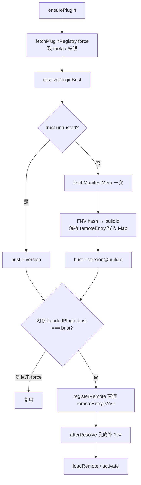

# 插件 MF entry 缓存破坏（version@manifestHash）

> **文档角色（本轮主文档）**：桌面 / WebView 仍吃旧 `remoteEntry.js`、发新版插件不生效的修复；**bust 指纹改为 Remote 自有 manifest 内容哈希，发布者不必改 Host registry**；进入插件时 **只 GET 一次** `mf-manifest.json`，`registerRemote` **直连** `remoteEntry.js?v=`。  
> **延伸阅读**：[模块联邦插件宿主.md](../plugins/模块联邦插件宿主.md)；[../ops/远程无存储缓存.md](../ops/远程无存储缓存.md)；[插件注册宿主API.md](../plugins/插件注册宿主API.md)；开发手册副本：[../../apps/frontend/src/plugins/docs/模块联邦实现指南.md](./模块联邦实现指南.md) §2.13（含 §2.13.3.1）。

## 1. 背景与目标

只给 `mf-manifest.json` 加 `?v=` **不够**：Module Federation 解析 snapshot 后会把真正 `import()` 的地址改写成固定名 `remoteEntry.js`（去掉 query）。WKWebView 对固定 ESM URL 强缓存，导致桌面端继续跑旧插件。

早期方案用 `version@registry.updatedAt` 作 bust：每次发插件都要改 Host 维护的 `plugins-registry.json`，**不安全**（发布者不应具备改你们清单的能力），也增加运维摩擦。

曾有一段时间 Host 先拉 manifest 算指纹，再用 `registerRemotes(entry=mf-manifest.json?v=…)`，导致 **Network 里同一文件出现两次 GET**（Host + MF Runtime）。

**当前目标**：

1. bust = `version@manifestHash`（hash 来自 Remote **自己域名**上的 `mf-manifest.json` 正文）。
2. **一次 GET** manifest：同时算指纹并解析 `remoteEntry` 绝对地址（`fetchManifestMeta` → `remoteEntryByManifest`）。
3. `registerRemote` **直连** `remoteEntry.js?v=`，MF **不再二次**拉 manifest。
4. `afterResolve` 在 MF 改写后再给 `remoteEntry.js` 补 `?v=`（兜底）。
5. `PluginManager` 用同一 bust 判断是否重载。
6. **发布者只部署 Remote 静态资源**；registry 仍只由 Host 管理员改（上架、权限、`entry` URL、展示用 `version` 等）。

## 2. 改动范围

| 路径 | 说明 |
|------|------|
| `apps/frontend/src/plugins/core/mf.ts` | `withBust` / `pluginBust` / `fetchManifestMeta` / `fetchEntryBuildId` / `resolvePluginBust` / `resolveRemoteEntryUrl` / `remoteEntryByManifest` / `afterResolve` / `registerRemote`（直连 remoteEntry） |
| `apps/frontend/src/plugins/core/PluginManager.ts` | `ensurePlugin` / `loadPlugin` 用 `resolvePluginBust`，不再把 `registry.updatedAt` 拼进 bust |
| `apps/frontend/src/plugins/core/types.ts` | `LoadedPlugin.bust` 语义：`version@manifestHash` |
| `apps/frontend/src/plugins/core/registry.ts` | force 拉 registry 仍加 `?t=`（清单本身防缓存；与 entry bust **解耦**） |

## 3. 实现思路

1. **trusted MF**：`fetchManifestMeta(entry)` → `cache: 'no-store'` 拉 manifest（URL 再加一次性 `t`）→ FNV-1a 内容指纹 + 解析 `remoteEntry.js` 绝对 URL → `pluginBust(meta, buildId)`。
2. **untrusted**：不走 MF entry，bust 仅为 `version`。
3. **registerRemotes**：`entry = withBust(已解析的 remoteEntry.js, bust)`；写入 `bustByRemote`。
4. **afterResolve**：MF 改写 entry 后，再对 `remoteInfo.entry` `withBust`。
5. **ensurePlugin**：force 拉 registry 取 meta；`await resolvePluginBust(meta)`；仅 `cur.bust === bust` 才跳过加载。

**安全边界**：能改 Remote 静态源的人本来就能投毒 JS；清单（权限 / enabled / entry URL）仍只经鉴权写入，发布流水线 **不得** SSH/API 改 `plugins-registry.json`。

## 4. 关键代码对比

### 4.1 `pluginBust` / `fetchManifestMeta` / `resolvePluginBust` / `registerRemote`

**对比范围**：bust token + 单次 manifest + 直连 remoteEntry。

**改动前（双次 GET manifest）** · `apps/frontend/src/plugins/core/mf.ts`

```typescript
export async function fetchEntryBuildId(entry: string): Promise<string> {
	const url = withBust(entry, `t${Date.now()}`);
	const res = await fetch(url, { cache: 'no-store' });
	if (!res.ok) throw new Error(`entry buildId ${res.status}: ${entry}`);
	return hashText(await res.text());
}

export function registerRemote(d: PluginDescriptor, bust?: string) {
	const token = (bust ?? d.version).trim();
	const name = remoteNameOf(d);
	if (token) bustByRemote.set(name, token);
	getMf().registerRemotes(
		[{ name, entry: withBust(d.entry, token), type: 'module' }],
		{ force: true },
	);
}
```

**改动后** · `apps/frontend/src/plugins/core/mf.ts`（当前）

```typescript
const remoteEntryByManifest = new Map<string, string>();

async function fetchManifestMeta(
	entry: string,
): Promise<{ buildId: string; remoteEntryUrl: string }> {
	const url = withBust(entry, `t${Date.now()}`);
	const res = await fetch(url, { cache: 'no-store' });
	if (!res.ok) {
		throw new Error(`entry buildId ${res.status}: ${entry}`);
	}
	const text = await res.text();
	const remoteEntryUrl = resolveRemoteEntryUrl(entry, text);
	remoteEntryByManifest.set(entryKey(entry), remoteEntryUrl);
	return { buildId: hashText(text), remoteEntryUrl };
}

export async function fetchEntryBuildId(entry: string): Promise<string> {
	const { buildId } = await fetchManifestMeta(entry);
	return buildId;
}

export async function resolvePluginBust(
	meta: Pick<PluginDescriptor, 'version' | 'entry' | 'trust'>,
): Promise<string> {
	if (meta.trust === 'untrusted') {
		return pluginBust(meta);
	}
	const { buildId } = await fetchManifestMeta(meta.entry);
	return pluginBust(meta, buildId);
}

export function registerRemote(d: PluginDescriptor, bust?: string) {
	const token = (bust ?? d.version).trim();
	const name = remoteNameOf(d);
	if (token) bustByRemote.set(name, token);
	const remoteEntry =
		remoteEntryByManifest.get(entryKey(d.entry)) ??
		resolveRemoteEntryUrl(d.entry, '');
	getMf().registerRemotes(
		[{ name, entry: withBust(remoteEntry, token), type: 'module' }],
		{ force: true },
	);
}
```

**变更摘要**：bust 第二段来自 Remote manifest 指纹；**一次** GET 同时写入 `remoteEntryByManifest`；`registerRemote` 注册 `remoteEntry.js?v=`，消除 MF 对 manifest 的第二次请求。

### 4.2 `ensurePlugin` 重载判定

**改动前** · `apps/frontend/src/plugins/core/PluginManager.ts`（基线）

```typescript
const bust = pluginBust(meta, registry.updatedAt);
// ...
await this.loadPlugin(meta, opts, registry.updatedAt);
```

**改动后** · `apps/frontend/src/plugins/core/PluginManager.ts`（当前）

```typescript
const bust = await resolvePluginBust(meta);
// ...
await this.loadPlugin(meta, opts, bust);

async loadPlugin(
	meta: PluginDescriptor,
	opts?: { force?: boolean },
	bustToken?: string,
) {
	const bust = bustToken ?? (await resolvePluginBust(meta));
	// … 与 bust 比对后 registerRemote(meta, bust)
}
```

**变更摘要**：加载前对 Remote entry **一次** fetch（指纹 + 解析 remoteEntry）；registry 保存/不保存不再决定 entry 是否刷新。

### 4.3 `withBust` / `afterResolve`（未改语义）

仍须在 MF 改写后给 `remoteEntry.js` 补同一 `?v=`；见源码 `bustRemoteEntryPlugin`。根因与此层无关，仅 token 来源与 register 的 entry 形态变了。

## 5. 端到端数据流



## 6. 发版 checklist（安全）

1. 部署新 Remote 静态资源（新 `mf-manifest.json` / `remoteEntry.js` 等）。**manifest 正文须变化**（Vite 构建一般会变 hashed chunk 引用）。
2. **不要**为刷新缓存去改 `plugins-registry.json`；仅当上架、改权限、改 `entry` URL、改展示文案等时由管理员改清单。
3. 可选：bump registry 里展示用 `version`（会进入 bust 前缀，但 **仅 bump version 而 manifest 未变时仍可能短路**——以 manifest hash 为准）。
4. **桌面生产须含本方案的 Host 壳**（`fetchManifestMeta` + 直连 `remoteEntry` + `afterResolve`）。
5. Remote 源站须对 Host / Tauri origin 开 CORS（Host 需 `fetch` manifest 算指纹）。

## 7. 兼容性与影响

| 项 | 说明 |
|----|------|
| 旧 Host 壳 | 仍可能按旧 `updatedAt` 逻辑、双次拉 manifest、或「已 activated 就短路」；须升级壳 |
| registry `updatedAt` | 仍用于清单编辑审计 / force 拉清单；**不再**驱动 MF entry bust |
| 网络 | 每次 `ensurePlugin`（trusted）对 `mf-manifest.json` **仅 1 次** GET；另有 `remoteEntry.js?v=…` |
| 误区：发布流水线写 registry | **禁止**；已撤销「bump-registry」类脚本 |

## 8. 验收与排障

| 步骤 | 期望 |
|------|------|
| DevTools 过滤 `mf-manifest.json` | 进入某一插件路由时 **仅 1 条**（Host `?v=t…`）；**不应**再出现 MF 发起的第二次 manifest |
| DevTools 看 `remoteEntry.js` | URL 含 `?v=version@<hash>` |
| 只部署新 Remote、不改 registry，再进插件页 | UI 为新版；`?v=` 相对发版前变化 |
| 同一次进入、资源未变 | `bust` 相同 → 复用已激活模块 |
| `curl` Remote `mf-manifest.json` | 200，CORS 允许 Host origin |
| `/remotes/plugins-registry.json` | 仍 `no-store`（清单防缓存，与 entry bust 独立） |

| 误区 | 正确做法 |
|------|----------|
| 只给 manifest 加 query、无 afterResolve | 必须补 `remoteEntry.js?v=` |
| `registerRemotes` 仍用 manifest URL | 应直连已解析的 `remoteEntry.js`（见 §3） |
| 发布者改 Host registry 刷缓存 | 部署 Remote 即可；清单只给管理员 |
| 只发插件不发桌面壳 | 生产 Host 在壳内，须发壳 |
| Remote 禁 CORS | `fetchManifestMeta` 失败 → 插件加载失败 |

## 9. 相关源码路径

| 说明 | 路径 |
|------|------|
| bust / fetchManifestMeta / 直连 remoteEntry / afterResolve | `apps/frontend/src/plugins/core/mf.ts` |
| 重载判定 | `apps/frontend/src/plugins/core/PluginManager.ts` |
| LoadedPlugin.bust | `apps/frontend/src/plugins/core/types.ts` |
| registry 拉取（与 bust 解耦） | `apps/frontend/src/plugins/core/registry.ts` |
| 插件 docs 详解 | `apps/frontend/src/plugins/docs/模块联邦实现指南.md` §2.13 |

---

（若与仓库最新源码不一致，以源码为准）
