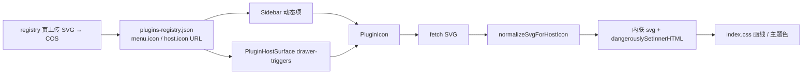

# Host 插件图标：SVG URL 动态加载与内联渲染

> **federation-kit 实现专章（含完整逐行注释代码）**：[packages/federation-kit/docs/implements-guide/插件图标.md](../../packages/federation-kit/docs/implements-guide/插件图标.md)。  
> **延伸阅读**：[Host 接入总览](./mf-plugins/宿主插件集成指南.md)、[Ebook Host Surface](./电子书宿主表面插件.md)、[动态插件系统](../plugins/动态插件系统.md)。旧文中「`menu.icon` / `host.icon` = Lucide 名 + Host `ICON_MAP` / `DEFAULT_PLUGIN_HOST_ICONS` 白名单」已由本方案取代（静态侧栏 `MENUS`/`PLUGINS` 仍用 `ICON_MAP`）。
>
> **桌面端拉取**：展示 URL 与侧栏头像相同（`resolveCosUrlForWebDisplay`）；正文 `fetch` 对绝对 `http(s)` 使用 `getPlatformFetch()`（Tauri HTTP 插件），避免 WebView CORS 导致图标失败。

## 1. 背景与目标

微前端子应用侧栏菜单与 Host Surface 抽屉触发器需要可自定义图标，且：

1. **改图标不必改 Host 白名单**（只改 registry + 上传 SVG）。
2. **选中色与静态 Lucide 菜单一致**（近黑灰单色跟 `text-teal-500` / `currentColor`）。
3. **hover 线性动画**：描边稿（Lucide 风）走 `stroke-dashoffset`；填充稿（iconfont）走 `clip-path` 显现。
4. **不能用 ``**：位图吃不到 `currentColor`，选中色无法对齐。

## 2. 改动范围

| 路径 | 角色 |
|------|------|
| `apps/frontend/src/federation/host/pluginIconUrl.ts` | URL 判定、写回 registry、SVG 消毒与 kind/theme |
| `apps/frontend/src/federation/host/PluginIcon.tsx` | fetch + 缓存 + 内联 SVG 渲染 |
| `apps/frontend/src/federation/index.ts` | barrel 导出 |
| `apps/frontend/src/components/design/Sidebar/index.tsx` | 动态菜单 miss `ICON_MAP` → `PluginIcon` |
| `apps/frontend/src/federation/host/PluginHostSurface.tsx` | 去掉 Lucide 白名单，`host.icon` → `PluginIcon` |
| `apps/frontend/src/views/plugins/registry.tsx` | 标题栏「设置项目图标」上传写回 |
| `apps/frontend/src/components/design/Upload/index.tsx` | `validExtensions` / `openRef` 等（文件对话框与菜单共存） |
| `apps/frontend/src/components/ui/dropdown-menu.tsx` | 默认可滚动，避免插件列表过长 |
| `apps/frontend/src/index.css` | 插件 stroke/fill 画线 keyframes 与选择器；主题 fill |
| `apps/frontend/src/i18n/locales/zh-CN.ts` / `en-US.ts` | 上传文案 |

## 3. 实现思路

### 3.1 数据契约

- registry 字段仍是字符串：`menu.icon`、`host.icon`。
- **插件自定义图标**：存 **SVG 图片 URL**（`https://…`、`/ext-cos/…`、`/remotes/…`）。
- **静态 Host 菜单**（`MENUS` / `PLUGINS`）：仍是 Lucide 导出名，走 `ICON_MAP`，不经 `PluginIcon`。

### 3.2 调用链



### 3.3 关键决策

| 决策 | 原因 |
|------|------|
| 内联 SVG 而非 `` | 选中色要跟侧栏 `text-*` / `currentColor` |
| `kind: stroke \| fill` | Lucide 描边 vs iconfont 填充，动画策略不同 |
| `theme: current \| original` | 近黑灰单色跟主题；品牌多色保留上传色 |
| 亮度+低彩度判定可主题色 | iconfont 常用 `#2c2c2c`，纯黑白名单会漏 |
| `useMemo` 稳定 `{__html}` | React 19 对 `dangerouslySetInnerHTML` 做对象 `===`；新对象会 `innerHTML=` 重建 path，stroke 在仍 hover 时重播；fill 动画在 svg 上无感 |
| 上传控件在 Dropdown 外 + `openRef` | 系统文件框会关菜单；菜单内 Upload 会被卸载 |
| 去掉 Host Lucide 白名单 | 新图标只改 registry，不必发 Host |

### 3.4 kind / theme / 动画对照

| 来源 | kind | 动画作用点 | CSS |
|------|------|------------|-----|
| 上传 Lucide 风描边 SVG | `stroke` | **path** 上 `stroke-dashoffset`（`pathLength=1`） | `.plugin-host-icon[data-plugin-icon-kind=stroke]` |
| 上传 iconfont 填充 SVG | `fill` | **svg** 上 `clip-path` 显现 | `.plugin-host-icon[data-plugin-icon-kind=fill]` |
| 静态 `ICON_MAP` Lucide | （组件） | path dash，选择器排除 `.plugin-host-icon` | `.lucide-stroke-draw-hover:hover svg:not(.plugin-host-icon)` |

**点击不重播（stroke）根因**：父级重渲染时若每次传入新的 `{ __html }` 对象，React 19 会重写 `innerHTML` → path DOM 重建 → 仍处 `:hover` 则 dash 动画重来。fill 动画挂在 svg 节点上，子节点重建不重播。

## 4. 关键实现（改动前 / 改动后对比 + 注释）

### 4.1 `PluginIcon`（纯新增）

**对比范围**：完整组件文件。纯新增，无改动前。

**改动后** · `apps/frontend/src/federation/host/PluginIcon.tsx`（当前，约 L1–L111）

```tsx
// 从 lucide-react 引入 Puzzle，作为 URL 无效或加载失败时的兜底图标
import { Puzzle } from 'lucide-react';
// 引入 React 状态、副作用与 memo 化对象钩子
import { useEffect, useMemo, useState } from 'react';
// 引入 className 合并工具 cn
import { cn } from '@/lib/utils';
// 引入 COS/同源展示 URL 解析，保证 fetch 可用
import { resolveCosUrlForWebDisplay } from '@/utils';
// 从同目录工具模块导入类型与 SVG 规范化函数
import {
// 导入 HostSvgParts 类型（规范化后的内联 SVG 描述）
	type HostSvgParts,
// 导入 URL 判定：是否按图片 URL 拉取
	isPluginIconUrl,
// 导入 SVG 文本消毒与 kind/theme 规范化
	normalizeSvgForHostIcon,
// 结束 import 花括号
} from './pluginIconUrl';
// 空行分隔

// 导出组件 props 类型，供业务与 barrel 使用
export type PluginIconProps = {
// JSDoc：name 对应 registry 的 menu.icon / host.icon，约定为 SVG URL
	/** registry `menu.icon` / `host.icon`：SVG 图片 URL */
// 可选图标地址字符串
	name?: string;
// 可选透传 className（尺寸等）
	className?: string;
// 结束 PluginIconProps
};
// 空行

// 缓存版本号；规范化算法变更时递增以失效内存缓存
const CACHE_VER = 'kind-v8';
// 模块级 Map：URL → 已规范化 HostSvgParts，跨实例复用
const svgCache = new Map<string, HostSvgParts>();
// 空行

// 生成缓存键，把版本与 URL 拼在一起
function cacheKey(url: string) {
// 返回带版本前缀的键，避免旧算法结果残留
	return `${CACHE_VER}:${url}`;
// 结束 cacheKey
}
// 空行

// 组件块级 JSDoc 开始：说明内联 SVG 与主题/动画职责
/**
// 说明近黑灰跟侧栏色、品牌色保留、填充/描边分流动画
 * 内联 SVG：近黑灰单色（含 iconfont #2c2c2c）跟侧栏 text-* / 选中 text-teal-500；
// 空行式注释延续
 * 品牌多色保留上传色；填充/描边分流动画。
// 说明 React 19 dangerouslySetInnerHTML 引用稳定性问题
 *
// 说明每次新对象会 innerHTML 重建 path，导致 stroke 在 hover 下重播
 * dangerouslySetInnerHTML 必须用稳定对象引用：React 19 updateProperties 对
// 说明 fill 动画在 svg 上故不受子节点重建影响
 * 该 prop 做 `===`，每次新 `{__html}` 都会 `innerHTML=` 重建子节点；
// JSDoc 结束
 * stroke 画线挂在 path 上会在仍 :hover 时重播；fill 画线挂在 svg 上故无感。
// 导出函数组件 PluginIcon，接收 name 与 className
 */
// 解构 props
export function PluginIcon({ name, className }: PluginIconProps) {
// 组件体开始
	const [parts, setParts] = useState<HostSvgParts | null>(() => {
// parts 状态：规范化后的 SVG；初始尝试同步读缓存避免闪烁
		const key = name?.trim() ?? '';
// 去掉 name 首尾空白得到查找键
		return isPluginIconUrl(key) ? (svgCache.get(cacheKey(key)) ?? null) : null;
// 若是合法图标 URL 则读缓存，否则 null
	});
// 结束 useState 初始化
	const [failed, setFailed] = useState(() => !isPluginIconUrl(name));
// failed 状态：非 URL 或拉取/解析失败时为 true，渲染 Puzzle

// 空行
	useEffect(() => {
// name 变化时拉取或命中缓存
		const key = name?.trim() ?? '';
// 规范化当前 name
		if (!isPluginIconUrl(key)) {
// 非 URL：清空 parts 并标记失败
			setParts(null);
// 清空已解析结果
			setFailed(true);
// 标记失败以显示 Puzzle
			return;
// 提前结束 effect
		}
// 尝试读内存缓存
		const cached = svgCache.get(cacheKey(key));
// 命中缓存则直接写入状态，跳过网络
		if (cached) {
// 写入缓存中的 parts
			setParts(cached);
// 清除失败标记
			setFailed(false);
// 命中缓存提前返回
			return;
// 空行
		}
// 未命中：准备异步拉取，cancelled 防止卸载后 setState

// 开始加载，先清失败
		let cancelled = false;
// 先清空 parts，短暂可能显示 Puzzle（无缓存场景）
		setFailed(false);
// 空行
		setParts(null);
// 把存储路径/绝对 URL 转成浏览器可 fetch 的地址

// 启动异步 IIFE
		const src = resolveCosUrlForWebDisplay(key);
// try 开始
		void (async () => {
// fetch SVG 文本，禁用强缓存以便换图标后可见
			try {
// 非 2xx 抛错进入 catch
				const res = await fetch(src, { cache: 'no-cache' });
// 读取响应正文（SVG XML）
				if (!res.ok) throw new Error(`icon fetch ${res.status}`);
// 消毒并判定 kind/theme，得到 HostSvgParts
				const text = await res.text();
// 规范化失败则抛错
				const next = normalizeSvgForHostIcon(text);
// 写入模块缓存供后续实例复用
				if (!next) throw new Error('invalid svg');
// 若未卸载则更新 parts 触发渲染内联 SVG
				svgCache.set(cacheKey(key), next);
// catch 网络或解析错误
				if (!cancelled) setParts(next);
// 仍挂载时才改状态
			} catch {
// 清空 parts
				if (!cancelled) {
// 标记失败显示 Puzzle
					setParts(null);
// 结束 catch 内 if
					setFailed(true);
// 结束 catch
				}
// 结束 async IIFE 调用
			}
// 空行
		})();
// effect 清理：标记取消，忽略迟到的 setState

// 置 cancelled
		return () => {
// 结束 cleanup
			cancelled = true;
// 结束 useEffect
		};
// 依赖仅 name，地址不变不重拉
	}, [name]);
// 空行

// 稳定 dangerouslySetInnerHTML 对象，避免 React 19 每次 === 失败导致重建 path
	const html = useMemo(
// 有 parts 时构造 {__html}；无则 null
		() => (parts ? { __html: parts.innerHTML } : null),
// 依赖 parts 引用；同一缓存对象则 html 对象引用保持稳定
		[parts],
// 结束 useMemo
	);
// 空行

// 失败或尚未解析完成：渲染兜底 Puzzle
	if (failed || !parts || !html) {
// return 开始
		return (
// Puzzle 组件
			<Puzzle
// 合并默认尺寸与外部 className
				className={cn('size-4 shrink-0 overflow-visible', className)}
// 装饰性图标，对辅助技术隐藏
				aria-hidden
// 自闭合 Puzzle
			/>
// 结束失败分支 return
		);
// 空行
	}
// 成功：渲染内联 svg

// return 开始
	return (
// svg 根元素
		<svg
// SVG 命名空间
			xmlns="http://www.w3.org/2000/svg"
// 使用规范化得到的 viewBox
			viewBox={parts.viewBox}
// 展开根级 presentation 属性（fill/stroke 等）
			{...parts.rootProps}
// data 属性：供 CSS 区分 stroke/fill 动画
			data-plugin-icon-kind={parts.kind}
// data 属性：current / original 主题
			data-plugin-icon-theme={parts.theme}
// className 合并开始
			className={cn(
// 基础尺寸、溢出可见、宿主图标标记类
				'size-4 shrink-0 overflow-visible plugin-host-icon',
// 近黑灰主题时追加 --theme，配合 CSS currentColor
				parts.theme === 'current' && 'plugin-host-icon--theme',
// 透传调用方 className
				className,
// 结束 cn
			)}
// aria-hidden
			aria-hidden
// 禁止键盘聚焦
			focusable="false"
// 使用稳定 html 对象注入子节点（path 等）
			dangerouslySetInnerHTML={html}
// 自闭合 svg（子节点由 innerHTML 提供）
		/>
// 结束成功 return
	);
// 结束组件函数
}
```

**变更摘要**：Host 统一入口；缓存 + 规范化 + 稳定 `__html` 引用，保证 stroke 画线不在点击重渲染时重播。


### 4.2 `isPluginIconUrl`（纯新增）

**对比范围**：完整符号。纯新增。

**改动后** · `apps/frontend/src/federation/host/pluginIconUrl.ts`（当前，约 L4–L13）

```typescript
// 4.2 `isPluginIconUrl`：符号起始
/** registry `icon` 是否按 SVG URL 拉取并内联 */
// 4.2 `isPluginIconUrl`：`export function isPluginIconUrl(value?: string | null): boolean {`
export function isPluginIconUrl(value?: string | null): boolean {
// 4.2 `isPluginIconUrl`：`const v = value?.trim();`
	const v = value?.trim();
// 4.2 `isPluginIconUrl`：`if (!v) return false;`
	if (!v) return false;
// 4.2 `isPluginIconUrl`：`return (`
	return (
// 4.2 `isPluginIconUrl`：`/^https?:\/\//i.test(v) ||`
		/^https?:\/\//i.test(v) ||
// 4.2 `isPluginIconUrl`：`v.startsWith('/ext-cos/') ||`
		v.startsWith('/ext-cos/') ||
// 4.2 `isPluginIconUrl`：`v.startsWith('/remotes/')`
		v.startsWith('/remotes/')
// 4.2 `isPluginIconUrl`：`);`
	);
// 符号结束
}
```

**变更摘要**：只有 URL 形态才走 PluginIcon 拉取；裸 Lucide 名会失败并显示 Puzzle。

### 4.3 `applyPluginIconUrl`（纯新增）

**对比范围**：完整符号。纯新增。

**改动后** · `apps/frontend/src/federation/host/pluginIconUrl.ts`（当前，约 L15–L39）

```typescript
// 4.3 `applyPluginIconUrl`：符号起始
/**
// 4.3 `applyPluginIconUrl`：`* 把上传得到的 URL 写入指定插件的 menu.icon / host.icon（有则写）。`
 * 把上传得到的 URL 写入指定插件的 menu.icon / host.icon（有则写）。
// 4.3 `applyPluginIconUrl`：`* 二者皆无则 wrote: []。`
 * 二者皆无则 wrote: []。
// 4.3 `applyPluginIconUrl`：`*/`
 */
// 4.3 `applyPluginIconUrl`：`export function applyPluginIconUrl(`
export function applyPluginIconUrl(
// 4.3 `applyPluginIconUrl`：`data: PluginRegistry,`
	data: PluginRegistry,
// 4.3 `applyPluginIconUrl`：`pluginId: string,`
	pluginId: string,
// 4.3 `applyPluginIconUrl`：`url: string,`
	url: string,
// 4.3 `applyPluginIconUrl`：`): { next: PluginRegistry; wrote: Array<'menu' | 'host'> } {`
): { next: PluginRegistry; wrote: Array<'menu' | 'host'> } {
// 4.3 `applyPluginIconUrl`：`const wrote: Array<'menu' | 'host'> = [];`
	const wrote: Array<'menu' | 'host'> = [];
// 4.3 `applyPluginIconUrl`：`const plugins = data.plugins.map((p) => {`
	const plugins = data.plugins.map((p) => {
// 4.3 `applyPluginIconUrl`：`if (p.id !== pluginId) return p;`
		if (p.id !== pluginId) return p;
// 4.3 `applyPluginIconUrl`：`let next = p;`
		let next = p;
// 4.3 `applyPluginIconUrl`：`if (p.menu) {`
		if (p.menu) {
// 4.3 `applyPluginIconUrl`：`next = { ...next, menu: { ...p.menu, icon: url } };`
			next = { ...next, menu: { ...p.menu, icon: url } };
// 4.3 `applyPluginIconUrl`：`wrote.push('menu');`
			wrote.push('menu');
// 4.3 `applyPluginIconUrl`：`}`
		}
// 4.3 `applyPluginIconUrl`：`if (p.host) {`
		if (p.host) {
// 4.3 `applyPluginIconUrl`：`next = { ...next, host: { ...p.host, icon: url } };`
			next = { ...next, host: { ...p.host, icon: url } };
// 4.3 `applyPluginIconUrl`：`wrote.push('host');`
			wrote.push('host');
// 4.3 `applyPluginIconUrl`：`}`
		}
// 4.3 `applyPluginIconUrl`：`return next;`
		return next;
// 4.3 `applyPluginIconUrl`：`});`
	});
// 4.3 `applyPluginIconUrl`：`return { next: { ...data, plugins }, wrote };`
	return { next: { ...data, plugins }, wrote };
// 符号结束
}
```

**变更摘要**：一次上传可同时写侧栏 menu.icon 与 host.icon。

### 4.4 `isThemeablePaint`（纯新增）

**对比范围**：完整符号。纯新增。

**改动后** · `apps/frontend/src/federation/host/pluginIconUrl.ts`（当前，约 L118–L135）

```typescript
// 4.4 `isThemeablePaint`：符号起始
/**
// 4.4 `isThemeablePaint`：`* iconfont 常用 #2c2c2c / #333 等近黑灰，白名单会漏；`
 * iconfont 常用 #2c2c2c / #333 等近黑灰，白名单会漏；
// 4.4 `isThemeablePaint`：`* 低彩度 +（够暗或够亮）视为可跟侧栏色。`
 * 低彩度 +（够暗或够亮）视为可跟侧栏色。
// 4.4 `isThemeablePaint`：`*/`
 */
// 4.4 `isThemeablePaint`：`export function isThemeablePaint(value: string): boolean {`
export function isThemeablePaint(value: string): boolean {
// 4.4 `isThemeablePaint`：`const v = value.trim().toLowerCase();`
	const v = value.trim().toLowerCase();
// 4.4 `isThemeablePaint`：`if (!v || v === 'none' || v === 'transparent') return false;`
	if (!v || v === 'none' || v === 'transparent') return false;
// 4.4 `isThemeablePaint`：`if (v === 'currentcolor' || v === 'inherit') return true;`
	if (v === 'currentcolor' || v === 'inherit') return true;
// 4.4 `isThemeablePaint`：`if (/^url\(/i.test(v)) return false;`
	if (/^url\(/i.test(v)) return false;
// 4.4 `isThemeablePaint`：`const rgb = parseRgb(v);`
	const rgb = parseRgb(v);
// 4.4 `isThemeablePaint`：`if (!rgb) return false;`
	if (!rgb) return false;
// 4.4 `isThemeablePaint`：`const [r, g, b] = rgb;`
	const [r, g, b] = rgb;
// 4.4 `isThemeablePaint`：`const chroma = Math.max(r, g, b) - Math.min(r, g, b);`
	const chroma = Math.max(r, g, b) - Math.min(r, g, b);
// 4.4 `isThemeablePaint`：`const L = luminance(r, g, b);`
	const L = luminance(r, g, b);
// 4.4 `isThemeablePaint`：`// 近似灰，且偏黑或偏白（含 #2c2c2c）`
	// 近似灰，且偏黑或偏白（含 #2c2c2c）
// 4.4 `isThemeablePaint`：`if (chroma <= 24 && (L <= 0.28 || L >= 0.82)) return true;`
	if (chroma <= 24 && (L <= 0.28 || L >= 0.82)) return true;
// 4.4 `isThemeablePaint`：`return false;`
	return false;
// 符号结束
}
```

**变更摘要**：低彩度近黑/近白可跟 currentColor，覆盖 #2c2c2c。

### 4.5 `detectPluginIconKind`（纯新增）

**对比范围**：完整符号。纯新增。

**改动后** · `apps/frontend/src/federation/host/pluginIconUrl.ts`（当前，约 L246–L254）

```typescript
// 4.5 `detectPluginIconKind`：符号起始
/** Lucide 根 fill="none"；iconfont 常不写或写深灰 fill → fill */
// 4.5 `detectPluginIconKind`：`export function detectPluginIconKind(svg: Element): PluginIconKin`
export function detectPluginIconKind(svg: Element): PluginIconKind {
// 4.5 `detectPluginIconKind`：`for (const el of svg.querySelectorAll(SHAPE_SEL)) {`
	for (const el of svg.querySelectorAll(SHAPE_SEL)) {
// 4.5 `detectPluginIconKind`：`if (hasFillPaint(el)) return 'fill';`
		if (hasFillPaint(el)) return 'fill';
// 4.5 `detectPluginIconKind`：`}`
	}
// 4.5 `detectPluginIconKind`：`const rootFill = svg.getAttribute('fill');`
	const rootFill = svg.getAttribute('fill');
// 4.5 `detectPluginIconKind`：`if (rootFill === 'none') return 'stroke';`
	if (rootFill === 'none') return 'stroke';
// 4.5 `detectPluginIconKind`：`return 'fill';`
	return 'fill';
// 符号结束
}
```

**变更摘要**：有非 none fill → fill；根 fill=none → stroke。

### 4.6 `prepareStrokeDraw`（纯新增）

**对比范围**：完整符号。纯新增。

**改动后** · `apps/frontend/src/federation/host/pluginIconUrl.ts`（当前，约 L256–L260）

```typescript
// 4.6 `prepareStrokeDraw`：符号起始
function prepareStrokeDraw(svg: Element) {
// 4.6 `prepareStrokeDraw`：`for (const el of svg.querySelectorAll(SHAPE_SEL)) {`
	for (const el of svg.querySelectorAll(SHAPE_SEL)) {
// 4.6 `prepareStrokeDraw`：`el.setAttribute('pathLength', '1');`
		el.setAttribute('pathLength', '1');
// 4.6 `prepareStrokeDraw`：`}`
	}
// 符号结束
}
```

**变更摘要**：pathLength=1，配合 CSS dasharray:1。

### 4.7 `normalizeSvgForHostIcon`（纯新增）

**对比范围**：完整符号。纯新增。

**改动后** · `apps/frontend/src/federation/host/pluginIconUrl.ts`（当前，约 L262–L335）

```typescript
// 4.7 `normalizeSvgForHostIcon`：符号起始
/**
// 4.7 `normalizeSvgForHostIcon`：`* 消毒；近黑灰单色 → currentColor（选中跟静态菜单）；`
 * 消毒；近黑灰单色 → currentColor（选中跟静态菜单）；
// 4.7 `normalizeSvgForHostIcon`：`* 描边稿 pathLength；填充稿不加描边；品牌色保留。`
 * 描边稿 pathLength；填充稿不加描边；品牌色保留。
// 4.7 `normalizeSvgForHostIcon`：`*/`
 */
// 4.7 `normalizeSvgForHostIcon`：`export function normalizeSvgForHostIcon(svgText: string): HostSvg`
export function normalizeSvgForHostIcon(svgText: string): HostSvgParts | null {
// 4.7 `normalizeSvgForHostIcon`：`const raw = svgText.trim();`
	const raw = svgText.trim();
// 4.7 `normalizeSvgForHostIcon`：`if (!raw || !/<svg[\s>]/i.test(raw)) return null;`
	if (!raw || !/<svg[\s>]/i.test(raw)) return null;
// 4.7 `normalizeSvgForHostIcon`：``

// 4.7 `normalizeSvgForHostIcon`：`const doc = new DOMParser().parseFromString(raw, 'image/svg+xml')`
	const doc = new DOMParser().parseFromString(raw, 'image/svg+xml');
// 4.7 `normalizeSvgForHostIcon`：`if (doc.querySelector('parsererror')) return null;`
	if (doc.querySelector('parsererror')) return null;
// 4.7 `normalizeSvgForHostIcon`：``

// 4.7 `normalizeSvgForHostIcon`：`const svg = doc.documentElement;`
	const svg = doc.documentElement;
// 4.7 `normalizeSvgForHostIcon`：`if (!svg || svg.tagName.toLowerCase() !== 'svg') return null;`
	if (!svg || svg.tagName.toLowerCase() !== 'svg') return null;
// 4.7 `normalizeSvgForHostIcon`：``

// 4.7 `normalizeSvgForHostIcon`：`for (const el of [`
	for (const el of [
// 4.7 `normalizeSvgForHostIcon`：`...svg.querySelectorAll('script, foreignObject, iframe, object, e`
		...svg.querySelectorAll('script, foreignObject, iframe, object, embed'),
// 4.7 `normalizeSvgForHostIcon`：`]) {`
	]) {
// 4.7 `normalizeSvgForHostIcon`：`el.remove();`
		el.remove();
// 4.7 `normalizeSvgForHostIcon`：`}`
	}
// 4.7 `normalizeSvgForHostIcon`：``

// 4.7 `normalizeSvgForHostIcon`：`for (const el of [svg, ...svg.querySelectorAll('*')]) {`
	for (const el of [svg, ...svg.querySelectorAll('*')]) {
// 4.7 `normalizeSvgForHostIcon`：`for (const attr of [...el.attributes]) {`
		for (const attr of [...el.attributes]) {
// 4.7 `normalizeSvgForHostIcon`：`const name = attr.name;`
			const name = attr.name;
// 4.7 `normalizeSvgForHostIcon`：`const val = attr.value.trim();`
			const val = attr.value.trim();
// 4.7 `normalizeSvgForHostIcon`：`if (/^on/i.test(name)) {`
			if (/^on/i.test(name)) {
// 4.7 `normalizeSvgForHostIcon`：`el.removeAttribute(name);`
				el.removeAttribute(name);
// 4.7 `normalizeSvgForHostIcon`：`continue;`
				continue;
// 4.7 `normalizeSvgForHostIcon`：`}`
			}
// 4.7 `normalizeSvgForHostIcon`：`if (`
			if (
// 4.7 `normalizeSvgForHostIcon`：`(name === 'href' || name === 'xlink:href') &&`
				(name === 'href' || name === 'xlink:href') &&
// 4.7 `normalizeSvgForHostIcon`：`/^javascript:/i.test(val)`
				/^javascript:/i.test(val)
// 4.7 `normalizeSvgForHostIcon`：`) {`
			) {
// 4.7 `normalizeSvgForHostIcon`：`el.removeAttribute(name);`
				el.removeAttribute(name);
// 4.7 `normalizeSvgForHostIcon`：`}`
			}
// 4.7 `normalizeSvgForHostIcon`：`}`
		}
// 4.7 `normalizeSvgForHostIcon`：`}`
	}
// 4.7 `normalizeSvgForHostIcon`：``

// 4.7 `normalizeSvgForHostIcon`：`const theme = applyThemeCurrentColor(svg);`
	const theme = applyThemeCurrentColor(svg);
// 4.7 `normalizeSvgForHostIcon`：`const kind = detectPluginIconKind(svg);`
	const kind = detectPluginIconKind(svg);
// 4.7 `normalizeSvgForHostIcon`：`if (kind === 'stroke') {`
	if (kind === 'stroke') {
// 4.7 `normalizeSvgForHostIcon`：`prepareStrokeDraw(svg);`
		prepareStrokeDraw(svg);
// 4.7 `normalizeSvgForHostIcon`：`}`
	}
// 4.7 `normalizeSvgForHostIcon`：``

// 4.7 `normalizeSvgForHostIcon`：`const viewBox = svg.getAttribute('viewBox') || '0 0 24 24';`
	const viewBox = svg.getAttribute('viewBox') || '0 0 24 24';
// 4.7 `normalizeSvgForHostIcon`：`const rootProps: SVGProps<SVGSVGElement> = {};`
	const rootProps: SVGProps<SVGSVGElement> = {};
// 4.7 `normalizeSvgForHostIcon`：`for (const name of ROOT_PRESENTATION) {`
	for (const name of ROOT_PRESENTATION) {
// 4.7 `normalizeSvgForHostIcon`：`const val = svg.getAttribute(name);`
		const val = svg.getAttribute(name);
// 4.7 `normalizeSvgForHostIcon`：`if (!val) continue;`
		if (!val) continue;
// 4.7 `normalizeSvgForHostIcon`：`if (name === 'stroke-width') rootProps.strokeWidth = val;`
		if (name === 'stroke-width') rootProps.strokeWidth = val;
// 4.7 `normalizeSvgForHostIcon`：`else if (name === 'stroke-linecap')`
		else if (name === 'stroke-linecap')
// 4.7 `normalizeSvgForHostIcon`：`rootProps.strokeLinecap = val as 'round';`
			rootProps.strokeLinecap = val as 'round';
// 4.7 `normalizeSvgForHostIcon`：`else if (name === 'stroke-linejoin')`
		else if (name === 'stroke-linejoin')
// 4.7 `normalizeSvgForHostIcon`：`rootProps.strokeLinejoin = val as 'round';`
			rootProps.strokeLinejoin = val as 'round';
// 4.7 `normalizeSvgForHostIcon`：`else if (name === 'stroke-opacity') rootProps.strokeOpacity = val`
		else if (name === 'stroke-opacity') rootProps.strokeOpacity = val;
// 4.7 `normalizeSvgForHostIcon`：`else if (name === 'fill-opacity') rootProps.fillOpacity = val;`
		else if (name === 'fill-opacity') rootProps.fillOpacity = val;
// 4.7 `normalizeSvgForHostIcon`：`else if (name === 'fill') rootProps.fill = val;`
		else if (name === 'fill') rootProps.fill = val;
// 4.7 `normalizeSvgForHostIcon`：`else if (name === 'stroke') rootProps.stroke = val;`
		else if (name === 'stroke') rootProps.stroke = val;
// 4.7 `normalizeSvgForHostIcon`：`else if (name === 'opacity') rootProps.opacity = Number(val) || v`
		else if (name === 'opacity') rootProps.opacity = Number(val) || val;
// 4.7 `normalizeSvgForHostIcon`：`}`
	}
// 4.7 `normalizeSvgForHostIcon`：``

// 4.7 `normalizeSvgForHostIcon`：`if (theme === 'current') {`
	if (theme === 'current') {
// 4.7 `normalizeSvgForHostIcon`：`if (kind === 'fill') {`
		if (kind === 'fill') {
// 4.7 `normalizeSvgForHostIcon`：`rootProps.fill = 'currentColor';`
			rootProps.fill = 'currentColor';
// 4.7 `normalizeSvgForHostIcon`：`} else {`
		} else {
// 4.7 `normalizeSvgForHostIcon`：`rootProps.stroke = 'currentColor';`
			rootProps.stroke = 'currentColor';
// 4.7 `normalizeSvgForHostIcon`：`if (!rootProps.fill) rootProps.fill = 'none';`
			if (!rootProps.fill) rootProps.fill = 'none';
// 4.7 `normalizeSvgForHostIcon`：`}`
		}
// 4.7 `normalizeSvgForHostIcon`：`}`
	}
// 4.7 `normalizeSvgForHostIcon`：``

// 4.7 `normalizeSvgForHostIcon`：`const innerHTML = svg.innerHTML.trim();`
	const innerHTML = svg.innerHTML.trim();
// 4.7 `normalizeSvgForHostIcon`：`if (!innerHTML) return null;`
	if (!innerHTML) return null;
// 4.7 `normalizeSvgForHostIcon`：``

// 4.7 `normalizeSvgForHostIcon`：`return { viewBox, kind, theme, rootProps, innerHTML };`
	return { viewBox, kind, theme, rootProps, innerHTML };
// 符号结束
}
```

**变更摘要**：消毒、主题改写、kind、stroke 预处理，产出 HostSvgParts。

### 4.8 Sidebar `processedMenus` 图标解析

**对比范围**：`processedMenus` 赋值表达式（完整 const）。

**改动前** · `apps/frontend/src/components/design/Sidebar/index.tsx`（基线 HEAD）

```tsx
// 按可见菜单映射出带 icon 与 onClick 的项
	const processedMenus = visibleMenus.map((menu) => ({
// 展开原 menu 字段
		...menu,
// 仅查 ICON_MAP；插件 URL 或未登记名会得到 undefined，侧栏空白
		icon: ICON_MAP[menu.icon as keyof typeof ICON_MAP],
// 点击跳转对应 path
		onClick: () => onJump(menu.path),
// 结束 map 对象与调用
	}));
```

**改动后** · `apps/frontend/src/components/design/Sidebar/index.tsx`（当前）

```tsx
// 按可见菜单映射出带 icon 与 onClick 的项
	const processedMenus = visibleMenus.map((menu) => ({
// 展开原 menu 字段
		...menu,
// 静态 Lucide 名仍走 ICON_MAP
		icon: ICON_MAP[menu.icon as keyof typeof ICON_MAP] ?? (
// 未命中则 PluginIcon：按 SVG URL 内联渲染
			<PluginIcon name={menu.icon} className="size-5.5" />
// PluginIcon 传入 registry 中的 icon 字符串与侧栏尺寸
		),
// 结束 PluginIcon 与空值合并
		onClick: () => onJump(menu.path),
// 点击跳转对应 path
	}));
```

**变更摘要**：动态插件菜单支持 URL 图标；静态 `MENUS`/`PLUGINS` 行为不变。

### 4.9 `PluginHostSurface`：去掉 Lucide 白名单

**对比范围**：删除 `DEFAULT_PLUGIN_HOST_ICONS` + `resolveIcon`；触发器改为 `PluginIcon`。

**改动前** · `apps/frontend/src/federation/host/PluginHostSurface.tsx`（基线 HEAD）

```tsx
// 注释：默认 lucide 名到组件映射
/** 默认 lucide 图标名 → 组件（registry `host.icon`） */
// 导出白名单表，新图标必须改 Host
export const DEFAULT_PLUGIN_HOST_ICONS: Record<string, LucideIcon> = {
// Sparkle
	Sparkle,
// Puzzle 兜底用
	Puzzle,
// Sparkles
	Sparkles,
// BookMarked
	BookMarked,
// Highlighter
	Highlighter,
// 结束表
};
// 空行

// 按名字解析图标组件
function resolveIcon(
// name 来自 host.icon
	name: string | undefined,
// 可注入覆盖表
	icons: Record<string, LucideIcon>,
// 返回 LucideIcon 类型
): LucideIcon {
// 无名字回 Puzzle
	if (!name) return Puzzle;
// 表中查找，miss 也 Puzzle
	return icons[name] ?? Puzzle;
// 结束函数
}
```

**改动后** · 白名单与 `resolveIcon` 已删除；抽屉触发器内：

```tsx
// 直接用 PluginIcon 读 host.icon URL 并内联；失败则 Puzzle
							<PluginIcon name={p.host?.icon} className="size-4" />
```

按钮同时加上 `lucide-stroke-draw-hover [&_svg]:overflow-visible`，与侧栏 hover 画线一致。

**变更摘要**：Host Surface 图标与侧栏同一套 URL→内联管线，无白名单。

### 4.10 CSS：插件 stroke / fill 画线（摘录）

**对比范围**：`index.css` 中插件图标动画相关规则（相对基线为新增/扩展）。

**改动后** · `apps/frontend/src/index.css`（当前，插件相关摘录）

```css
// 统一画线时长 CSS 变量
.lucide-stroke-draw-hover {
// 时长 0.5s，与静态 Lucide 一致
	--icon-draw-duration: 0.5s;
// 结束宿主类
}
// 描边插件图标：dashoffset 从 1 画到 0（配合 pathLength=1）
@keyframes plugin-icon-stroke-draw {
// 动画起点：完全隐藏描边
	from { stroke-dashoffset: 1; }
// 动画终点：描边完整
	to { stroke-dashoffset: 0; }
// 结束 keyframes
}
// 填充插件图标：clip 从右向左显现
@keyframes plugin-icon-fill-draw {
// 起点：右侧全部裁切
	from { clip-path: inset(0 100% 0 0); }
// 终点：完整可见
	to { clip-path: inset(0 0 0 0); }
// 结束 keyframes
}
// hover 且 stroke kind：对 path 施加 dash 动画（选择器还有 line/circle 等并列规则）
.lucide-stroke-draw-hover:hover svg.plugin-host-icon[data-plugin-icon-kind='stroke'] path {
// dash 长度 1（与 pathLength 对齐）
	stroke-dasharray: 1;
// 初始 offset 1
	stroke-dashoffset: 1;
// 线性 forwards 播完保持终点
	animation: plugin-icon-stroke-draw var(--icon-draw-duration, 0.5s) linear forwards;
// 结束 stroke 规则摘录
}
// hover 且 fill kind：动画作用在 svg 根上
.lucide-stroke-draw-hover:hover svg.plugin-host-icon[data-plugin-icon-kind='fill'] {
// clip-path 显现动画
	animation: plugin-icon-fill-draw var(--icon-draw-duration, 0.5s) linear forwards;
// 结束 fill 规则
}
// 近黑灰主题的填充图标：强制 fill 跟 currentColor（跟侧栏选中色）
svg.plugin-host-icon--theme[data-plugin-icon-kind='fill'] :is(path, circle, rect, ellipse, polygon, polyline) {
// fill currentColor !important 压内联色
	fill: currentColor !important;
// 结束主题 fill 规则
}
```

**变更摘要**：stroke 动画在 path、fill 在 svg；主题 fill 可用 !important。描边色靠 normalize 写入的 attribute `currentColor` 继承，避免对 path 写 `stroke: currentColor !important` 与 dash 动画互相干扰。

### 4.11 Registry 页上传写回（行为说明 + 要点）

`apps/frontend/src/views/plugins/registry.tsx`：

1. Monaco 标题栏右侧「设置项目图标」打开 `DropdownMenu` 列插件 id。

2. 每项右侧 `ImageUp` 调用 `onPickPluginIcon(id)`：把 id 记入 `pendingIconPluginIdRef`，再 `uploadOpenRef.current?.()` 打开**菜单外**隐藏 `Upload`。

3. `Upload`：`validTypes={["image/svg+xml"]}`、`validExtensions={[".svg"]}`；成功后 `uploadCosFile` → `applyPluginIconUrl` → 写回编辑器 JSON 文本（可再保存 registry）。

4. 不把 `Upload` 放进菜单：系统文件对话框会关闭菜单并卸载项内组件。

## 5. 行为变化与兼容性

- **插件图标**：改为 SVG URL；旧 Lucide 名字符串会显示 Puzzle，需在注册表页重新上传。

- **静态侧栏** `ICON_MAP`：不变。

- **选中色**：近黑灰单色内联 SVG 跟 `text-teal-500`；品牌多色 `theme: original` 保留上传色。

- **hover 动画**：仅 hover；点击选中重渲染不因 `__html` 对象重建而重播 stroke（`useMemo` 稳定引用）。

- **Host Surface**：移除 `icons` 覆盖 prop 与默认白名单。

## 6. 测试与回归建议

- [ ] 注册表上传 Lucide 风描边 SVG → 侧栏/触发器显示，hover 画线，点击选中变色且**不重播**画线。

- [ ] 上传 iconfont 填充 SVG → hover 为 clip 显现，点击不重播。

- [ ] 多色品牌 SVG → 保留原色（original）。

- [ ] 非法 URL / 非 SVG → Puzzle。

- [ ] 静态菜单 Lucide hover 画线仍正常。

- [ ] 同时有 menu 与 host 的插件，一次上传两边 icon 均更新。

## 7. 相关文档与代码索引

| 说明 | 路径 |
|------|------|
| 本专题 | `docs/app/插件宿主图标.md` |
| Host 接入 | `docs/app/mf-plugins/宿主插件集成指南.md` |
| Ebook Surface | `docs/app/电子书宿主表面插件.md` |
| PluginIcon | `apps/frontend/src/federation/host/PluginIcon.tsx` |
| URL/规范化 | `apps/frontend/src/federation/host/pluginIconUrl.ts` |
| 导出 | `apps/frontend/src/federation/index.ts` |

---

若与仓库最新源码不一致，以源码为准。
