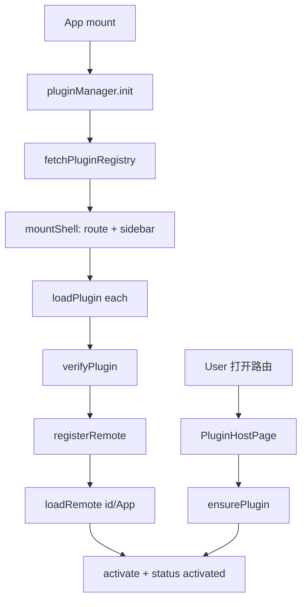

# Module Federation 动态插件 Host

> **文档角色（主文档）**：Host 侧动态插件运行时（registry → 校验 → MF loadRemote → 路由/侧栏注入 → 宿主页）。  
> **延伸阅读**：[../ops/远程注册静态.md](../ops/远程注册静态.md)（registry 静态分发与 CORS）；[../ops/远程无存储缓存.md](../ops/远程无存储缓存.md)（remotes `no-store`）；[插件入口缓存失效.md](../plugins/插件入口缓存失效.md)（entry `?v=` / afterResolve）；[模块联邦共享React路由.md](./模块联邦共享React路由.md)（勿 shared react-router）；[插件注册宿主API.md](../plugins/插件注册宿主API.md)；[远程插件HMR.md](../plugins/远程插件HMR.md)；[../english/学习笔记远程.md](../english/学习笔记远程.md)；**第三方任意域名接入配置**：[../ideas/第三方联邦插件接入.md](../ideas/plugins/第三方联邦插件接入.md)；**主/子样式隔离**：[../ideas/模块联邦CSS隔离.md](../ideas/plugins/模块联邦CSS隔离.md)。

---

## 1. 背景与目标

### 1.1 问题

主站前端体量大，部分能力（演示 Remote、计数器、学习笔记等）希望：

- **独立仓库/应用构建与部署**（独立端口 9005/9006/9008 等）；
- 运行时由 Host **按清单加载**，而不是全部打进 Host bundle；
- 具备 **origin 白名单 / hostApi 版本 /（可选）integrity** 等最低安全闸门；
- 失败时 **不闪烁重试**；侧栏与路由注入幂等。

### 1.2 目标（逐点）

| #   | 目标                                                                                                          |
| --- | ------------------------------------------------------------------------------------------------------------- |
| 1   | `@module-federation/vite` Host + Runtime `registerRemotes` / `loadRemote`                                     |
| 2   | `src/plugins/*`：Manager、Verifier、Injectors、HostPage、Bridge                                               |
| 3   | 启动 `pluginManager.init()`：拉 registry → mountShell（**不**预拉 MF）；首次进页 `ensurePlugin` 再 loadRemote |
| 4   | `injectRoute !== false` 时注入顶栏路由；`false` 时业务树自挂 `PluginHostPage`                                 |
| 5   | Sidebar 订阅 `sidebarInjector`，动态菜单                                                                      |
| 6   | `buildRoutes()` 合并动态子路由；`routeEpoch` 重建 router                                                      |
| 7   | shared React 单例；`clearMfViteDepCachePlugin` 规避 virtual:mf owner 漂移                                     |
| 8   | MF 走 WebView 原生网络；Tauri `plugin-http` capabilities **只**覆盖 API 等，不加第三方插件域                  |
| 9   | 准入 = registry 上架 + 生产 https；对方 Remote 自配 CORS（含 `tauri://localhost`）                            |
| 10  | 一仓多 expose：`remoteName` + `expose`；业务 Dialog 内嵌（如 `ebookIdeasList`）                               |
| 11  | 插件默认懒加载（`preload: route`）；勿在 init 里 `await` 全量 loadRemote                                      |
| 12  | **样式**：Host 运行时 `@scope` 自动隔离（子项目零侵入）；`untrusted` 强制 iframe；详见 [样式隔离实现.md](../style/样式隔离实现.md) |

---

## 2. 改动范围

| 路径                                                          | 说明                                            |
| ------------------------------------------------------------- | ----------------------------------------------- |
| `apps/frontend/src/plugins/**`                                | **新增**插件运行时                              |
| `apps/frontend/vite.config.ts`                                | federation、optimizeDeps exclude、cors、proxy   |
| `apps/frontend/plugins/index.ts`                              | `clearMfViteDepCachePlugin`                     |
| `apps/frontend/src/router/index.tsx`                          | init plugins + 动态 router                      |
| `apps/frontend/src/router/buildRoutes.ts`                     | **新增**                                        |
| `apps/frontend/src/router/routes.ts`                          | 英语 notes 静态子路由（见 english 专题）        |
| `apps/frontend/src/components/design/Sidebar/index.tsx`       | 动态菜单                                        |
| `apps/frontend/src/vite-env.d.ts`                             | 环境变量类型                                    |
| `apps/frontend/package.json` / 根 `package.json`              | MF 依赖与脚本                                   |
| `apps/remote-demo` / `remote-counter` / `remote-plugins` | Remote 应用（独立包；笔记/想法在 host-plugins） |
| `apps/frontend/src-tauri/**`                                  | 能力/配置微调（按环境）                         |

---

## 3. 实现思路

### 3.1 端到端数据流



### 3.2 关键决策

| 决策         | 选择                                                                                 | 未选方案                           |
| ------------ | ------------------------------------------------------------------------------------ | ---------------------------------- |
| Remote 发现  | 服务端 uploads registry JSON                                                         | 写死在 Host 源码                   |
| 路由注入     | `routeInjector` + 重建 `createBrowserRouter`                                         | 全静态路由                         |
| 业务内嵌插件 | `injectRoute: false` + 业务页包 `PluginHostPage`（含 Dialog 挂载，如 EPUB 全书想法） | 强行顶层 path                      |
| 一仓多插件   | registry `remoteName` + `expose` 指向同一 MF entry 的不同 expose                     | 每插件单独 federation name / 端口  |
| 共享 React   | MF shared singleton + Runtime registerShared                                         | 双份 React（易挂）                 |
| 失败重试     | 失败态稳住，仅手动「重新加载」                                                       | 自动死循环拉取                     |
| 第三方       | 对方 CORS + registry 上架（任意 HTTPS）；加插件不发桌面版                            | 每家改 capabilities / 开放代理反代 |
| 样式隔离     | 生产者 scoped CSS（见 [模块联邦CSS隔离.md](../ideas/plugins/模块联邦CSS隔离.md)）；untrusted → iframe | Host 劫持 head + Shadow          |

### 3.3 Vite / MF 踩坑点（本轮已处理）

1. **`optimizeDeps` 不要 exclude `react-router`**：否则 CJS `cookie` 的 `parse` named export 在 Safari/Tauri 报错。
2. **federation `shared` 不要包含 `react-router`**：生产 `loadShare` 易与 `react-router/dom` 拆成双实例，导致 `useLocation` 找不到 Router（线上 `/plugins` 白屏）。详见 [模块联邦共享React路由.md](./模块联邦共享React路由.md)。
3. **要 exclude `react*`**：避免预打包写入 `virtual:mf:...` 后重启解析失败。
4. **`clearMfViteDepCachePlugin`**：serve 时清 `node_modules/.vite`，对齐 `mf_owner` 递增。
5. **`hostInitInjectLocation: 'entry'`**：避免默认 html 注入把任意 ts 打成无 export bootstrap。
6. **桌面插件缓存**：bust 为 `version@manifestHash`（拉 Remote 自有 manifest 指纹）；须 `afterResolve` 给改写后的 `remoteEntry.js` 补 `?v=`；发布者只更静态资源、勿改 Host registry。见 [插件入口缓存失效.md](../plugins/插件入口缓存失效.md)。

---

## 4. 关键实现（改动前 / 改动后 + 逐行注释）

### 4.1 类型契约 `PluginDescriptor`（`apps/frontend/src/plugins/types.ts`）

**对比范围**：纯新增。基线不存在。

**改动后** · `apps/frontend/src/plugins/types.ts`（新增，约 L15–L34）

```typescript
// 单个插件在 registry 中的描述
export interface PluginDescriptor {
	// 与 MF remote name / loadRemote(`${id}/App`) 对齐
	id: string;
	// 可选 i18n 标题键
	titleKey?: string;
	// 路由 path（顶层注入或业务内路径）
	routePath: string;
	// MF entry：通常为 .../mf-manifest.json 绝对 URL
	entry: string;
	// 插件自身 semver
	version: string;
	// Host API 兼容范围，如 ^1.0.0
	hostApiRange: string;
	// 可选侧栏菜单
	menu?: { order: number; icon?: string; nameKey?: string };
	/**
	 * 是否由 PluginManager 注入顶层路由。
	 * false：宿主已在业务路由树（如英语学习子路由）挂好 PluginHostPage，只负责 loadRemote。
	 */
	injectRoute?: boolean;
	// 权限声明（Bridge 可按权限裁剪能力）
	permissions: PluginPermission[];
	// 预加载策略提示
	preload?: "eager" | "route" | "idle";
	// 总开关
	enabled: boolean;
	// 可选 SRI
	integrity?: string;
	// 可选签名钩子
	signature?: string;
	// 信任等级；untrusted 当前直接拒绝
	trust: PluginTrust;
}
```

**变更摘要**：定义 Host↔Remote 契约字段；`injectRoute` 区分顶层注入与业务内嵌。

---

### 4.2 `mf.ts`：实例、shared、register、load（纯新增）

**改动后** · `apps/frontend/src/plugins/mf.ts`（新增，全文）

```typescript
// MF Runtime API
import {
	createInstance,
	getInstance,
	type ModuleFederation,
} from "@module-federation/enhanced/runtime";
// 用于 registerShared 的版本与模块引用
import React from "react";
import ReactDOM from "react-dom";
import type { PluginDescriptor, PluginModule } from "./types";

// 进程内单例缓存
let mf: ModuleFederation | null = null;
// shared 是否已注册
let sharedReady = false;

// 获取或创建 Host MF 实例
function getMf(): ModuleFederation {
	if (mf) return mf;
	// 复用 @module-federation/vite 创建的默认实例（与 Remote shared 对齐）
	try {
		const existing = getInstance();
		if (existing) {
			mf = existing;
			return mf;
		}
	} catch {
		/* no default instance yet */
	}
	// 无默认实例时手建空 remotes Host
	mf = createInstance({ name: "host", remotes: [] });
	return mf;
}

// 向 Runtime 登记 React / ReactDOM singleton
function ensureShared() {
	if (sharedReady) return;
	const instance = getMf();
	instance.registerShared({
		react: {
			version: React.version,
			scope: "default",
			get: async () => () => React,
			shareConfig: {
				singleton: true,
				requiredVersion: `^${React.version}`,
			},
		},
		"react-dom": {
			version: ReactDOM.version || React.version,
			scope: "default",
			get: async () => () => ReactDOM,
			shareConfig: {
				singleton: true,
				requiredVersion: `^${ReactDOM.version || React.version}`,
			},
		},
	});
	sharedReady = true;
}

// 按 descriptor 注册/覆盖 remote
export function registerRemote(d: PluginDescriptor) {
	ensureShared();
	getMf().registerRemotes(
		[
			{
				name: d.id,
				entry: d.entry,
				type: "module",
			},
		],
		{ force: true },
	);
}

// 加载 expose ./App，要求 default 导出组件
export async function loadRemoteApp(
	d: PluginDescriptor,
): Promise<PluginModule> {
	ensureShared();
	const mod = await getMf().loadRemote<PluginModule>(`${d.id}/App`);
	if (!mod?.default) {
		throw new Error(`plugin ${d.id}: expose ./App missing default export`);
	}
	return mod;
}
```

---

### 4.3 `verifyPlugin`（纯新增）

**改动后** · `apps/frontend/src/plugins/PluginVerifier.ts`（`verifyPlugin` 全函数，约 L84–L135）

```typescript
// 加载前校验：信任、origin、hostApi、可选 integrity/signature
export async function verifyPlugin(d: PluginDescriptor): Promise<void> {
	// 未信任插件当前直接拒绝（预留 iframe 路径）
	if (d.trust === "untrusted") {
		throw new PluginVerifyError(
			`plugin ${d.id}: untrusted rejected (use iframe path)`,
			"TRUST",
		);
	}

	let url: URL;
	try {
		// entry 必须是合法绝对 URL
		url = new URL(d.entry);
	} catch {
		throw new PluginVerifyError(`plugin ${d.id}: invalid entry URL`, "ORIGIN");
	}

	// 环境白名单（prod/dev 不同默认端口）
	const origins = allowedOrigins();
	if (!origins.some((o) => url.origin === new URL(o).origin)) {
		throw new PluginVerifyError(
			`plugin ${d.id}: origin ${url.origin} not allowlisted`,
			"ORIGIN",
		);
	}

	// Host API semver 范围
	if (!satisfiesRange(HOST_API_VERSION, d.hostApiRange)) {
		throw new PluginVerifyError(
			`plugin ${d.id}: hostApi ${HOST_API_VERSION} not in ${d.hostApiRange}`,
			"HOST_API",
		);
	}

	// 有 integrity 且未 skip 时拉取 entry 做 SHA-384
	if (d.integrity && !skipIntegrity()) {
		const res = await fetch(d.entry, { cache: "no-store" });
		if (!res.ok) {
			throw new PluginVerifyError(
				`plugin ${d.id}: fetch entry failed ${res.status}`,
				"INTEGRITY",
			);
		}
		const hash = await sha384Base64(await res.arrayBuffer());
		if (hash !== d.integrity) {
			throw new PluginVerifyError(
				`plugin ${d.id}: integrity mismatch`,
				"INTEGRITY",
			);
		}
	}

	// ponytail: signature 由发布流水线验签后可只下发已验标记；此处留钩子
	if (d.signature === "invalid") {
		throw new PluginVerifyError(`plugin ${d.id}: bad signature`, "SIGNATURE");
	}
}
```

---

### 4.4 `PluginManagerImpl`（纯新增，核心方法）

**改动后** · `apps/frontend/src/plugins/PluginManager.ts`（类主体，约 L26–L180）

```typescript
// 插件生命周期中枢
class PluginManagerImpl {
	// id → 已加载状态
	private plugins = new Map<string, LoadedPlugin>();
	/** 同一插件并发 load 共用一个 Promise，避免失败重入闪烁 */
	private inflight = new Map<string, Promise<void>>();
	// 默认导航：整页跳转；App 会注入 router.navigate
	private navigateImpl: (to: string) => void = (to) => {
		window.location.assign(to);
	};

	setNavigate(fn: (to: string) => void) {
		this.navigateImpl = fn;
	}

	get(id: string) {
		return this.plugins.get(id);
	}

	list() {
		return [...this.plugins.values()];
	}

	// 启动：拉清单、挂壳、并行 load
	async init() {
		const registry = await fetchPluginRegistry({ force: true });
		const enabled = registry.plugins.filter((p) => p.enabled);
		for (const meta of enabled) {
			this.mountShell(meta);
		}
		await Promise.all(enabled.map((p) => this.loadPlugin(p)));
	}

	// 路由（可选）+ 侧栏菜单
	private mountShell(meta: PluginDescriptor) {
		if (meta.injectRoute !== false) {
			routeInjector.inject(meta.id, [createPluginRoute(meta)]);
		}
		if (meta.menu) {
			sidebarInjector.add({
				pluginId: meta.id,
				path: meta.routePath,
				nameKey: meta.menu.nameKey ?? meta.titleKey ?? meta.id,
				icon: meta.menu.icon ?? "Puzzle",
				order: meta.menu.order,
			});
		}
	}

	// 页面按需确保插件可用
	async ensurePlugin(id: string, opts?: { force?: boolean }) {
		const cur = this.plugins.get(id);
		if (cur?.status === "activated") return cur;
		if (cur?.status === "failed" && !opts?.force) {
			throw new Error(cur.error || `加载 ${id} 失败`);
		}

		const pending = this.inflight.get(id);
		if (pending && !opts?.force) {
			await pending;
			const after = this.plugins.get(id);
			if (after?.status === "activated") return after;
			throw new Error(after?.error || `加载 ${id} 失败`);
		}

		const registry = await fetchPluginRegistry({ force: true });
		const meta = registry.plugins.find((p) => p.id === id && p.enabled);
		if (!meta) {
			throw new Error(`registry 中无启用插件 ${id}`);
		}
		this.mountShell(meta);
		await this.loadPlugin(meta, opts);
		const next = this.plugins.get(id);
		if (next?.status !== "activated") {
			throw new Error(next?.error || `加载 ${id} 失败`);
		}
		return next;
	}

	async loadPlugin(meta: PluginDescriptor, opts?: { force?: boolean }) {
		const prev = this.plugins.get(meta.id);
		if (
			prev?.status === "activated" &&
			prev.meta.version === meta.version &&
			!opts?.force
		) {
			return;
		}
		if (prev?.status === "activated") {
			await this.unloadPlugin(meta.id);
			this.mountShell(meta);
		}

		const existing = this.inflight.get(meta.id);
		if (existing) {
			if (!opts?.force) return existing;
			await existing.catch(() => {});
		}

		const run = this.runLoad(meta);
		this.inflight.set(meta.id, run);
		try {
			await run;
		} finally {
			if (this.inflight.get(meta.id) === run) {
				this.inflight.delete(meta.id);
			}
		}
	}

	private async runLoad(meta: PluginDescriptor) {
		const nav = (to: string) => this.navigateImpl(to);
		const loading: LoadedPlugin = {
			meta,
			bridge: createHostBridge(meta, nav),
			mod: { default: () => null },
			status: "loading",
		};
		this.plugins.set(meta.id, loading);

		try {
			await verifyPlugin(meta);
			registerRemote(meta);
			const mod = await loadRemoteApp(meta);
			const bridge = createHostBridge(meta, nav);
			await mod.activate?.(bridge.api);

			this.plugins.set(meta.id, {
				meta,
				bridge,
				mod,
				status: "activated",
			});
		} catch (e) {
			const message = e instanceof Error ? e.message : String(e);
			console.error(`[PluginManager] load ${meta.id} failed`, e);
			this.plugins.set(meta.id, {
				...loading,
				status: "failed",
				error: message,
			});
		}
	}

	async unloadPlugin(id: string) {
		const loaded = this.plugins.get(id);
		if (!loaded) return;
		try {
			await loaded.mod.deactivate?.();
		} catch (e) {
			console.error(`[PluginManager] deactivate ${id}`, e);
		}
		eventBus.clearPlugin(id);
		routeInjector.remove(id);
		sidebarInjector.remove(id);
		this.plugins.set(id, {
			...loaded,
			status: "unloaded",
		});
	}
}

export const pluginManager = new PluginManagerImpl();
```

---

### 4.5 `RouteInjector` / `SidebarInjector` 幂等（纯新增）

**改动后** · `apps/frontend/src/plugins/RouteInjector.ts`（`inject`，约 L9–L21）

```typescript
// 注入插件路由；相同 path 集合不 notify，避免闪烁
inject(pluginId: string, routes: RouteConfig[]) {
	const prev = this.byPlugin.get(pluginId);
	// 相同 path 不 notify，避免重建 router 导致 PluginHostPage 反复挂载闪烁
	if (
		prev &&
		prev.length === routes.length &&
		prev.every((r, i) => r.path === routes[i]?.path)
	) {
		return;
	}
	this.byPlugin.set(pluginId, routes);
	this.notify();
}
```

**改动后** · `apps/frontend/src/plugins/SidebarInjector.ts`（`add`，约 L13–L29）

```typescript
// 添加/更新侧栏项；字段全相同则跳过
add(item: PluginSidebarItem) {
	const prev = this._items.find((x) => x.pluginId === item.pluginId);
	if (
		prev &&
		prev.path === item.path &&
		prev.nameKey === item.nameKey &&
		prev.icon === item.icon &&
		prev.order === item.order
	) {
		return;
	}
	this._items = [
		...this._items.filter((x) => x.pluginId !== item.pluginId),
		item,
	].sort((a, b) => a.order - b.order);
	this.notify();
}
```

---

### 4.6 `PluginHostPage`（纯新增）

**改动后** · `apps/frontend/src/plugins/PluginHostPage.tsx`（组件全文，约 L7–L90）

```typescript
// 宿主页：渲染 Remote default 组件或错误/重试 UI
export function PluginHostPage({ pluginId }: Props) {
	// 手动重试计数；>0 时 force ensure
	const [retryKey, setRetryKey] = useState(0);
	// 初始 busy：若已在 loading
	const [busy, setBusy] = useState(
		() => pluginManager.get(pluginId)?.status === 'loading',
	);
	// 初始错误：若已 failed
	const [error, setError] = useState<string | null>(() => {
		const cur = pluginManager.get(pluginId);
		return cur?.status === 'failed' ? (cur.error ?? null) : null;
	});
	// 强制重渲染钩子
	const [, bump] = useState(0);

	useEffect(() => {
		let cancelled = false;
		(async () => {
			const cur = pluginManager.get(pluginId);
			if (cur?.status === 'activated') {
				bump((n) => n + 1);
				return;
			}
			// 已失败且非手动重试：稳住错误态，禁止自动再拉（避免闪烁）
			if (cur?.status === 'failed' && retryKey === 0) {
				setError(cur.error ?? null);
				setBusy(false);
				return;
			}

			setBusy(true);
			setError(null);
			try {
				await pluginManager.ensurePlugin(pluginId, {
					force: retryKey > 0,
				});
			} catch (e) {
				if (!cancelled) {
					setError(e instanceof Error ? e.message : String(e));
				}
			} finally {
				if (!cancelled) {
					setBusy(false);
					bump((n) => n + 1);
				}
			}
		})();
		return () => {
			cancelled = true;
		};
	}, [pluginId, retryKey]);

	const loaded = pluginManager.get(pluginId);
	if (loaded?.status === 'activated') {
		const Comp = loaded.mod.default;
		return (
			<PluginErrorBoundary pluginId={pluginId}>
				<div className={`plugin-${pluginId} h-full w-full`}>
					<Comp {...loaded.bridge} />
				</div>
			</PluginErrorBoundary>
		);
	}

	const detail =
		error ||
		loaded?.error ||
		(busy || loaded?.status === 'loading'
			? '加载中…'
			: '未加载（请确认 Remote 已启动后重试）');

	return (
		<div className="flex flex-col gap-3 p-6 text-sm text-muted-foreground">
			<p>
				插件「{pluginId}」不可用
				{detail ? `：${detail}` : ''}
			</p>
			<button
				type="button"
				className="w-fit rounded-md border border-border px-3 py-1.5 text-foreground hover:bg-muted"
				disabled={busy || loaded?.status === 'loading'}
				onClick={() => setRetryKey((n) => n + 1)}
			>
				{busy || loaded?.status === 'loading' ? '加载中…' : '重新加载'}
			</button>
		</div>
	);
}
```

---

### 4.7 `buildRoutes`（纯新增）

**改动后** · `apps/frontend/src/router/buildRoutes.ts`（全文）

```typescript
// 动态路由注入器
import { routeInjector } from "@/plugins";
// 静态路由表与类型
import routes, { type RouteConfig } from "./routes";

/** 静态壳路由 + PluginManager 注入的动态插件路由 */
export function buildRoutes(): RouteConfig[] {
	// 当前已注入的动态路由
	const dynamic = routeInjector.getRoutes();
	// 无动态项时直接返回静态表（避免无谓复制）
	if (dynamic.length === 0) return routes;

	// 将动态路由挂到 Layout 壳的 children 末尾
	return routes.map((route, index) => {
		// Layout 壳：首条带 children 的路由
		if (index === 0 && route.children) {
			return {
				...route,
				children: [...route.children, ...dynamic],
			};
		}
		return route;
	});
}
```

---

### 4.8 Router `App`：init + routeEpoch（改动前后）

**对比范围**：`apps/frontend/src/router/index.tsx` 中 `App` 组件内路由创建相关逻辑。

**改动前** · `apps/frontend/src/router/index.tsx`（基线）

```typescript
// 静态导入路由表
import routes from './routes';

const App = () => {
	// 仅输入框 Tab 导航
	useInputsOnlyTab();

	// ...（未改动）其它 useEffect：剪贴板、token 等

	// 一次性创建 router，无插件动态合并
	const router = createBrowserRouter(routes as RouteObject[]);
	return (
		<div className="h-full w-full bg-theme-background">
			<Toaster />
			{/* ... RouterProvider ... */}
		</div>
	);
};
```

**改动后** · `apps/frontend/src/router/index.tsx`（当前，约 L17–L38 及相关）

```typescript
// 插件管理器与路由注入器
import { pluginManager, routeInjector } from '@/plugins';
// 动态合并构建
import { buildRoutes } from './buildRoutes';

const App = () => {
	useInputsOnlyTab();
	// 路由世代：注入变化或 init 完成时 +1，触发重建 router
	const [routeEpoch, setRouteEpoch] = useState(0);

	useEffect(() => {
		// 订阅注入变化
		const unsub = routeInjector.subscribe(() => {
			setRouteEpoch((n) => n + 1);
		});
		// 启动插件系统
		void pluginManager
			.init()
			.then(() => setRouteEpoch((n) => n + 1))
			.catch((e) => console.error('[plugins] init failed', e));
		return unsub;
	}, []);

	const router = useMemo(() => {
		const r = createBrowserRouter(buildRoutes() as RouteObject[]);
		// 把 SPA navigate 注入 Manager，供 Bridge 使用
		pluginManager.setNavigate((to) => {
			void r.navigate(to);
		});
		return r;
	}, [routeEpoch]);

	// ...（未改动）其它 useEffect

	return (
		<div className="h-full w-full bg-theme-background">
			<Toaster />
			{/* RouterProvider router={router} */}
		</div>
	);
};
```

**变更摘要**：插件 init 与动态路由驱动 router 重建；注入 navigate。

---

### 4.9 Sidebar 动态菜单（改动前后）

**对比范围**：`Sidebar` 组件订阅与 `visibleMenus`。

**改动前** · `apps/frontend/src/components/design/Sidebar/index.tsx`（基线摘要）

```typescript
// 无 observer；仅静态 MENUS
const Sidebar = () => {
	// ...
	const visibleMenus = useMemo(() => {
		const loggedIn = hasValidAuthToken();
		return MENUS.filter((menu) => !menu.requiresAuth || loggedIn);
	}, [storageInfo]);
	// ...
};
```

**改动后** · `apps/frontend/src/components/design/Sidebar/index.tsx`（当前相关符号）

```typescript
// MobX observer：用户态变化可刷新
const Sidebar = observer(() => {
	// ...
	// 插件菜单本地 state，初始拷贝 injector
	const [pluginMenus, setPluginMenus] = useState(() => [
		...sidebarInjector.items,
	]);

	useEffect(() => {
		const sync = () => setPluginMenus([...sidebarInjector.items]);
		sync();
		return sidebarInjector.subscribe(sync);
	}, []);

	const visibleMenus = useMemo(() => {
		const loggedIn = hasValidAuthToken();
		const dynamic: SidebarMenuConfig[] = pluginMenus.map((m) => ({
			nameKey: m.nameKey,
			icon: m.icon,
			path: m.path,
			requiresAuth: m.requiresAuth,
		}));
		return [...MENUS, ...dynamic].filter(
			(menu) => !menu.requiresAuth || loggedIn,
		);
	}, [storageInfo, pluginMenus]);
	// ...
});
```

**变更摘要**：侧栏合并插件菜单；订阅 injector。

---

### 4.10 Vite Host federation + 清缓存插件

**改动后** · `apps/frontend/plugins/index.ts`（`clearMfViteDepCachePlugin`，新增）

```typescript
/**
 * @module-federation/vite 会把 virtual:mf:...mf_owner__N... 写进 optimizeDeps。
 * N 在每次 vite 配置重载时递增，磁盘上的 .vite/deps 仍引用旧 N → import-analysis 报 Failed to resolve。
 * serve 时每次配置阶段清缓存，让 deps 与当前 owner 对齐（#708/#768）。
 */
export function clearMfViteDepCachePlugin(): Plugin {
	return {
		name: "clear-mf-vite-dep-cache",
		enforce: "pre",
		config(config, { command }) {
			if (command !== "serve") return;
			const root = config.root ? path.resolve(config.root) : process.cwd();
			fs.rmSync(path.join(root, "node_modules/.vite"), {
				recursive: true,
				force: true,
			});
		},
	};
}
```

**改动后** · `apps/frontend/vite.config.ts`（federation 配置块，新增）

```typescript
federation({
	name: 'host',
	filename: 'remoteEntry.js',
	remotes: {},
	// 勿 shared react-router，见 模块联邦共享React路由.md
	shared: {
		react: { singleton: true, requiredVersion: '^19.1.0' },
		'react-dom': { singleton: true, requiredVersion: '^19.1.0' },
	},
	// 默认 html：clientInjected 前会把任意 src/*.ts 包成无 export 的 entry bootstrap
	hostInitInjectLocation: 'entry',
	dts: false,
	dev: {
		remoteHmr: true,
	},
}),
```

---

## 5. 环境变量（Host）

| 变量                                                               | 作用                                                            |
| ------------------------------------------------------------------ | --------------------------------------------------------------- |
| `VITE_DEV_PLUGIN_REGISTRY_URL` / `VITE_PROD_PLUGIN_REGISTRY_URL`   | 覆盖 registry URL                                               |
| `VITE_HOST_API_VERSION`                                            | Host 插件契约 semver（默认 `1.0.0`）；插件 `hostApiRange` 须覆盖 |
| `VITE_DEV_PLUGIN_ENTRY_ORIGINS` / `VITE_PROD_PLUGIN_ENTRY_ORIGINS` | **已废弃**；准入改由 registry + `entryUrlAllowed`（生产 https） |
| `VITE_PLUGIN_SKIP_INTEGRITY`                                       | 默认跳过 integrity（`!== 'false'` 即跳过）                      |

详见 `apps/frontend/src/vite-env.d.ts`。第三方接入步骤见 [../ideas/第三方联邦插件接入.md](../ideas/plugins/第三方联邦插件接入.md)。

---

## 6. 行为变化与兼容性

- 启用清单中的插件会出现**侧栏入口**（有 `menu` 时）与/或**路由**。
- `learningNotes`：`injectRoute: false`，入口在英语学习子路由，不重复注入顶层。
- Remote 未启动：页面显示「不可用」+「重新加载」，**不会**疯狂闪烁重试。
- 未开 CORS 的 Remote：`loadRemote` 失败（桌面常见漏 `tauri://localhost`，见 ops §7 / ideas 接入文）。
- **加第三方插件**：改 registry + 对方 CORS；**不**改 `capabilities/default.json`、**不**发桌面版（Host 契约破坏性变更除外）。

---

## 7. 测试与回归建议

1. 启动 Host + 三个 Remote；确认侧栏 Demo/Counter；英语学习 → 学习笔记。
2. 关掉 9008：笔记页错误态稳定；点重新加载可恢复。
3. 改 registry `enabled: false`：对应插件不再 mount。
4. 生产 entry 写成 `http://`：Verifier `ORIGIN`（须 https）；开发 localhost http 仍可通过。
5. Remote CORS：对 `9002` 与 `tauri://localhost` 各 curl 一次 ACAO。
6. 热更 Vite 配置后不再出现 `virtual:mf` resolve 失败（清缓存插件）。

---

## 8. 相关源码路径

| 说明                     | 路径                                                                                                              |
| ------------------------ | ----------------------------------------------------------------------------------------------------------------- |
| 插件运行时               | `apps/frontend/src/plugins/`（`core/` / `inject/` / `host/` / `host-api/`）                                       |
| Host Vite                | `apps/frontend/vite.config.ts`                                                                                    |
| Remotes                  | `apps/remote-demo`、`apps/remote-counter`、`apps/remote-plugins`（`remotePlugins`：IdeasList / LearningNotes） |
| Registry 数据            | `apps/backend/uploads/remotes/plugins-registry.json`                                                              |
| Tauri HTTP 范围（非 MF） | `apps/frontend/src-tauri/capabilities/default.json`                                                               |
| 第三方接入规划文         | `docs/ideas/第三方联邦插件接入.md`                                                                  |

---

（若与仓库最新源码不一致，以源码为准）
