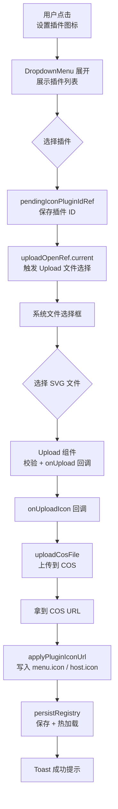

# Registry 图标上传：插件 SVG 图标 COS 上传与写入流程

> **文档角色**：插件 Registry 编辑器新增 SVG 图标上传功能的完整实现说明
> **延伸阅读**：[插件图标系统.md](./插件图标系统.md)（图标渲染系统）；[registry-editor-workflow.md](./注册图标上传.md)

## 1. 背景与目标

此前插件图标通过手动编辑 JSON 的 `menu.icon` / `host.icon` 字段设置，且仅支持 Lucide 图标名（如 `"Sparkle"`）。开发者需要一个便捷的 UI 来为指定插件上传 SVG 图标，自动写入 registry。

**目标**：在 Registry 编辑器顶栏新增「设置插件图标」下拉菜单，支持：
1. 选择已注册插件
2. 上传 SVG 文件到 COS
3. 自动将 COS URL 写入 `menu.icon` 和 `host.icon`（若存在）
4. 自动保存 registry 并热加载

## 2. 改动范围

| 路径 | 变更类型 | 说明 |
|------|----------|------|
| `apps/frontend/src/views/plugins/registry.tsx` | 重写 | 新增图标上传 UI（DropdownMenu + Upload）、上传逻辑 |
| `apps/frontend/src/components/design/Upload/index.tsx` | 修改 | 新增 `uploadType="button"`、`openRef`、`validExtensions`、SVG preview |
| `apps/frontend/src/components/ui/dropdown-menu.tsx` | 修改 | 新增 `scrollable` / `viewportClassName` props，支持长列表滚动 |
| `apps/frontend/src/components/ui/spinner.tsx` | 小改 | `text-default` → `text-textcolor` |
| `apps/frontend/src/i18n/locales/zh-CN.ts` | 修改 | 新增图标上传相关文案 |
| `apps/frontend/src/i18n/locales/en-US.ts` | 修改 | 新增图标上传相关英文文案 |
| `apps/frontend/src/federation/host/pluginIconUrl.ts` | 新增函数 | `applyPluginIconUrl`：批量写入 `menu.icon` / `host.icon` |
| `apps/frontend/src/federation/index.ts` | 修改 | barrel 新增 `applyPluginIconUrl` 导出 |

## 3. 实现思路

| # | 要点 | 说明 |
|---|------|------|
| 1 | Upload 挂菜单外 | 系统文件选择框会抢走焦点关闭 Dropdown，将 Upload 组件放在 Dropdown 外部（absolute 定位），通过 `openRef` ref 触发 |
| 2 | pendingIconPluginIdRef | 闭包变量保存当前选中的插件 ID，Upload 的 `onUpload` 回调读取此 ref |
| 3 | applyPluginIconUrl | 纯函数：遍历插件数组，对匹配 pluginId 的项写入 `menu.icon` / `host.icon` |
| 4 | persistRegistry | 统一持久化入口：`savePluginRegistry` + `pluginManager.init()` |
| 5 | busy 状态 | `loading \|\| saving \|\| !!uploadingPluginId` 统一控制所有按钮的 disabled 状态 |
| 6 | DropdownMenu scrollable | Radix DropdownMenuContent 包裹 ScrollArea，支持长列表滚动 |

## 4. 关键代码对比与注释

### 4.1 Upload 组件新增 `uploadType="button"` 与 `openRef`

**对比范围**：`Upload/index.tsx` 新增 props 与 button 渲染分支（约 L36–L50, L330–L366）

**改动前** · `apps/frontend/src/components/design/Upload/index.tsx`（基线，约 L19–L42）

```typescript
// 旧版：IProps 接口，uploadType 为 string 无类型约束
interface IProps {
    // ...
    /** image：展示预览区；无 button 类型 */
    uploadType?: string;
    // 无 openRef：无法从外部触发文件选择
    // 无 validExtensions：只靠 MIME type 校验
    // 无 buttonVariant / buttonSize / buttonClassName
}
```

**改动后** · `apps/frontend/src/components/design/Upload/index.tsx`（当前，约 L20–L50）

```typescript
// 新版：UploadProps 类型化，新增 button 模式与 openRef
export type UploadProps = {
    // 新增：扩展名兜底（如 .svg），MIME 为空时仍可通过校验
    validExtensions?: string[];
    // ...
    /** image：方块预览区；button：触发按钮（聊天附件等） */
    uploadType?: 'image' | 'button';
    // 新增：button 模式下透传 Button props
    buttonVariant?: ButtonVariant;
    buttonSize?: ButtonSize;
    buttonClassName?: string;
    // 新增：外部打开文件选择
    // 场景：Upload 挂在会卸载的 DropdownMenu 内 → 菜单关闭时 Upload 被卸载，
    // 文件选择框也被关闭 → 解决方案：把 Upload 放菜单外，用 ref 触发
    openRef?: React.MutableRefObject<(() => void) | null>;
};
```

**变更摘要**：
1. `uploadType` 从 `string` 收窄为 `'image' | 'button'`
2. 新增 `validExtensions`：支持扩展名兜底校验（`image/svg+xml` 常伴随空 MIME）
3. 新增 `buttonVariant` / `buttonSize` / `buttonClassName`：button 模式样式定制
4. 新增 `openRef`：外部触发文件选择器

#### `openRef` 实现

**当前** · `apps/frontend/src/components/design/Upload/index.tsx`（约 L139–L145）

```typescript
// openRef effect：将 triggerFileInput 注入外部 ref
useEffect(() => {
    if (!openRef) return;
    openRef.current = triggerFileInput;
    return () => { openRef.current = null; };
}, [openRef, disabled, loading]);
```

#### `validExtensions` 校验

**当前** · `apps/frontend/src/components/design/Upload/index.tsx`（约 L52–L71）

```typescript
// 文件类型校验：MIME + 扩展名双保险
function fileMatchesType(
    file: File,
    validTypes: string[],
    validExtensions: string[],
): boolean {
    // 1. MIME 精确匹配
    if (file.type && validTypes.includes(file.type)) return true;
    // 2. 通配符（如 image/*）
    if (validTypes.some((t) => t.endsWith('/*'))) {
        const prefix = validTypes.find((t) => t.endsWith('/*'))?.slice(0, -1);
        if (prefix && file.type.startsWith(prefix)) return true;
    }
    // 3. 扩展名兜底
    const name = file.name.toLowerCase();
    if (validExtensions.some((ext) => name.endsWith(ext.toLowerCase()))) {
        return true;
    }
    // 4. SVG 特殊处理：空 MIME 但扩展名匹配
    if (validTypes.includes('image/svg+xml') && name.endsWith('.svg')) {
        return true;
    }
    return false;
}
```

#### button 渲染分支

**当前** · `apps/frontend/src/components/design/Upload/index.tsx`（约 L330–L366）

```typescript
// button 模式：渲染为 Button + Tooltip
{uploadType === 'button' && (
    <Tooltip side="right" content={tooltipContent ?? t?.('upload.tooltip.default') ?? '仅支持PDF、Word、Excel文件'} disabled={!showTooltip}>
        <Button type="button" variant={buttonVariant} size={buttonSize}
            className={cn('bg-theme/5 mb-1 flex h-8 items-center rounded-md text-sm', buttonClassName)}
            disabled={disabled || loading} onClick={triggerFileInput}>
            {loading ? (
                <div className="flex items-center gap-2">
                    <Spinner className="text-textcolor" />
                    {t?.('upload.uploading') ?? '上传中...'}
                </div>
            ) : (
                children || (
                    <div className="flex items-center">
                        <UploadIcon className="text-textcolor mx-auto mr-2 h-8 w-8" />
                        {t?.('upload.button') ?? '上传文件'}
                    </div>
                )
            )}
        </Button>
    </Tooltip>
)}
```

**变更摘要**：Upload 组件从「只有 image 预览模式」扩展为「image + button 双模式」，新增 `openRef` 实现跨组件文件选择触发。

---

### 4.2 Registry 页面：图标上传 UI

**对比范围**：`registry.tsx` 新增状态、Upload 挂载、DropdownMenu 插件选择

**改动前** · `apps/frontend/src/views/plugins/registry.tsx`（基线，约 L1–L30）

```typescript
// 旧版：只有 ListRestart + Save 两个按钮，无图标上传入口
import { ListRestart, Save } from 'lucide-react';
// 无 Upload 导入
// 无 DropdownMenu 导入
// 无 applyPluginIconUrl / uploadCosFile 导入
// 无上传相关状态
```

**改动后** · `apps/frontend/src/views/plugins/registry.tsx`（当前，约 L1–L27）

```typescript
// 新增导入
import {
    DropdownMenu, DropdownMenuContent, DropdownMenuItem, DropdownMenuTrigger,
} from '@ui/dropdown-menu';
import { Toast } from '@ui/sonner';
// ★ 新增 ImageUp 图标
import { ImageUp, ListRestart, Save } from 'lucide-react';
// ★ 新增 Upload 组件
import Upload from '@/components/design/Upload';
import { Spinner } from '@/components/ui';
import { Button } from '@/components/ui/button';
// ★ 新增 applyPluginIconUrl（写入 menu.icon / host.icon）
import {
    applyPluginIconUrl, fetchPluginRegistryRawText,
    PLUGIN_REGISTRY_FILENAME, type PluginRegistry,
    pluginManager, savePluginRegistry,
} from '@/federation';
import { useI18n, useTheme } from '@/hooks';
// ★ 新增 uploadCosFile（上传到 COS）
import { uploadCosFile } from '@/service';
import type { FileWithPreview } from '@/types';
```

**变更摘要**：新增 DropdownMenu、Upload、ImageUp、applyPluginIconUrl、uploadCosFile 等依赖。

#### 新增状态

**当前** · `apps/frontend/src/views/plugins/registry.tsx`（约 L52–L65）

```typescript
// 新增上传相关状态
const [uploadingPluginId, setUploadingPluginId] = useState<string | null>(null);
// 新增：live ref 存编辑器文本（避免 onUploadIcon 闭包读到旧 text state）
const textLiveRef = useRef(text);
textLiveRef.current = text;
// 新增：Upload open ref
const uploadOpenRef = useRef<(() => void) | null>(null);
// 新增：闭包变量存当前选中插件 ID
const pendingIconPluginIdRef = useRef('');
```

#### `applyPluginIconUrl` 写入逻辑

**当前** · `apps/frontend/src/federation/host/pluginIconUrl.ts`（约 L19–L39）

```typescript
// 纯函数：将上传得到的 URL 写入指定插件的 menu.icon / host.icon
export function applyPluginIconUrl(
    data: PluginRegistry,
    pluginId: string,
    url: string,
): { next: PluginRegistry; wrote: Array<'menu' | 'host'> } {
    const wrote: Array<'menu' | 'host'> = [];
    // 遍历插件数组，找到匹配 ID 的项
    const plugins = data.plugins.map((p) => {
        if (p.id !== pluginId) return p;
        let next = p;
        // 有 menu → 写入 menu.icon
        if (p.menu) {
            next = { ...next, menu: { ...p.menu, icon: url } };
            wrote.push('menu');
        }
        // 有 host → 写入 host.icon
        if (p.host) {
            next = { ...next, host: { ...p.host, icon: url } };
            wrote.push('host');
        }
        return next;
    });
    return { next: { ...data, plugins }, wrote };
}
```

#### `onUploadIcon` 上传回调

**当前** · `apps/frontend/src/views/plugins/registry.tsx`（约 L157–L213）

```typescript
// 上传图标并写入 registry 的核心回调
const onUploadIcon = useCallback(
    async (pluginId: string, picked: FileWithPreview | FileWithPreview[]) => {
        // 取第一个文件（maxCount=1）
        const item = Array.isArray(picked) ? picked[0] : picked;
        const file = item?.file;
        if (!file || !pluginId || loading || saving || uploadingPluginId) return;

        // 从 live ref 读最新编辑器 JSON（避免闭包读到旧 state）
        const latest = getEditorTextRef.current?.() ?? textLiveRef.current;
        let data: PluginRegistry;
        try {
            data = JSON.parse(latest) as PluginRegistry;
        } catch {
            Toast({ type: 'warning', title: t('plugins.registry.invalidJson') });
            return;
        }
        // 校验目标插件存在
        if (!data.plugins.some((p) => p.id === pluginId)) {
            Toast({ type: 'warning', title: t('plugins.registry.pluginNotFound', { id: pluginId }) });
            return;
        }

        setUploadingPluginId(pluginId);
        try {
            // 1. 上传到 COS
            const res = await uploadCosFile(file);
            const url = res?.data?.url as string | undefined;
            if (!url) {
                Toast({ type: 'error', title: t('plugins.registry.iconUploadFail') });
                return;
            }
            // 2. 写入 menu.icon / host.icon
            const { next, wrote } = applyPluginIconUrl(data, pluginId, url);
            if (wrote.length === 0) {
                Toast({ type: 'warning', title: t('plugins.registry.iconNoTarget') });
                return;
            }
            // 3. 持久化 + 热加载
            await persistRegistry(next, t('plugins.registry.iconUploadOk'));
        } catch (e) {
            Toast({
                type: 'error',
                title: t('plugins.registry.iconUploadFail'),
                message: e instanceof Error ? e.message : t('plugins.registry.iconUploadFail'),
            });
        } finally {
            setUploadingPluginId(null);
        }
    },
    [loading, saving, uploadingPluginId, t, persistRegistry],
);
```

#### Upload 挂载策略

**当前** · `apps/frontend/src/views/plugins/registry.tsx`（约 L240–L255）

```typescript
// ★ Upload 挂在菜单外：absolute 定位 + openRef 触发
// 原因：系统文件选择框会抢走焦点关闭 Dropdown，菜单内 Upload 会被卸载
<Upload
    t={t}
    uploadType="button"          // button 模式
    className="pointer-events-none absolute h-0 w-0 overflow-hidden opacity-0"
    accept=".svg,image/svg+xml"
    validTypes={['image/svg+xml']}
    validExtensions={['.svg']}   // SVG 扩展名校验
    maxCount={1}
    maxSize={2 * 1024 * 1024}    // 2MB
    disabled={busy || jsonParseError}
    loading={!!uploadingPluginId}
    openRef={uploadOpenRef}       // ★ 外部 ref 触发
    onUpload={(picked) =>
        onUploadIcon(pendingIconPluginIdRef.current, picked)  // 读闭包变量
    }
/>
```

#### DropdownMenu 插件选择

**当前** · `apps/frontend/src/views/plugins/registry.tsx`（约 L296–L356）

```typescript
// 图标上传触发器：DropdownMenu + 插件列表
{pluginIds.length !== 0 ? (
    <DropdownMenu>
        <DropdownMenuTrigger asChild disabled={busy || pluginIds.length === 0}>
            <Button type="button" variant="link" size="sm" disabled={busy}
                aria-busy={!!uploadingPluginId}
                title={uploadingPluginId ? t('plugins.registry.iconUploading') : undefined}
                className={titleBarBtn}>
                <span className={titleIconSlot}>
                    {uploadingPluginId ? (
                        <Spinner className="size-4 p-0" aria-hidden />
                    ) : (
                        <ImageUp className="size-4" aria-hidden />
                    )}
                </span>
                {t('plugins.registry.iconUploadLabel')}
            </Button>
        </DropdownMenuTrigger>
        {/* ★ scrollable DropdownMenuContent */}
        <DropdownMenuContent align="end" className="min-w-50"
            viewportClassName="max-h-80">  {/* ScrollArea 高度上限 */}
            {pluginIds.map((id) => (
                <DropdownMenuItem key={id} className="gap-3 py-1 pr-0"
                    onClick={(e) => {
                        e.stopPropagation();
                        onPickPluginIcon(id);  // 设 ref + 触发文件选择
                    }}>
                    <span className="min-w-0 flex-1 truncate">{id}</span>
                    <div className="shrink-0 size-7 flex items-center justify-center"
                        onPointerDown={(e) => { e.preventDefault(); e.stopPropagation(); }}>
                        <ImageUp className="size-4 text-textcolor" aria-hidden />
                    </div>
                </DropdownMenuItem>
            ))}
        </DropdownMenuContent>
    </DropdownMenu>
) : null}
```

#### `onPickPluginIcon` 触发

**当前** · `apps/frontend/src/views/plugins/registry.tsx`（约 L228–L235）

```typescript
// 点击菜单项 → 保存插件 ID 到 ref → 触发 Upload 文件选择
const onPickPluginIcon = useCallback(
    (id: string) => {
        if (busy || jsonParseError) return;
        // ★ 保存插件 ID 到闭包 ref
        pendingIconPluginIdRef.current = id;
        // ★ 通过 openRef 触发 Upload 的文件选择器
        uploadOpenRef.current?.();
    },
    [busy, jsonParseError],
);
```

**变更摘要**：Upload 放菜单外避免卸载，通过 `openRef` + `pendingIconPluginIdRef` 实现菜单选择 → 触发文件选择 → 回调读取 ID 的完整流程。

---

### 4.3 DropdownMenu scrollable 增强

**对比范围**：`dropdown-menu.tsx` 新增 `scrollable` / `viewportClassName`

**当前** · `apps/frontend/src/components/ui/dropdown-menu.tsx`（约 L37–L79）

```typescript
// 新增 scrollable prop（默认 true）
scrollable = true,
// 新增 viewportClassName：传给 ScrollArea 的高度上限
viewportClassName = 'max-h-(--radix-dropdown-menu-content-available-height)',

// props 接口
interface DropdownMenuContentExtraProps {
    /** 默认用 ScrollArea；已自管滚动时传 false */
    scrollable?: boolean;
    /** 传给 ScrollArea root/viewport 的高度上限 */
    viewportClassName?: string;
}

// 渲染逻辑
{scrollable ? (
    <ScrollArea>
        <DropdownMenuPrimitive.Content>
            {/* ... children */}
        </DropdownMenuPrimitive.Content>
    </ScrollArea>
) : (
    <DropdownMenuPrimitive.Content>
        {/* ... children */}
    </DropdownMenuPrimitive.Content>
)}
```

**变更摘要**：DropdownMenuContent 可选包裹 ScrollArea，支持长列表滚动。Registry 页面用 `viewportClassName="max-h-80"` 限制插件列表高度。

---

### 4.4 i18n 新增文案

**中文** · `apps/frontend/src/i18n/locales/zh-CN.ts`（约 L1793–L1801）

```typescript
// 新增图标上传相关文案
'plugins.registry.iconUploadLabel': '设置插件图标',
'plugins.registry.iconPickPlugin': '选择插件',
'plugins.registry.iconUpload': '上传并写入',
'plugins.registry.iconUploading': '上传中…',
'plugins.registry.iconUploadOk': 'SVG 图标已上传并写入 registry',
'plugins.registry.iconUploadFail': '图标上传失败',
'plugins.registry.iconSvgOnly': '仅支持上传 SVG 文件',
'plugins.registry.iconNoTarget': '该插件没有 menu / host，无法写入 icon',

// 更新 help 文案：icon 从 lucide 图标名改为 SVG URL
'plugins.registry.help.menu': '侧栏入口：order 排序；icon 为 SVG 图片 URL（上传后写入，可选）。',
'plugins.registry.help.host': '业务页自动挂载：surface（如 ebook.read）、slot（drawer/toolbar）、icon（SVG URL）、order。',
```

**英文** · `apps/frontend/src/i18n/locales/en-US.ts`（约 L1945–L1953）

```typescript
'plugins.registry.iconUploadLabel': 'Set plugin icon',
'plugins.registry.iconPickPlugin': 'Select plugin',
'plugins.registry.iconUpload': 'Upload & write',
'plugins.registry.iconUploading': 'Uploading…',
'plugins.registry.iconUploadOk': 'SVG icon uploaded and written to registry',
'plugins.registry.iconUploadFail': 'Icon upload failed',
'plugins.registry.iconSvgOnly': 'Only SVG files are supported',
'plugins.registry.iconNoTarget': 'Plugin has no menu / host; cannot write icon',

'plugins.registry.help.menu': 'Sidebar entry: order; icon is an SVG image URL (upload, optional).',
'plugins.registry.help.host': 'Auto-mount on a host surface: surface (e.g. ebook.read), slot (drawer/toolbar), icon (SVG URL), order.',
```

---

### 4.5 Spinner 颜色修复

**当前** · `apps/frontend/src/components/ui/spinner.tsx`（约 L10）

```typescript
// 旧版：text-default（不跟随主题）
className={cn('size-5 pl-px animate-spin text-default', className)}
// 新版：text-textcolor（跟随主题色变量）
className={cn('size-5 pl-px animate-spin text-textcolor', className)}
```

**变更摘要**：Spinner 颜色从 `text-default`（固定色）改为 `text-textcolor`（主题变量），保证黑色/米色/绿色主题下 spinner 颜色正确。

## 5. 完整流程图



## 6. 兼容性与影响

| 项目 | 说明 |
|------|------|
| `uploadType` 类型 | 从 `string` 收窄为 `'image' \| 'button'`；旧代码传 `uploadType="image"` 仍兼容 |
| `openRef` | 新增 prop，不传则无副作用 |
| `validExtensions` | 新增 prop，不传则只靠 MIME 校验 |
| `applyPluginIconUrl` | 新增纯函数，不修改既有行为 |
| DropdownMenu `scrollable` | 默认 `true`，旧 DropdownMenuContent 自动获得滚动能力，如需关闭传 `scrollable={false}` |
| Spinner 颜色 | `text-default` → `text-textcolor`：可能影响个别硬编码深色背景下的显示 |
| `icon` 字段格式 | 从 Lucide 名改为 SVG URL：旧数据（Lucide 名）仍兼容（PluginIcon fallback Puzzle） |

## 7. 风险与回归清单

| 风险 | 排查 |
|------|------|
| DropdownMenu 关闭时文件选择框被关闭 | Upload 必须放 DropdownMenu 外部（absolute 定位） |
| SVG 校验通过但 fetch 失败 | `onUploadIcon` catch 分支有 Toast 提示；检查 COS 上传是否成功 |
| 插件无 menu/host | `applyPluginIconUrl` 返回 `wrote: []`，Toast 提示"无法写入" |
| 编辑器 JSON 已被用户修改 | `onUploadIcon` 从 `getEditorTextRef` / `textLiveRef` 读最新值 |
| 上传后菜单状态不一致 | `persistRegistry` 内部调用 `pluginManager.init()` 热加载 |
| DropdownMenu 长列表溢出 | `scrollable + viewportClassName="max-h-80"` 限制高度 |
| 主题切换时 Spinner 不可见 | `text-textcolor` 跟随主题变量，检查各主题变量定义 |

建议回归：
1. **上传成功路径**：选择有 menu + host 的插件 → 上传 SVG → 检查 JSON 中 icon 字段为 COS URL
2. **上传失败路径**：上传非 SVG 文件 → 检查 Toast 提示
3. **空目标路径**：选择无 menu/host 的插件 → 检查 Toast "无法写入" 提示
4. **下拉选择器**：插件列表超过 10 项 → 检查 DropdownMenu 是否可滚动
5. **主题切换**：切到黑色/米色主题 → Spinner 颜色是否正确
6. **并发保护**：上传过程中点击保存/重载 → 检查按钮 disabled 状态
7. **快捷键保护**：上传过程中按 ⌘/Ctrl+S → 检查是否被 `busy` 状态拦截

## 8. 相关源码路径

| 说明 | 路径 |
|------|------|
| Registry 编辑器页面 | `apps/frontend/src/views/plugins/registry.tsx` |
| Upload 组件（button 模式 + openRef） | `apps/frontend/src/components/design/Upload/index.tsx` |
| DropdownMenu（scrollable） | `apps/frontend/src/components/ui/dropdown-menu.tsx` |
| Spinner 组件 | `apps/frontend/src/components/ui/spinner.tsx` |
| i18n 中文文案 | `apps/frontend/src/i18n/locales/zh-CN.ts` |
| i18n 英文文案 | `apps/frontend/src/i18n/locales/en-US.ts` |
| `applyPluginIconUrl` | `apps/frontend/src/federation/host/pluginIconUrl.ts` |
| Federation barrel | `apps/frontend/src/federation/index.ts` |
| `uploadCosFile` 服务 | `apps/frontend/src/service/` |

---

（若与仓库最新源码不一致，以源码为准）
