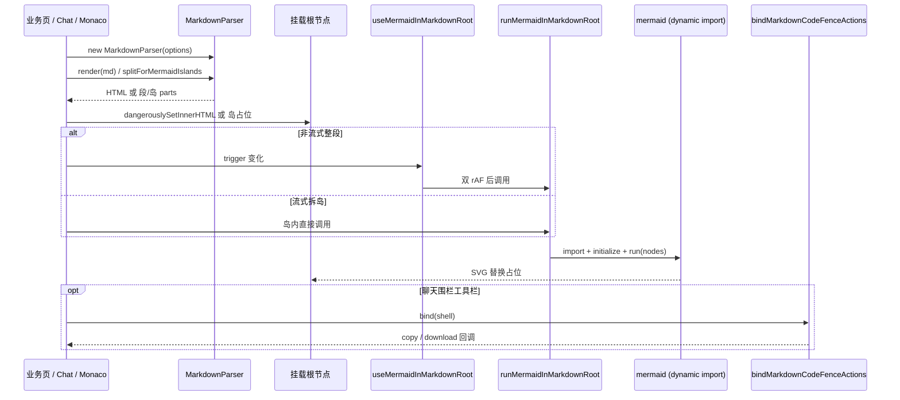

# 我们怎么做「可复用」Markdown 渲染（技术分享稿）

> **时长**：口播约 5–8 分钟（按「主链 + 3 个硬点」讲；附录可会后看）  
> **目标**：听完能说出 **解析 → 挂载 → 出图 → 交互 → 流式拆岛** 每一步调了谁、为什么这么写  
> **对照源码**：  
> - 工具包 `packages/markdown-kit`  
> - 文档页 `apps/frontend/src/views/document/index.tsx`  
> - 聊天流式 `apps/frontend/src/components/design/ChatAssistantMessage/`  
> - Monaco 分屏 `apps/frontend/src/components/design/Markdown/` / `Monaco/`

---

## 0. 技术栈一句话（先对齐名词）

| 角色 | 技术 | 本仓落点 |
|------|------|----------|
| 解析内核 | **markdown-it** + KaTeX / task-lists / hljs | `MarkdownParser`（`src/markdown/parser.ts`） |
| 图示 | **Mermaid**（占位 DOM + 浏览器内 `mermaid.run`） | `src/mermaid/*` + `@dnhyxc-ai/markdown-kit/react` |
| 代码体验 | 围栏 DOM 契约 + 复制/下载绑定 | `code-fence-dom.ts` / `code-fence-actions.ts` |
| 样式 | github-markdown-css + KaTeX + hljs 多主题 | `styles.css` / `markdown-base.css` / `styles/hljs/*` |
| 产品接线 | 文档预览、知识库、聊天、Monaco 分屏 | `apps/frontend` 多处，**禁止业务再手写一套 fence 选择器** |

**反直觉结论（开场 20 秒）**：  
`parser.render(md)` 得到 HTML **不等于**「Markdown 页做完了」。  
真正成立的闭环是：**解析出契约 DOM → 宿主挂载 →（可选）Mermaid 二次出图 →（可选）围栏事件绑定**；流式聊天还要再加一层 **拆岛**，否则整段 `innerHTML` 会把已画好的 SVG 冲掉。

---

## 1. 端到端主链（口播核心 · ~2 分钟）

听完这一节，脑子里要有这条链（函数名可对源码）：

```text
业务拿到 markdown 字符串
  └─ new MarkdownParser(options)
       ├─ markdown-it 插件：KaTeX / task-lists / 外链 target=_blank …
       ├─ fence 规则：mermaid → 占位；普通语言 → hljs；可选聊天工具栏 DOM
       └─ 可选：标题 data-md-heading-line / 锚点 id

  └─ html = parser.render(md)   // 外包 <div class="markdown-body">…

宿主挂载
  └─ <div ref={root} dangerouslySetInnerHTML={{ __html: html }} />
       ├─ 文档 / Monaco（非流式）
       │    useMermaidInMarkdownRoot({ rootRef, trigger, preferDark, parser })
       │      → 双 rAF 后 runMermaidInMarkdownRoot(root)
       │           → 动态 import('mermaid') → initialize(主题) → mermaid.run({ nodes })
       └─ 聊天助手（流式）
            enableMermaid: false          // 解析器不再吐 mermaid 占位
            splitForMermaidIslands…       // markdown 段 / mermaid 岛交替
            岛内：占位 HTML + runMermaidInMarkdownRoot
            壳上：bindMarkdownCodeFenceActions(shell)  // 复制 / 下载
```

### 1.1 最小可用：静态预览（文档页同款）

```tsx
// 对照 apps/frontend/src/views/document/index.tsx
import { MarkdownParser } from '@dnhyxc-ai/markdown-kit';
import { useMermaidInMarkdownRoot } from '@dnhyxc-ai/markdown-kit/react';
import '@dnhyxc-ai/markdown-kit/styles.css';

const parser = useMemo(
  () => new MarkdownParser({ highlightTheme: preferDark ? 'github-dark' : 'github' }),
  [preferDark],
);

useMermaidInMarkdownRoot({ rootRef, preferDark, trigger: markdown, parser });

return <div ref={rootRef} dangerouslySetInnerHTML={{ __html: parser.render(markdown) }} />;
```

**实现要点**：

1. **`rootRef` 必须与 `dangerouslySetInnerHTML` 同层（或包住它）**，否则 Hook 扫不到 `.mermaid` 占位。  
2. **`trigger` 要跟正文一起变**（`markdown` 或预计算的 `html`），否则 DOM 已更新、Mermaid 不重跑。  
3. **样式走子路径入口**（`styles.css` / `markdown-base.css`）；包声明 `sideEffects: true`，别指望只靠 tree-shake 出完整排版。

### 1.2 条件导出：为什么拆三个入口

| 子路径 | 干什么 | 不干什么 |
|--------|--------|----------|
| `@dnhyxc-ai/markdown-kit` | Parser、围栏 API、主题注入、DOM 常量 | **不**拉 React、**不**静态打进整个 mermaid |
| `@dnhyxc-ai/markdown-kit/react` | Hook / `runMermaidInMarkdownRoot` | 无 React 的 Node 侧勿引 |
| `…/styles.css` 等 | 一键或拆分 CSS | — |

Mermaid 在 `runMermaidInMarkdownRoot` 里 **首次才 `import('mermaid')`**，避免路由壳把图库打进主包。

---

## 2. 硬点 A · 两阶段 Mermaid：占位 ≠ 出图（~1.5 分钟）

文件：`parser.ts`（fence 补丁）、`mermaid/in-markdown.ts`、`react/use-mermaid-in-markdown-root.ts`

### 2.1 解析器只负责「契约 HTML」

开启 `enableMermaid`（默认 true）时，` ```mermaid ` 不走普通代码高亮，而是输出与选择器常量对齐的结构：

```html
<div class="mermaid-markdown-wrap" data-mermaid="1">
  <div class="mermaid">…DSL…</div>
</div>
```

常量集中在 `MARKDOWN_MERMAID_*` / `MERMAID_ENTRY_*`（`markdown-selectors.ts`）。  
**业务侧禁止手写 class / data 属性字符串**——岛组件、缩放预览、工具栏都靠同一套选择器。

另有 `normalizeMermaidFenceBody`：流式/粘贴进来的方括号标签等做宽松处理，减少「DSL 几乎对但 mermaid 报错」的闪烁。

### 2.2 运行时：队列 + 主题签名 + 动态加载

```ts
// runMermaidInMarkdownRoot（简化）
runQueue = runQueue.then(async () => {
  const nodes = queryMermaidMarkdownEntryNodes(root); // 全子树，不只第一个 .markdown-body
  const mermaid = await loadMermaid();                // 动态 import + 解 default 套娃
  ensureMermaidInitialized(mermaid, preferDark);      // 同主题不重复 initialize
  await mermaid.run({ nodes, suppressErrors });
});
```

**三个工程决策**：

| 决策 | 原因 |
|------|------|
| **全局 `runQueue` 串行** | 多处同时 `mermaid.run` 会打乱内部状态 |
| **`lastMermaidInitSignature` 按 dark/default** | 避免每次 run 都 `initialize` 导致主题抖动 |
| **`resolveMermaidApi` 剥最多 3 层 default** | Vite / MF 下 `import('mermaid')` 形状不稳定 |

### 2.3 Hook：双 rAF + 节流（不是防抖）

```ts
// useMermaidInMarkdownRoot：布局提交后再扫
requestAnimationFrame(() => {
  requestAnimationFrame(() => {
    if (runId !== generationRef.current) return; // 代数丢弃过期帧
    void runMermaidInMarkdownRoot(root, {
      preferDark,
      suppressErrors: throttleMs > 0, // 流式中间态 DSL 常不完整
    });
  });
});
```

**必讲一句**：流式场景若用**防抖**，每次 chunk 都 `clearTimeout`，会变成「停流才出图」；要用 **`throttleMs` 节流**，保证持续有增量时仍按间隔跑。

---

## 3. 硬点 B · 流式拆岛：整段 HTML 冲不掉 SVG（~1.5 分钟）

文件：`parser.splitForMermaidIslands`；应用侧 `StreamingMarkdownBody` + `MermaidFenceIsland` + `splitForMermaidIslandsWithOpenTail`

### 3.1 问题

聊天助手高频：

```tsx
setHtml(parser.render(fullMarkdownSoFar));
// dangerouslySetInnerHTML 整段替换 → 上一次 mermaid.run 生成的 <svg> 被销毁
```

单靠 `useMermaidInMarkdownRoot` **治不好**——根因是「整树 HTML 被换」，不是「没调用 run」。

### 3.2 解法：markdown 段与 mermaid 岛分治

```text
parser（聊天）: enableMermaid: false
  → 普通围栏可带工具栏；mermaid 不当占位吐出

splitForMermaidIslands(source) → MarkdownMermaidSplitPart[]
  | { type: 'markdown', text, lineBase0 }
  | { type: 'mermaid', text, complete }

渲染：
  markdown 段 → parser.render(段) → 静态 HTML 子树（可高频替换）
  mermaid 岛  → 独立 React 节点，内部写 MARKDOWN_MERMAID_PLACEHOLDER_HTML
               → runMermaidInMarkdownRoot(host)
               → 岛不因前后 markdown 段更新而 unmount（key 稳）
```

应用侧再包一层 **开放尾部**（`splitForMermaidIslandsWithOpenTail`）：流式末尾未闭合的 ` ```mermaid ` 也单独成块，避免半截围栏被塞进整段 HTML。

### 3.3 和「整段扫描」怎么选

| 场景 | 推荐 | 原因 |
|------|------|------|
| 文档页、知识库、已落盘正文 | `render` + `useMermaidInMarkdownRoot` | 更新低频，实现最短 |
| Monaco 分屏预览 | 同上；可关 `enableMermaid` | 与编辑器同步，偶发大文档 |
| SSE / 打字机助手消息 | **拆岛** | 保已渲染 SVG；未闭合围栏可抑制错误闪烁 |

---

## 4. 硬点 C · 围栏 DOM 契约 + 事件绑定（~1 分钟）

文件：`code-fence-dom.ts`、`code-fence-actions.ts`；接线 `ChatAssistantMessage`

### 4.1 解析器只产出结构，不绑点击

`enableChatCodeFenceToolbar: true` 时，fence 输出带 `data-*` 的工具栏（复制 / 下载文案可配）。  
**样式与点击在宿主**：吸顶条、浮动条、下载落盘策略都是产品差异，不进 kit 死逻辑。

### 4.2 一行绑定

```ts
const detach = bindMarkdownCodeFenceActions(shellEl, {
  onDownload(payload) {
    // payload.code / lang / filename / blob…
  },
});
// unmount 时 detach()
```

导出 `MARKDOWN_CODE_FENCE_*`、`queryMarkdownCodeFenceBlockRoots`、`getMarkdownCodeFencePlainText` 等，让聊天工具条、Monaco 预览、自定义吸顶条 **共用同一套 DOM 契约**。

### 4.3 Monaco：标题行号属性

```ts
new MarkdownParser({
  enableHeadingSourceLineAttr: true, // data-md-heading-line（1-based）
  enableChatCodeFenceToolbar: true,
});
```

预览滚动对齐编辑器、目录锚点（`enableHeadingAnchorIds`，默认开）都靠解析期补属性，而不是预览后再扫一遍文本。

---

## 5. 样式 / 主题 / 安全（~1 分钟，对着产品）

### 5.1 三种引样式方式

| 方式 | 用法 | 适合 |
|------|------|------|
| 一键 | `import '…/styles.css'` | 演示、文档工具页 |
| 正文 + 自选 hljs | `markdown-base.css` + `styles/hljs/<主题>.min.css` | 要跟 App 主题精细对齐 |
| 离线 / `?raw` | `highlightThemeCss: cssString` | 无 CDN、Tauri 等 |

运行时也可 `applyHighlightJsTheme({ themeId })` / `clearAppliedHighlightJsTheme()`（全局单例 `<style>` 节点）。

### 5.2 XSS 底线

| 选项 | 默认 | 含义 |
|------|------|------|
| `html` | **`false`** | Markdown 里的 raw HTML 当文本转义，不进 DOM 执行 |
| 若业务必须 `html: true` | — | **宿主必须 sanitize** 后再 `innerHTML` |

分享可带一句：聊天场景输入不可信，默认关 HTML 不是「功能阉割」，是信任边界。

### 5.3 本仓落地地图（三种挂载，共用 Parser）

| 形态 | 产品例子 | 关键组合 |
|------|----------|----------|
| **A 整段预览** | 文档分析、用户消息、会话列表标题 | `render` +（可选）`useMermaidInMarkdownRoot` |
| **B 编辑器分屏** | Monaco Markdown 预览 | `render` + 行号属性 + 围栏工具栏 + Mermaid Hook |
| **C 流式助手** | ChatAssistantMessage | `enableMermaid: false` + 拆岛 + `bindMarkdownCodeFenceActions` |

---

## 6. 收尾 · 带走 5 条可落地结论

1. **闭环** = `MarkdownParser.render`（契约 HTML）+ 挂载 +（可选）`runMermaidInMarkdownRoot` +（可选）`bindMarkdownCodeFenceActions`，不是单次 `render`。  
2. **Mermaid 两阶段**：解析器只吐占位；出图在浏览器队列里动态加载；Hook 用双 rAF，流式用 **节流不是防抖**。  
3. **流式必拆岛**：整段 `dangerouslySetInnerHTML` 会冲掉 SVG；`splitForMermaidIslands` + 独立岛才是根治。  
4. **DOM 契约进包、交互在宿主**：围栏 / Mermaid 选择器只从 kit 常量取；复制下载用 `bindMarkdownCodeFenceActions`。  
5. **默认 `html: false`**；样式走导出子路径；React / Mermaid 走 `/react`，避免主包重量与 peer 污染。

### 会后深挖路径

| 主题 | 文档 / 代码 |
|------|-------------|
| 对外用法与拷贝示例 | `packages/markdown-kit/README.md` |
| 维护者 API / 故障排查 | `packages/markdown-kit/INFO.md`、`docs/tools.md` |
| 流式围栏拆分（应用侧） | `apps/frontend/src/utils/splitMarkdownFences.ts` |
| 岛组件与缩放预览 | `MermaidFenceIsland`、`docs/mermaid/` |
| 单测 | `packages/markdown-kit/test/**`（parser / mermaid / code-fence / react hook） |

---

## 附录 A · 口播时间盒（讲者用）

| 段 | 时长 | 必讲 | 可砍 |
|----|------|------|------|
| 开场 + 主链 | 2min | render → 挂载 → Mermaid / 围栏 | KaTeX、task-list 细节 |
| 硬点 A Mermaid | 1.5min | 占位 vs run、队列、动态 import | default 套娃解包 |
| 硬点 B 拆岛 | 1.5min | 为什么冲 SVG、split + 岛、开放尾部 | lineBase0 与 Monaco 对齐 |
| 硬点 C 围栏契约 | 1min | toolbar DOM + bind、标题行号 | 吸顶条产品 UI |
| 样式 / XSS / 三种挂载 + 收尾 | 1min | html:false、文档 vs 聊天各一例 | CDN 主题注入实现 |

**可选现场 Demo（+1min）**：

1. 文档页打开含 ` ```mermaid ` 的正文 → Elements 先看到占位 → Network/断点看到动态加载 mermaid → SVG 出现。  
2. 聊天流式画一张图 → 继续打字：岛内 SVG 仍在，只有 markdown 段在刷。  
3. 点代码块「复制」→ 断点进 `bindMarkdownCodeFenceActions`，对照 `MARKDOWN_CODE_FENCE_*` 属性。

---

## 附录 B · 一张图记住调用关系



---

## 附录 C · 源码目录速查（对着仓库讲）

| 路径 | 职责 |
|------|------|
| `src/markdown/parser.ts` | `MarkdownParser`、`splitForMermaidIslands`、`normalizeMermaidFenceBody` |
| `src/markdown/code-fence-dom.ts` | 围栏 DOM 常量与查询 |
| `src/markdown/code-fence-actions.ts` | 复制/下载绑定与纯函数 |
| `src/mermaid/markdown-selectors.ts` | Mermaid 占位选择器契约 |
| `src/mermaid/in-markdown.ts` | `runMermaidInMarkdownRoot` 队列 |
| `src/react/use-mermaid-in-markdown-root.ts` | React Hook（节流 / 代数） |
| `src/highlight/*` | 主题注入、说明符、构建生成的 styles |
| `scripts/build-mk-css.js` | 合并 CSS + 生成主题 id 列表 |
