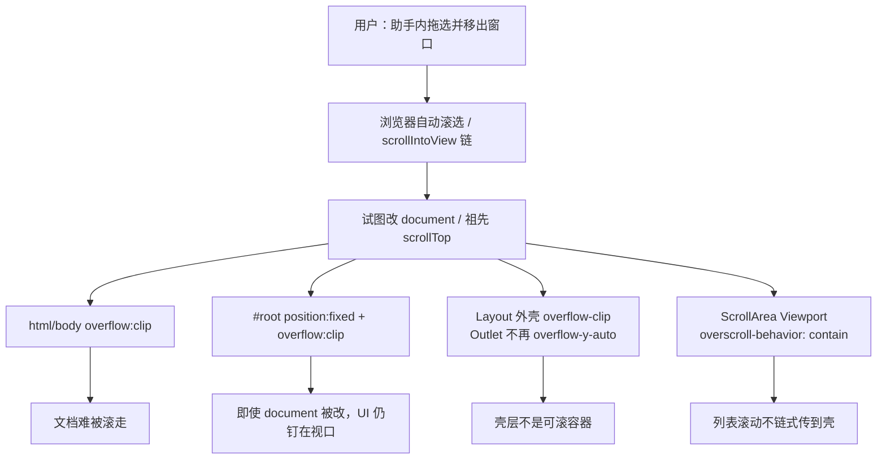

# 助手拖选移出窗口整页上移（功能实现详解与复刻指南）

> **一句话**：在助手消息里拖选文字并按住鼠标移出整个应用窗口时，页面不再整体上移、底边不再露出黑缝；上下留白保持一致。  
> **入口**：任意走主 Layout 的页面 → 打开助手（如电子书「MK 问书」、知识库助手、英语 Agent）→ 在消息 Markdown 正文拖选 → 按住左键移出应用窗口边界。  
> **关联文件**：`apps/frontend/src/index.css`、`apps/frontend/src/layout/index.tsx`、`apps/frontend/src/components/ui/scroll-area.tsx`  
> **文档目标**：讲清「为何会整页上移」与「当前纯 CSS 壳层方案」；按复刻手册可在其他 SPA / Tauri / Electron 项目落地等价防护。  
> **非目标**：助手右键菜单与朗读（见 [chat/助手选区朗读指南.md](../chat/助手选区朗读指南.md)）；EPUB 正文 iframe 选区；章节听书滚动高亮。

---

## 0. 先看这里（必填，一眼建立模型）

### 0.1 30 秒读懂

- **做什么**：防止「拖选移出窗口」时浏览器自动滚选把**文档壳**顶歪，导致侧栏 + 主内容一起上移、窗口底部出现黑边。
- **不做什么**：不禁止消息列表内部正常滚动；不改选区业务逻辑；不依赖全局 `scroll` 监听钉回 `scrollTop`（已弃用）。
- **关键角色**：
  - **界面层**：助手消息可 `select-text`，列表在 `ScrollArea` 内滚。
  - **壳层**：`#root` 用 `position: fixed` 钉在视口；`html/body` 与 Layout Outlet 用 `overflow: clip`，不再做文档级滚动容器。
  - **滚动组件**：`ScrollArea` Viewport 用 `overscroll-behavior: contain` 切断滚动链。

### 0.2 功能点总表（必填）

| 编号 | 功能点（人话） | 用户可感知表现 | 关键实现位置（文件 → 符号） | 正文小节 |
|------|----------------|----------------|------------------------------|----------|
| F1 | `#root` 钉在视口，文档被改 `scrollTop` 也不带动 UI | 拖选移出窗口后上下间距仍一致 | `index.css` → `#root` | §4.1 |
| F2 | 文档层 `html/body` 用 `overflow: clip` | 文档本身尽量不可滚 | `index.css` → `html, body` | §4.2 |
| F3 | Layout Outlet 不用 `overflow-y-auto`，改用 `overflow-clip` | 选区自动滚选找不到壳层可滚祖先 | `layout/index.tsx` → `Layout` | §4.3 |
| F4 | ScrollArea 切断滚动链 + Root 用 clip | 列表滚到顶/底不会把滚动传给外层壳 | `scroll-area.tsx` → `ScrollArea` | §4.4 |

### 0.3 架构一图（必填）



### 0.4 文件地图与建造顺序（必填）

| 建造序 | 文件 | 职责（一句话） | 依赖 |
|--------|------|----------------|------|
| 1 | `apps/frontend/src/index.css` | 文档层 clip + `#root` fixed 钉视口 | 无 |
| 2 | `apps/frontend/src/layout/index.tsx` | 主壳与 Outlet 用 `overflow-clip`，滚动交给路由页 | 1 |
| 3 | `apps/frontend/src/components/ui/scroll-area.tsx` | 列表视口 `overscroll-behavior-contain`，Root `overflow-clip` | 无（可与 1 并行） |

---

## 1. 人话版：用户旅程（必填）

1. **进入**：打开电子书阅读并打开右侧「MK 问书」，或打开知识库助手 / 英语 Agent；助手里已有可选中的 Markdown 正文。
2. **主路径**：在助手消息里按下鼠标拖出一段选区，**不松手**，把光标移到应用窗口外（甚至移到屏幕边缘）。此时浏览器会「跟着选区往外滚」——以前整页（含左侧导航）会往上挪，底下露出一条黑边，上下留白不再对称；**修好后**主界面仍贴在窗口内，只允许助手消息列表自己滚动（若需要）。
3. **分支**：
   - 只在助手面板内拖选、不移出窗口：行为与平时一致，列表可正常滚。
   - 松手后选区仍在：布局不应保持「歪掉」的状态。
4. **离开**：关闭助手或切路由；壳层 CSS 全局生效，无需额外清理。

---

## 2. 问题与解决方案总表（必填）

| 问题编号 | 现象 / 风险（人话） | 根因 | 解决方案（本项目做法） | 对应功能点 |
|----------|---------------------|------|------------------------|------------|
| P1 | 拖选移出窗口后整页上移、底边黑缝 | 浏览器自动滚选会改 `document` / 可滚祖先的 `scrollTop`；`#root` 若只是文档流内 `height:100%`，会跟着文档一起被顶走 | `#root { position: fixed; inset: 0; overflow: clip }` | F1 |
| P2 | 仅设 `overflow: hidden` 仍会被改 `scrollTop` | `hidden`/`auto` 仍是 scroll container；WKWebView 拖选时仍可能写 `scrollTop` | 文档层改用 `overflow: clip`；关键路径不依赖「hidden 等于不可滚」 | F2 |
| P3 | Layout 包 Outlet 的 `overflow-y-auto` 成为自动滚选目标 | 选区/`scrollIntoView` 会沿滚动链滚**所有**可滚祖先（仓库内 Monaco 注释亦有同结论） | Outlet 改为 `overflow-clip`；页面滚动交给页内 `ScrollArea` | F3 |
| P4 | 列表滚到边界后滚动「漏」到外层 | 默认 overscroll 会 scroll chaining | Viewport `overscroll-behavior-contain` | F4 |
| P5 | 用捕获阶段 `scroll` 监听钉回 `document.scrollTop` | 能修，但每个页内滚动都会进回调（虽早退，仍有监听成本）；且治标不治本 | **弃用 JS 钉滚动**，改 F1–F4 纯 CSS | — |

---

## 3. 实现思路总览（必填）

### 3.1 总体策略

这不是「助手业务 bug」，而是 **桌面 WebView / 浏览器在拖选越界时的自动滚选** 打到了 **SPA 壳层滚动模型**。

三层防护，由内到外：

1. **切断链**：列表视口 `overscroll-behavior: contain`，边界处不再把滚动量传给祖先。  
2. **别当可滚祖先**：Layout / Outlet / ScrollArea Root 用 `overflow: clip`，不要用 `overflow-y-auto` 包整页。  
3. **钉住视口（关键）**：`#root` `position: fixed; inset: 0`。即使 WKWebView 仍改了 `document` 的 `scrollTop`，应用 UI 相对视口不动——这与「JS 每次 scroll 钉回 0」效果同类，但零运行时开销。

**为何不用更简单做法**：只写 `overflow: hidden` 或只写 `clip` 而不 `fixed`——在本仓库实测中，拖选移出窗口时仍可能整页上移（P1/P2）。JS 钉滚动有效但不符合「尽量纯 CSS」与性能偏好。

### 3.2 数据流与控制流

无业务状态机。事件流：

```text
mousedown 选区 → 指针移出窗口
  → 浏览器自动滚选 / 滚动链
  →（旧）document 或 Layout overflow-y-auto 的 scrollTop↑ → UI 上移
  →（新）ScrollArea contain + 壳层 clip + #root fixed → 视觉稳定
```

### 3.3 模块职责

| 模块 | 谁调用我 | 我调用谁 |
|------|----------|----------|
| `index.css` `#root` / `html,body` | 浏览器渲染整页 | 无 |
| `Layout` | 路由根布局 | `Outlet`、Sidebar、Header |
| `ScrollArea` | AssistantShell、各业务列表 | Radix ScrollArea Viewport |

---

## 4. 分功能点详解（必填，核心）

### 4.1 F1：`#root` 钉在视口

#### （1）人话说明

应用真正画在 `#root` 里。若 `#root` 只是普通块级、跟着文档排版，文档一旦被滚，整块 UI（侧栏、顶栏、内容）都会往上挪，底下露出窗口背景（看起来像黑缝）。把 `#root` 固定在视口四边上，文档怎么滚，界面都钉在窗口里。

#### （2）实现思路

这是 Electron / Tauri SPA 常见的 **app shell** 写法：应用层与 `document` 滚动解耦。注释里写明动机：拖选移出窗口时 document 被改 `scrollTop` 也不带动整页 UI。

#### （3）问题与对策

对应 **P1**。边界：子元素自己的 `ScrollArea` / `overflow:auto` 仍可滚；`position:fixed` 的 `#root` 不影响页内滚动容器。

#### （4）实现过程

1. 在全局样式为 `#root` 设置 `position: fixed` 与 `inset: 0`。  
2. 同时设 `overflow: clip`，避免 `#root` 自身再成为可滚容器。  
3. 背景、字体等原有样式保留。

#### （5）关键代码（逐行上方注释）

- **位置**：`apps/frontend/src/index.css` → `#root`（约 L401–L412）
- **说明**：整页 UI 的视口锚点；本滚动问题的主修复

```css
/* 应用挂载根：所有 React 树画在这里 */
#root {
	/* 相对视口固定，而不是跟着 document 文档流滚动 */
	position: fixed;
	/* 四边贴齐视口，等价于铺满窗口 */
	inset: 0;
	/* 根节点自身不可被程序/拖选改成可滚容器 */
	overflow: clip;
	/* 主题背景色，黑缝若出现时往往是露出了更外层背景 */
	background-color: var(--background);
	/* 主题氛围渐变（与本滚动修复无关，保留原样） */
	background-image: var(--theme-bg-atmosphere);
	/* 渐变不平铺 */
	background-repeat: no-repeat;
	/* 渐变铺满根节点 */
	background-size: cover;
	/* 全局字体变量 */
	font-family: var(--font-family);
}
```

#### （6）复刻提示

- 可原样搬迁：`#root` / `#app` 的 `position: fixed; inset: 0; overflow: clip`。  
- 须替换：根节点 id（有的项目叫 `#app`）。  
- 最小验证：DevTools 里手动把 `document.documentElement.scrollTop = 100`，界面不应整体上移。

---

### 4.2 F2：文档层 `html/body` 使用 `overflow: clip`

#### （1）人话说明

告诉浏览器：整页文档不要当滚动容器。`clip` 比 `hidden` 更严——规范上不允许再通过改 `scrollTop` 去滚这块区域（实际引擎仍可能有例外，所以要配合 F1）。

#### （2）实现思路

与 F1 叠加：能 clip 则 clip；clip 被引擎绕过时，fixed `#root` 兜底。`overscroll-behavior: none` 减少弹性滚动传导。

#### （3）问题与对策

对应 **P2**。注意：不要误以为「写了 overflow:hidden 就永远 scrollTop=0」。

#### （4）实现过程

1. `html, body` 设满高满宽、去 margin。  
2. `overflow: clip` + `overscroll-behavior: none`。  
3. 保留全局 `user-select: none`（助手消息区另行 `select-text`）。

#### （5）关键代码（逐行上方注释）

- **位置**：`apps/frontend/src/index.css` → `html, body`（约 L19–L30）
- **说明**：文档层滚动策略

```css
/* 同时命中文档元素与 body */
html,
body {
	/* 去掉默认外边距，避免 100% 高度计算偏差 */
	margin: 0;
	/* 去掉默认内边距 */
	padding: 0;
	/* 占满视口高度，配合子级 h-full */
	height: 100%;
	/* 占满视口宽度 */
	width: 100%;
	/* 禁止橡皮筋/滚动链传到外层视口 */
	overscroll-behavior: none;
	/* 文档层禁止滚动；即便引擎仍改 scrollTop，#root fixed 也不跟着走 */
	overflow: clip;
	/* 默认禁止整页误选；输入框/编辑器/助手正文另行放开 */
	-webkit-user-select: none;
	/* 标准属性：同上 */
	user-select: none;
}
```

#### （6）复刻提示

- 可原样搬迁：`overflow: clip` + `overscroll-behavior: none`。  
- 若必须兼容极老浏览器：可回退 `overflow: hidden`，但务必保留 F1。  
- 最小验证：拖选移出窗口后 `document.scrollingElement.scrollTop` 即使非 0，UI 仍应稳定（靠 F1）。

---

### 4.3 F3：Layout 壳层与 Outlet 使用 `overflow-clip`

#### （1）人话说明

主布局里曾经用 `overflow-y-auto` 包住整页路由内容。拖选时浏览器会把这个「整页滚动条」当成自动滚选目标，于是看起来像整个应用在动。现在壳层只裁剪、不滚动；真正要滚的内容在各页面自己的 `ScrollArea` 里。

#### （2）实现思路

与仓库内既有结论一致（如 Monaco：禁止对标题 `scrollIntoView` 滚到 Layout Outlet）。注释写明：文档被拖选顶歪时靠 `#root` fixed；Outlet 勿用 `overflow-y-auto`。

#### （3）问题与对策

对应 **P3**。边界：依赖「Layout 外层滚动」的旧页面需自备内部滚动；本仓库主要页面已用 `h-full` + `ScrollArea`。

#### （4）实现过程

1. 含侧栏的外层 flex 容器：`overflow-clip`。  
2. Header 下方 Outlet 容器：`overflow-clip` + 固定高度计算，**不要** `overflow-y-auto`。  
3. 不在 Layout 挂全局 `scroll` 监听。

#### （5）关键代码（逐行上方注释）

- **位置**：`apps/frontend/src/layout/index.tsx` → `Layout` 返回的壳层 JSX（约 L84–L131）
- **说明**：只摘与滚动壳相关的结构；鉴权 Toast / 影院态订阅等同文件其它逻辑此处省略

```tsx
// Layout 组件默认导出：整站主壳
const Layout = () => {
	// 此处省略：路由、鉴权、影院态、主题等与本滚动问题无关的逻辑
	// ...

	// 返回主壳 DOM
	return (
		// 聊天核心 Context 包住整站布局
		<ChatCoreProvider>
			{/* 最外层 main：背景与圆角；高度继承 #root */}
			<main
				className={cn(
					"relative flex h-full w-full bg-theme-background",
					theater ? "rounded-none" : "rounded-md",
				)}
			>
				{/*
				  壳层 overflow-clip；文档被拖选顶歪时靠 #root position:fixed（index.css）钉住视口。
				  路由页滚动交给各自 ScrollArea。overflow 不与 rounded 同层，以免废掉 backdrop-filter。
				*/}
				{/* 侧栏 + 内容列：clip，避免成为选区自动滚选的祖先 */}
				<div className="relative flex h-full w-full min-w-0 flex-1 overflow-clip">
					{/* 非影院态渲染侧栏 */}
					{theater ? null : <Sidebar />}
					{/* Tooltip 上下文 */}
					<TooltipProvider>
						{/* 内容列：含窗口拖拽区与内边距 */}
						<div
							data-tauri-drag-region
							className={cn(
								"box-border flex h-full w-full min-w-0 max-w-full flex-1 flex-col",
								theater ? "rounded-none p-0" : "rounded-md py-7 pr-7",
							)}
						>
							{/* 主题次级背景卡片 */}
							<div
								className={cn(
									"relative h-full w-full min-w-0 max-w-full bg-theme-secondary",
									theater ? "rounded-none" : "rounded-md",
								)}
							>
								{/* Header + Outlet 外层再 clip 一层 */}
								<div className="relative h-full w-full min-w-0 max-w-full overflow-clip">
									{/* 顶栏 */}
									{theater ? null : <Header />}
									{/* Outlet 槽：固定高度 + overflow-clip，禁止整页 overflow-y-auto */}
									<div
										className={cn(
											"box-border min-h-0 min-w-0 w-full max-w-full overflow-clip",
											theater ? "h-full" : "h-[calc(100%-3.25rem)]",
										)}
									>
										{/* 此处省略：鉴权未通过时不渲染；Suspense + Outlet */}
										{/* ... */}
									</div>
								</div>
							</div>
						</div>
					</TooltipProvider>
					{/* 此处省略：Web 页脚备案链接 */}
				</div>
			</main>
		</ChatCoreProvider>
	);
};
```

#### （6）复刻提示

- 可原样搬迁：「壳 clip、页内自滚」分层。  
- 必须替换：Header 高度（本项目用 `calc(100%-3.25rem)`）。  
- 最小验证：拖选移出窗口时 Layout 节点 `scrollTop` 保持 0，且无整页位移。

---

### 4.4 F4：ScrollArea 切断滚动链

#### （1）人话说明

助手消息列表滚到顶或底时，若继续「往外拖选」，浏览器可能把这次滚动传给外层（滚动链）。给列表视口加上「到边就停、别传给爹」的策略，外层壳更不容易被带动。

#### （2）实现思路

在 Radix `ScrollArea` Viewport 上统一加 Tailwind `overscroll-behavior-contain`；Root 用 `overflow-clip` 替代 `overflow-hidden`，减少 Root 自身成为 scroll container 的可能。

#### （3）问题与对策

对应 **P4**。边界：需要「滚到父级继续滚」的特殊页可在 `viewportClassName` 覆盖；默认以壳层稳定优先。

#### （4）实现过程

1. Root：`overflow-clip`。  
2. Viewport：默认类名加入 `overscroll-behavior-contain`。  
3. 保留原有 flex 子节点覆盖与回调 props。

#### （5）关键代码（逐行上方注释）

- **位置**：`apps/frontend/src/components/ui/scroll-area.tsx` → `ScrollArea`（约 L45–L79）
- **说明**：全局列表滚动组件；助手消息区复用此处

```tsx
// 返回 Radix ScrollArea 结构
return (
	// Root：相对定位 + 裁剪，不再用 overflow-hidden 当可滚壳
	<ScrollAreaPrimitive.Root
		data-slot="scroll-area"
		className={cn(
			"relative min-w-0 overflow-clip border-0 border-transparent bg-transparent",
			className,
		)}
		{...props}
	>
		{/* 真正产生 scrollTop 的视口 */}
		<ScrollAreaPrimitive.Viewport
			ref={ref}
			tabIndex={viewportTabIndex}
			data-tauri-drag-region={dataTauriDragRegion}
			data-slot="scroll-area-viewport"
			className={cn(
				"focus-visible:ring-ring/50 size-full max-w-full min-w-0 rounded-[inherit] transition-[color,box-shadow] outline-none focus-visible:ring-[3px] focus-visible:outline-1",
				// 拖选到边缘时不把滚动链传到文档壳
				"overscroll-behavior-contain",
				// 覆盖 Radix 内联 table 包裹，保证 flex 子布局
				"[&>div]:flex! [&>div]:min-h-full! [&>div]:min-w-full! [&>div]:flex-col!",
				viewportClassName,
			)}
			onScroll={onScroll}
			onWheel={onWheel}
			onWheelCapture={onWheelCapture}
			onPointerDownCapture={onPointerDownCapture}
		>
			{children}
		</ScrollAreaPrimitive.Viewport>
		{/* 此处省略：纵向/横向 ScrollBar 与 Corner */}
	</ScrollAreaPrimitive.Root>
);
```

#### （6）复刻提示

- 可原样搬迁：`overscroll-behavior: contain`（或 Tailwind `overscroll-behavior-contain`）。  
- 非 Radix 时：给真正的 `overflow: auto` 节点加同名 CSS。  
- 最小验证：列表滚到顶后继续向上拖选，Layout / `#root` 不应上移。

---

## 5. 跨项目复刻手册（必填）

### 5.1 前置条件

- SPA 单根挂载（`#root` / `#app`）。  
- 桌面壳（Tauri / Electron）或浏览器均可；本问题在 **拖选移出窗口** 时更易复现。  
- 长列表应有独立滚动容器，不要依赖「整页 body 滚」。

### 5.2 推荐建造顺序（按依赖）

1. **Step 1 — 钉根节点（F1）**：`#root { position: fixed; inset: 0; overflow: clip }`；验收：手动改 `documentElement.scrollTop` UI 不动。  
2. **Step 2 — 文档层 clip（F2）**：`html, body { overflow: clip; overscroll-behavior: none }`。  
3. **Step 3 — 布局壳（F3）**：去掉包住整页的 `overflow-y-auto`，改为 `overflow: clip`；页面自备 ScrollArea。  
4. **Step 4 — 列表 overscroll（F4）**：主聊天/助手列表视口 `overscroll-behavior: contain`。  
5. **Step 5 — 手工验收**：助手拖选移出窗口，确认无整页上移。

### 5.3 最小可运行切片（MVP）

- **必做**：F1（单独就能大幅缓解「document 被滚」导致的视觉位移）。  
- **强烈建议**：F3 + F4（防止中间可滚祖先与滚动链）。  
- **增强**：F2（文档层规范收紧）。

### 5.4 平台差异清单

| 本项目用法 | 可移植抽象 | 其他项目常见替身 |
|------------|------------|------------------|
| `#root { position: fixed; inset: 0 }` | 应用壳钉视口 | `#app` fixed；或外层 `100dvh` + fixed shell |
| `overflow: clip` | 不可滚裁剪 | 旧环境用 `hidden` + 必须保留 fixed 壳 |
| Tailwind `overscroll-behavior-contain` | 切断滚动链 | CSS `overscroll-behavior: contain` |
| Layout Outlet 不 `overflow-y-auto` | 壳不滚、页自滚 | Next.js / 各框架根 layout 同理 |
| （已弃用）捕获 `scroll` 钉 `scrollTop` | 运行时纠偏 | 仅当 CSS 不足时的兜底 |

### 5.5 验收用例（对应功能点）

- [ ] **F1**：DevTools 设置 `document.documentElement.scrollTop = 200`，侧栏与主区不整体上移。  
- [ ] **F2**：正常使用中文档层不应出现可拖动的整页滚动条。  
- [ ] **F3**：Outlet 容器计算样式为 `overflow: clip`（非 `auto`）。  
- [ ] **F4**：助手长消息滚到顶/底再继续拖选向外，整页不跟跳。  
- [ ] **主路径**：助手拖选 → 按住移出应用窗口 → 上下留白仍对称、无底边黑缝。  
- [ ] **回归**：助手内正常滚轮/触控板滚动列表仍可用；首页等自带 ScrollArea 的页可滚。

### 5.6 常见移植失误

1. **只改 `overflow: hidden` 不 `fixed #root`**：WKWebView 仍可能改 `scrollTop`，症状依旧。  
2. **Layout 仍保留 `overflow-y-auto`**：自动滚选优先打到它，整页仍会动。  
3. **把 `overscroll-behavior: contain` 加在错节点**：必须加在真正产生滚动的 Viewport / `overflow:auto` 元素上。  
4. **用全局 `scroll` 监听钉所有元素**：会干扰合法 ScrollArea，且有性能噪音。  
5. **页面依赖「外层 Layout 滚动」却删了 `overflow-y-auto` 又不加页内滚动**：内容被 clip 看不到——需给该页补内部 ScrollArea。  
6. **误以为 `position:fixed` 的 `#root` 会禁止所有滚动**：只解耦文档滚动；页内滚动容器不受影响。

---

## 6. 验证要点（建议）

- [ ] 电子书 MK 问书：拖选移出窗口  
- [ ] 知识库助手：同上  
- [ ] 英语 Agent：同上  
- [ ] 仅在面板内拖选、不移出窗口：布局不变、列表可滚  
- [ ] 松手后布局不保持「歪掉」状态  
- [ ] 影院态 / 全屏插件页：无异常裁剪  

---

## 7. 影响与边界（必填，放文末）

### 7.1 对本项目其他功能的影响

- **是否影响已有功能点**：局部 — 所有走主 Layout + ScrollArea 的页面共享壳层策略。  
- **是否影响既有正常逻辑**：否（预期）— 页内滚动仍由各页 ScrollArea 负责；不改选区/朗读业务。

### 7.2 影响点明细

| # | 对象 | 方式 | 程度 | 说明与回归 |
|---|------|------|------|------------|
| 1 | 主 Layout / 全站壳 | CSS 滚动模型 | 中 | 回归：各主页面列表/长文滚动 |
| 2 | ScrollArea 全局 | overscroll contain | 低 | 个别「父级继续滚」交互需覆盖 class |
| 3 | `#root` fixed | 与 document 滚动解耦 | 低 | 与窗口缩放、多窗主题等并存；见既有 tauri 缩放文档 |
| 4 | 助手选区朗读 | 无直接耦合 | 无 | 仅共用「可选择的消息区」场景触发本问题 |

### 7.3 文档范围外的相邻能力

助手右键「朗读/复制」、`SelectionSpeakBar`、听书互斥、EPUB iframe 选区工具条等不在本文展开。

---

## 附录 A：曾验证但未作为最终方案的做法

| 做法 | 结果 | 结论 |
|------|------|------|
| 仅 `html/body { overflow: clip }` + Layout `overflow-clip` | 拖选移出窗口仍可能整页上移 | 引擎仍可能改 document `scrollTop`，且 `#root` 在文档流内会跟着走 |
| Layout 捕获 `scroll`，仅当 target 为 `document/html/body` 时钉回 0 | **能修复** | 有效但有监听成本；最终以 F1 fixed 壳替代 |
| 选区期间遍历祖先钉 `scrollTop`（放行 ScrollArea Viewport） | 更强兜底 | 更复杂；当前最终代码未采用 |

---

## 附录 B：原理小结（给要讲清楚的人）

1. **症状**：选区越界 → 浏览器自动滚选 → 某个「整页级」滚动容器 `scrollTop` 变大 → 侧栏+内容相对窗口上移 → 底部露出壳外背景。  
2. **判定**：若「只钉 document 的 JS」就好使，根因在**文档壳**，不在助手业务 state。  
3. **最终解**：让 UI **不依赖 document 的 scrollTop**（`#root` fixed），并尽量让壳层**根本不是可滚容器**（clip + 去掉 Outlet `overflow-y-auto` + ScrollArea contain）。

若与仓库最新源码不一致，以源码为准。
