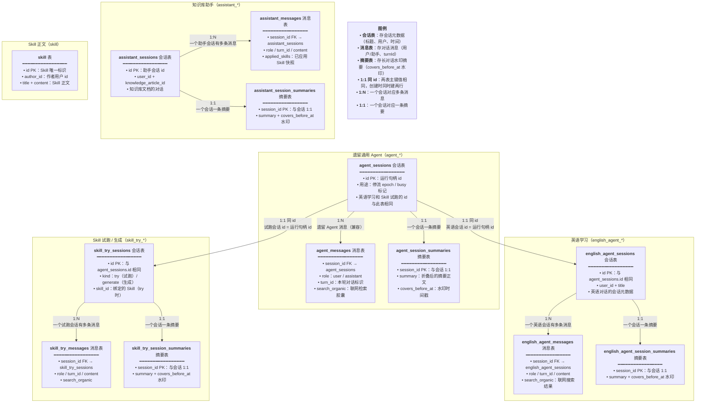

# 数据库迁移

## 一、功能概述

本次改动新增 6 个迁移文件，其中 3 个是空迁移（占位），3 个是实际建表 / 加列：

| 迁移 | 作用 | 状态 |
|---|---|---|
| `1789406044043-agent-business` | 占位（up/down 为空） | 空 |
| `1789406069615-agent-business` | 建 `skill_try_*` / `english_agent_*` 表 | 实际 |
| `1789480821731-assistant-session-summary` | 占位 | 空 |
| `1789480828252-assistant-session-summary` | 建 `assistant_session_summaries` 表 | 实际 |
| `1789485482173-assistant-message-applied-skills` | 占位 | 空 |
| `1789485490097-assistant-message-applied-skills` | `assistant_messages` 加 `applied_skills` 列 | 实际 |

## 二、改动点明细

### 1. `1789406069615-agent-business.ts`（实际建表）

#### 改动原因
为 Skill 试跑和英语学习建独立的业务表（会话 + 消息 + 摘要）。

#### 改动前
无这些表，英语学习和 Skill 试跑消息混在 `agent_messages`。

#### 改动后
```ts
// 导出迁移类 AgentBusiness1789406069615，实现 TypeORM 的 MigrationInterface 接口
// 类名中的时间戳 1789406069615 是迁移生成时的毫秒时间戳，用于确定执行顺序
export class AgentBusiness1789406069615 implements MigrationInterface {
	// name 属性是迁移的唯一标识，TypeORM 将其写入 migrations 表以追踪已执行的迁移
	// 值必须与类名保持一致，否则迁移记录会对不上
	name = 'AgentBusiness1789406069615';

	// up 方法：迁移的正向执行逻辑，由 TypeORM 在升级数据库时调用
	// 参数 queryRunner 是 TypeORM 提供的 SQL 执行器，支持事务和原生 SQL
	// 返回 Promise<void> 表示异步执行，无返回值
	public async up(queryRunner: QueryRunner): Promise<void> {
		// 建 skill_try_session_summaries 表：存储 Skill 试跑会话的摘要记录
		// 字段说明：session_id(varchar36,主键,关联skill_try_sessions.id)、
		// summary(longtext,摘要正文,可存超长文本)、
		// covers_before_at(timestamp,摘要覆盖到的消息时间水印,用于增量摘要)、
		// created_at/updated_at(timestamp6,微秒精度时间戳,updated_at行更新时自动刷新)
		// 索引 idx_skill_try_summary_session(session_id) 加速按会话ID查询摘要
		// 主键设为 session_id：一个会话只对应一条摘要，无需额外自增ID
		await queryRunner.query(`CREATE TABLE \`skill_try_session_summaries\` (
			\`session_id\` varchar(36) NOT NULL,
			\`summary\` longtext NOT NULL,
			\`covers_before_at\` timestamp NULL,
			\`created_at\` timestamp(6) NOT NULL DEFAULT CURRENT_TIMESTAMP(6),
			\`updated_at\` timestamp(6) NOT NULL DEFAULT CURRENT_TIMESTAMP(6) ON UPDATE CURRENT_TIMESTAMP(6),
			INDEX \`idx_skill_try_summary_session\` (\`session_id\`),
			PRIMARY KEY (\`session_id\`)
		) ENGINE=InnoDB`);

		// 建 skill_try_messages 表：存储 Skill 试跑过程中的消息记录
		// 字段说明：id(varchar36,主键,消息唯一ID)、role(enum,角色只能是user或assistant)、
		// turn_id(varchar36,轮次ID,同一轮对话的多条消息共享)、
		// content(longtext,消息正文)、search_organic(json,搜索结果数据,可空)、
		// created_at(消息创建时间)、session_id(所属会话ID,可空)
		// 联合索引 idx_skill_try_msg_session_turn(session_id,turn_id)：按会话+轮次快速删除某轮消息
		// 联合索引 idx_skill_try_msg_session_created(session_id,created_at)：按会话升序列出消息
		await queryRunner.query(`CREATE TABLE \`skill_try_messages\` (
			\`id\` varchar(36) NOT NULL,
			\`role\` enum ('user', 'assistant') NOT NULL,
			\`turn_id\` varchar(36) NULL,
			\`content\` longtext NOT NULL,
			\`search_organic\` json NULL,
			\`created_at\` timestamp(6) NOT NULL DEFAULT CURRENT_TIMESTAMP(6),
			\`session_id\` varchar(36) NULL,
			INDEX \`idx_skill_try_msg_session_turn\` (\`session_id\`, \`turn_id\`),
			INDEX \`idx_skill_try_msg_session_created\` (\`session_id\`, \`created_at\`),
			PRIMARY KEY (\`id\`)
		) ENGINE=InnoDB`);

		// 建 english_agent_messages 表：存储英语学习场景的消息记录
		// 字段结构与 skill_try_messages 完全一致：id、role、turn_id、content、search_organic、created_at、session_id
		// 复用相同的两个联合索引策略：按会话+轮次删消息、按会话+时间列消息
		// 独立建表是为了将英语学习消息与 Skill 试跑消息物理隔离，避免互相干扰
		await queryRunner.query(`CREATE TABLE \`english_agent_messages\` (
			\`id\` varchar(36) NOT NULL,
			\`role\` enum ('user', 'assistant') NOT NULL,
			\`turn_id\` varchar(36) NULL,
			\`content\` longtext NOT NULL,
			\`search_organic\` json NULL,
			\`created_at\` timestamp(6) NOT NULL DEFAULT CURRENT_TIMESTAMP(6),
			\`session_id\` varchar(36) NULL,
			INDEX \`idx_english_agent_msg_session_turn\` (\`session_id\`, \`turn_id\`),
			INDEX \`idx_english_agent_msg_session_created\` (\`session_id\`, \`created_at\`),
			PRIMARY KEY (\`id\`)
		) ENGINE=InnoDB`);

		// 建 english_agent_sessions 表：存储英语学习会话的元数据
		// 字段说明：id(varchar36,主键,与agent_sessions.id复用相同值)、
		// user_id(int,所属用户ID)、title(varchar255,会话标题,可空)、
		// created_at/updated_at(创建/更新时间戳)
		// 联合索引 idx_english_agent_session_user_updated(user_id,updated_at)：
		// 支持按用户查询并按更新时间倒序排列会话列表
		await queryRunner.query(`CREATE TABLE \`english_agent_sessions\` (
			\`id\` varchar(36) NOT NULL,
			\`user_id\` int NOT NULL,
			\`title\` varchar(255) NULL,
			\`created_at\` timestamp(6) NOT NULL DEFAULT CURRENT_TIMESTAMP(6),
			\`updated_at\` timestamp(6) NOT NULL DEFAULT CURRENT_TIMESTAMP(6) ON UPDATE CURRENT_TIMESTAMP(6),
			INDEX \`idx_english_agent_session_user_updated\` (\`user_id\`, \`updated_at\`),
			PRIMARY KEY (\`id\`)
		) ENGINE=InnoDB`);

		// 建 english_agent_session_summaries 表：存储英语学习会话的摘要
		// 字段与 skill_try_session_summaries 一致：session_id(主键)、summary、covers_before_at、时间戳
		// 索引 idx_english_agent_summary_session(session_id) 加速按会话ID查询摘要
		// 主键设为 session_id：一个会话只对应一条摘要记录
		await queryRunner.query(`CREATE TABLE \`english_agent_session_summaries\` (
			\`session_id\` varchar(36) NOT NULL,
			\`summary\` longtext NOT NULL,
			\`covers_before_at\` timestamp NULL,
			\`created_at\` timestamp(6) NOT NULL DEFAULT CURRENT_TIMESTAMP(6),
			\`updated_at\` timestamp(6) NOT NULL DEFAULT CURRENT_TIMESTAMP(6) ON UPDATE CURRENT_TIMESTAMP(6),
			INDEX \`idx_english_agent_summary_session\` (\`session_id\`),
			PRIMARY KEY (\`session_id\`)
		) ENGINE=InnoDB`);

		// 为 skill_try_messages 表添加外键约束 FK_399e35ef9620bc1e6cb0b96d1f5
		// 外键字段 session_id 引用 skill_try_sessions 表的 id 字段
		// ON DELETE CASCADE：删除会话时自动级联删除其下所有消息，无需手动清理
		// ON UPDATE NO ACTION：禁止更新被引用的主键值，保证数据一致性
		await queryRunner.query(`ALTER TABLE \`skill_try_messages\` ADD CONSTRAINT \`FK_399e35ef9620bc1e6cb0b96d1f5\` FOREIGN KEY (\`session_id\`) REFERENCES \`skill_try_sessions\`(\`id\`) ON DELETE CASCADE ON UPDATE NO ACTION`);
		// 为 english_agent_messages 表添加外键约束 FK_f59e9a5cd0d09acbaedf4ecf2fc
		// 外键字段 session_id 引用 english_agent_sessions 表的 id 字段
		// ON DELETE CASCADE：删除英语学习会话时级联删除其消息
		await queryRunner.query(`ALTER TABLE \`english_agent_messages\` ADD CONSTRAINT \`FK_f59e9a5cd0d09acbaedf4ecf2fc\` FOREIGN KEY (\`session_id\`) REFERENCES \`english_agent_sessions\`(\`id\`) ON DELETE CASCADE ON UPDATE NO ACTION`);
	}

	// down 方法：迁移的回滚逻辑，由 TypeORM 在降级数据库时调用
	// 必须按 up 中建表的逆序删除：先删外键约束，再删索引，最后删表
	// 否则会因为外键依赖或索引存在导致删表失败
	public async down(queryRunner: QueryRunner): Promise<void> {
		// 删除 english_agent_messages 的外键约束，解除对 english_agent_sessions 的引用
		await queryRunner.query(`ALTER TABLE \`english_agent_messages\` DROP FOREIGN KEY \`FK_f59e9a5cd0d09acbaedf4ecf2fc\``);
		// 删除 skill_try_messages 的外键约束，解除对 skill_try_sessions 的引用
		await queryRunner.query(`ALTER TABLE \`skill_try_messages\` DROP FOREIGN KEY \`FK_399e35ef9620bc1e6cb0b96d1f5\``);
		// 删除 english_agent_session_summaries 的会话索引
		await queryRunner.query(`DROP INDEX \`idx_english_agent_summary_session\` ON \`english_agent_session_summaries\``);
		// 删除 english_agent_session_summaries 表（英语学习会话摘要表）
		await queryRunner.query(`DROP TABLE \`english_agent_session_summaries\``);
		// 删除 english_agent_sessions 的用户+时间联合索引
		await queryRunner.query(`DROP INDEX \`idx_english_agent_session_user_updated\` ON \`english_agent_sessions\``);
		// 删除 english_agent_sessions 表（英语学习会话表）
		await queryRunner.query(`DROP TABLE \`english_agent_sessions\``);
		// 删除 english_agent_messages 的按时间排序联合索引
		await queryRunner.query(`DROP INDEX \`idx_english_agent_msg_session_created\` ON \`english_agent_messages\``);
		// 删除 english_agent_messages 的按轮次联合索引
		await queryRunner.query(`DROP INDEX \`idx_english_agent_msg_session_turn\` ON \`english_agent_messages\``);
		// 删除 english_agent_messages 表（英语学习消息表）
		await queryRunner.query(`DROP TABLE \`english_agent_messages\``);
		// 删除 skill_try_messages 的按时间排序联合索引
		await queryRunner.query(`DROP INDEX \`idx_skill_try_msg_session_created\` ON \`skill_try_messages\``);
		// 删除 skill_try_messages 的按轮次联合索引
		await queryRunner.query(`DROP INDEX \`idx_skill_try_msg_session_turn\` ON \`skill_try_messages\``);
		// 删除 skill_try_messages 表（Skill 试跑消息表）
		await queryRunner.query(`DROP TABLE \`skill_try_messages\``);
		// 删除 skill_try_session_summaries 的会话索引
		await queryRunner.query(`DROP INDEX \`idx_skill_try_summary_session\` ON \`skill_try_session_summaries\``);
		// 删除 skill_try_session_summaries 表（Skill 试跑会话摘要表）
		await queryRunner.query(`DROP TABLE \`skill_try_session_summaries\``);
	}
}
```

#### 改动说明
建 5 张表：
- `skill_try_session_summaries` / `skill_try_messages`：Skill 试跑
- `english_agent_sessions` / `english_agent_messages` / `english_agent_session_summaries`：英语学习

注意 `skill_try_sessions` 表不在此迁移（由更早的迁移创建），此迁移只给它加外键。

---

### 2. `1789480828252-assistant-session-summary.ts`（实际建表）

#### 改动原因
为知识库助手长对话水印摘要折叠建 `assistant_session_summaries` 表。

#### 改动前
无此表。

#### 改动后
```ts
// 导出迁移类 AssistantSessionSummary1789480828252，实现 TypeORM 的 MigrationInterface 接口
// 时间戳 1789480828252 标识此迁移在迁移链中的执行顺序
export class AssistantSessionSummary1789480828252 implements MigrationInterface {
	// name 属性是迁移的唯一标识，TypeORM 将其写入 migrations 表追踪执行状态
	name = 'AssistantSessionSummary1789480828252';

	// up 方法：正向迁移，创建 assistant_session_summaries 表
	// 参数 queryRunner 为 SQL 执行器，返回 Promise<void> 异步执行
	public async up(queryRunner: QueryRunner): Promise<void> {
		// 建 assistant_session_summaries 表：存储知识库助手长对话的水印摘要
		// 字段说明：session_id(varchar36,主键,关联assistant_sessions.id)、
		// summary(longtext,摘要正文)、
		// covers_before_at(timestamp,摘要覆盖到的消息时间水印,用于增量折叠长对话)、
		// created_at/updated_at(微秒精度时间戳)
		// 索引 idx_assistant_summary_session(session_id) 加速按会话查询摘要
		// 主键设为 session_id：一个助手会话只对应一条摘要
		await queryRunner.query(`CREATE TABLE \`assistant_session_summaries\` (
			\`session_id\` varchar(36) NOT NULL,
			\`summary\` longtext NOT NULL,
			\`covers_before_at\` timestamp NULL,
			\`created_at\` timestamp(6) NOT NULL DEFAULT CURRENT_TIMESTAMP(6),
			\`updated_at\` timestamp(6) NOT NULL DEFAULT CURRENT_TIMESTAMP(6) ON UPDATE CURRENT_TIMESTAMP(6),
			INDEX \`idx_assistant_summary_session\` (\`session_id\`),
			PRIMARY KEY (\`session_id\`)
		) ENGINE=InnoDB`);
	}

	// down 方法：回滚迁移，按先索引后表的顺序删除
	public async down(queryRunner: QueryRunner): Promise<void> {
		// 删除 assistant_session_summaries 的会话索引
		await queryRunner.query(`DROP INDEX \`idx_assistant_summary_session\` ON \`assistant_session_summaries\``);
		// 删除 assistant_session_summaries 表（知识库助手会话摘要表）
		await queryRunner.query(`DROP TABLE \`assistant_session_summaries\``);
	}
}
```

#### 改动说明
结构与 `agent_session_summaries` 一致：sessionId（主键）+ summary + coversBeforeAt（水印）。

---

### 3. `1789485490097-assistant-message-applied-skills.ts`（实际加列）

#### 改动原因
`assistant_messages` 表加 `applied_skills` json 列，存储助手行已应用的 Skill 快照。

#### 改动前
无 `applied_skills` 列。

#### 改动后
```ts
// 导出迁移类 AssistantMessageAppliedSkills1789485490097，实现 TypeORM 的 MigrationInterface 接口
// 时间戳 1789485490097 标识此迁移在迁移链中的执行顺序
export class AssistantMessageAppliedSkills1789485490097 implements MigrationInterface {
	// name 属性是迁移的唯一标识，TypeORM 将其写入 migrations 表追踪执行状态
	name = 'AssistantMessageAppliedSkills1789485490097';

	// up 方法：正向迁移，给 assistant_messages 表新增 applied_skills 列
	// 参数 queryRunner 为 SQL 执行器，返回 Promise<void> 异步执行
	public async up(queryRunner: QueryRunner): Promise<void> {
		// 给 assistant_messages 表新增 applied_skills 列，类型为 json，允许为 NULL
		// 存储助手回复已应用的 Skill 快照数组，格式为 [{ id, title }]
		// 与实体类 AssistantMessage.appliedSkills 字段一一对应
		// 设为可空是为了兼容历史消息数据，避免迁移时因旧数据无值而报错
		await queryRunner.query(`ALTER TABLE \`assistant_messages\` ADD \`applied_skills\` json NULL`);
	}

	// down 方法：回滚迁移，删除 assistant_messages 表的 applied_skills 列
	public async down(queryRunner: QueryRunner): Promise<void> {
		// 从 assistant_messages 表删除 applied_skills 列，将表结构恢复到迁移前的状态
		await queryRunner.query(`ALTER TABLE \`assistant_messages\` DROP COLUMN \`applied_skills\``);
	}
}
```

#### 改动说明
`applied_skills` 是可空 json 列，存 `[{ id, title }]`，与 `AssistantMessage.appliedSkills` 实体字段对应。

---

### 4. 三个空迁移

`1789406044043-agent-business.ts`、`1789480821731-assistant-session-summary.ts`、`1789485482173-assistant-message-applied-skills.ts` 的 `up` / `down` 为空实现。

#### 改动原因
TypeORM 迁移生成机制产生的占位文件，实际 SQL 在同名（时间戳不同）的后续迁移中。这些空迁移需保留以维持迁移链顺序。

#### 改动说明
空迁移不影响数据库，仅占位。

## 三、功能实现逻辑

### 表关系总览



### 新增索引说明

| 表 | 索引 | 用途 |
|---|---|---|
| `skill_try_messages` | `idx_skill_try_msg_session_turn(session_id, turn_id)` | 按 turn 删除本轮消息 |
| `skill_try_messages` | `idx_skill_try_msg_session_created(session_id, created_at)` | 按会话升序列消息 |
| `english_agent_messages` | `idx_english_agent_msg_session_turn` | 同上 |
| `english_agent_messages` | `idx_english_agent_msg_session_created` | 同上 |
| `english_agent_sessions` | `idx_english_agent_session_user_updated(user_id, updated_at)` | 列表按用户 + 时间倒序 |
| `*_session_summaries` | `idx_*_summary_session(session_id)` | 按会话查摘要 |

## 四、注意事项 / 风险点

1. **外键 ON DELETE CASCADE**：删会话时消息自动级联删除，无需手动删消息。
2. **空迁移保留**：三个空迁移不能删，否则迁移链断裂。
3. **id 复用**：`english_agent_sessions.id` / `skill_try_sessions.id` 与 `agent_sessions.id` 相同，创建时需同时建两张表。
4. **`skill_try_sessions` 表来源**：不在本次迁移，由更早的迁移创建（含 skill_id / kind 字段）。
5. **`applied_skills` 仅 assistant 表**：`english_agent_messages` / `skill_try_messages` / `agent_messages` 无此列，Skill 快照只在 `assistant_messages` 落地。
