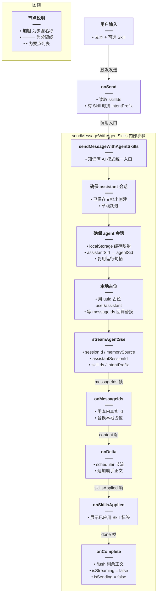
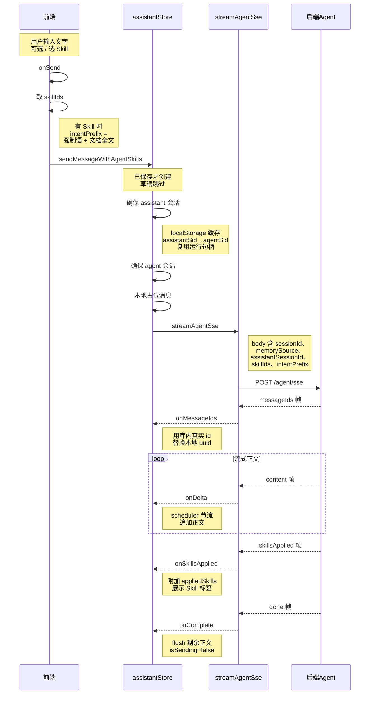
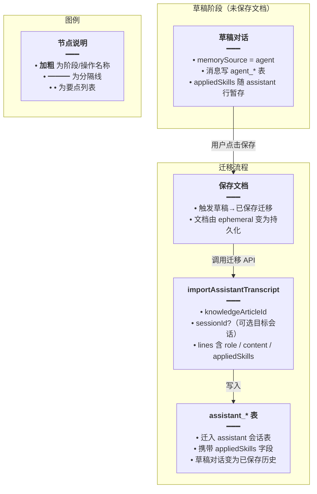

# 知识库助手接入 Agent

## 一、功能概述

知识库助手的 AI 模式（非 RAG）从原来的 `/assistant/sse` 切换为 `/agent/sse`，使其具备工具调用（联网搜索、知识库检索）和 Skill 强制加载能力。消息仍写入助手 store 列表以复用现有 UI 壳，但持久化路径分两种：

- 已保存文档：`memorySource=assistant`，消息写 `assistant_*` 表
- 草稿（未保存）：`memorySource=agent`，消息写 `agent_*` 表

## 二、实现方案

核心是在 `assistantStore` 中新增 `sendMessageWithAgentSkills` 方法，复用 Agent SSE 通道，同时维护一个「agent session ↔ assistant session」的映射（`agentSessionByScope` + localStorage 持久化），保证同一知识库文档的多次对话复用同一个 agent 运行句柄（停流 epoch）。



## 三、改动点明细

### 1. `apps/frontend/src/utils/agentSse.ts`（新增）

#### 改动原因
独立的 Agent SSE 客户端，对齐 `AgentController.chatSse` 的 `data: JSON` 行协议，支持 content / tool / searchOrganic / skillsApplied / messageIds / error / done 帧。

#### 改动前
无此文件（之前只有 assistantSse）。

#### 改动后
```ts
// 导入全局 Toast 提示组件，流解析失败等场景用它弹错误提示
import { Toast } from '@ui/index';
// 导入后端基础地址常量，后续拼接成完整请求 URL
import { BASE_URL } from '@/constants';
// 导入未登录处理函数，401 时触发登录态跳转
import { notifyUnauthorized } from '@/router/authSession';
// 导入 Agent SSE 的接口路径常量
import { AGENT_SSE } from '@/service/api';
// 导入联网搜索结果项类型，用于 searchOrganic 帧的类型标注
import type { SearchOrganicItem } from '@/types/chat';
// 复用 assistantSse 的用户主动中止标记常量，避免重复定义
import { ASSISTANT_SSE_USER_ABORT_MARKER } from '@/utils/assistantSse';
// 导入平台 fetch 封装，兼容 Tauri 与浏览器环境
import { getPlatformFetch } from '@/utils/fetch';

// 把 assistantSse 的中止标记以新名称导出，供调用方统一判断是否用户主动中止
export { ASSISTANT_SSE_USER_ABORT_MARKER as AGENT_SSE_USER_ABORT_MARKER };

// 从 localStorage 读取登录 token，SSR 环境返回空串避免报错
function readToken(): string {
	// 非浏览器环境（如 SSR）没有 window 对象，直接返回空串
	if (typeof window === 'undefined') return '';
	// 读取 token，取不到时兜底为空串
	return localStorage.getItem('token') || '';
}

/** 解包 NestJS MessageEvent，兼容 { data: { ... } } 与扁平对象 */
// 解包 payload：NestJS 的 MessageEvent 会把真实数据包在 data 字段里，这里统一打平
function unwrapAgentPayload(
	// 原始 payload，可能是嵌套或扁平两种格式
	raw: Record<string, unknown>,
// 返回解包后的扁平对象
): Record<string, unknown> {
	// 取出 data 字段，NestJS MessageEvent 的真实数据通常在此
	const inner = raw.data;
	// 只有 data 是普通对象（非数组）时才可能是嵌套格式，需要进一步判断
	if (inner && typeof inner === 'object' && !Array.isArray(inner)) {
		// 把 inner 断言为对象类型，便于用 in 判断字段
		const o = inner as Record<string, unknown>;
		// 含任一 Agent SSE 协议关键字段即视为嵌套格式，返回 inner
		if (
			'type' in o ||
			'done' in o ||
			'content' in o ||
			'error' in o ||
			'raw' in o ||
			'organic' in o ||
			('userMessageId' in o && 'assistantMessageId' in o)
		) {
			// 返回解包后的内层对象
			return o;
		}
	}
	// 否则认为是扁平对象，原样返回
	return raw;
}

// SSE 回调接口，定义流过程中各类事件的回调签名
export interface AgentSseCallbacks {
	// 正文增量回调，每收到一段 content 文本就触发
	onDelta: (text: string) => void;
	// 工具调用开始/结束回调，可选
	onTool?: (ev: { phase: 'start' | 'end'; name?: string }) => void;
	// 流开始回调，可选
	onStart?: () => void;
	// 流完成回调，error 为用户中止标记或服务端错误文案，可选
	onComplete?: (error?: string) => void;
	// 流错误回调，可选
	onError?: (err: Error) => void;
	// 联网搜索结果回调，可选
	onSearchOrganic?: (organic: SearchOrganicItem[]) => void;
	// 本轮强制加载的 Skill 回调（id + title），可选
	onSkillsApplied?: (skills: Array<{ id: string; title: string }>) => void;
	// 占位落库后服务端下发的真实消息 ID 回调，用于对齐 UI id 与库内 id，可选
	onMessageIds?: (ids: {
		// 用户消息在库内的真实 id
		userMessageId: string;
		// 助手消息在库内的真实 id
		assistantMessageId: string;
	}) => void;
}

/** 消费 POST /agent/sse；返回 abort() */
// 发起 Agent SSE 流式请求，处理各类帧并触发对应回调，返回 abort 函数
export async function streamAgentSse(options: {
	// 可选自定义接口路径，默认用 AGENT_SSE
	api?: string;
	// 请求体，包含 sessionId、content、skillIds 等
	body: Record<string, unknown>;
	// 各类事件回调集合
	callbacks: AgentSseCallbacks;
// 返回 abort 函数，调用即中止请求
}): Promise<() => void> {
	// 解构参数，api 缺省取 AGENT_SSE
	const { api = AGENT_SSE, body, callbacks } = options;
	// 解构回调字段，便于直接调用
	const {
		onDelta, onTool, onStart, onComplete, onError,
		onSearchOrganic, onSkillsApplied, onMessageIds,
	} = callbacks;

	// 创建 AbortController，用于随时中止流式请求
	const controller = new AbortController();

	try {
		// 触发流开始回调
		onStart?.();
		// 获取平台 fetch 函数（Tauri / 浏览器兼容）
		const platformFetch = await getPlatformFetch();
		// 发起 POST 请求，请求体为 JSON，携带 token 与 abort signal
		const response = await platformFetch(BASE_URL + api, {
			// 使用 POST 方法
			method: 'POST',
			// 设置请求头
			headers: {
				// 携带 Bearer token 鉴权
				Authorization: `Bearer ${readToken()}`,
				// 声明请求体为 JSON
				'Content-Type': 'application/json',
			},
			// 把 body 序列化为 JSON 字符串
			body: JSON.stringify(body),
			// 绑定 abort signal，支持外部中止
			signal: controller.signal,
		});

		// 响应非 2xx 时按状态码处理
		if (!response.ok) {
			// 401 表示未登录，触发未登录通知并抛错
			if (response.status === 401) {
				notifyUnauthorized();
				throw new Error('请先登录后再试');
			}
			// 其它错误直接抛出状态文案
			throw new Error(`HTTP error! status: ${response.statusText}`);
		}

		// 从响应体获取 reader 用于逐块读取流
		const reader = response.body?.getReader();
		// 若无法获取 reader，抛错
		if (!reader) {
			throw new Error('无法读取流式响应');
		}

		// 创建 utf-8 解码器，把二进制 chunk 转成字符串
		const decoder = new TextDecoder('utf-8');
		// 缓冲区，保存尚未按行切分完的剩余内容
		let buffer = '';
		// 标记流是否已收尾，防止 onComplete 重复触发
		let streamFinished = false;
		// 统一收尾函数，防止重复回调
		const finish = (err?: string) => {
			// 已收尾则直接返回，保证幂等
			if (streamFinished) return;
			// 标记已收尾
			streamFinished = true;
			// 触发完成回调，传入错误（若有）
			onComplete?.(err);
		};

		// 自执行异步 IIFE 读取流，不阻塞主 try 块返回 abort 函数
		(async () => {
			try {
				// 循环读取流，readLoop 标签用于 error/done 时跳出外层循环
				readLoop: while (true) {
					// 读取下一个 chunk，done 表示流结束
					const { done, value } = await reader.read();
					// 流正常结束，收尾并跳出循环
					if (done) {
						finish();
						break;
					}

					// 把二进制 chunk 解码为字符串，stream:true 保留多字节字符
					const chunk = decoder.decode(value, { stream: true });
					// 追加到缓冲区
					buffer += chunk;
					// 按换行切分，最后一行可能不完整留给下次处理
					const lines = buffer.split('\n');
					// 取出最后一行作为新的缓冲区（可能不完整）
					buffer = lines.pop() || '';

					// 遍历每一行解析 SSE 事件
					for (const line of lines) {
						// 去除首尾空白
						const trimmed = line.trim();
						// 只处理 data: 开头的行，其它行（如注释）跳过
						if (!trimmed.startsWith('data:')) continue;
						// 截取 data: 之后的内容并去除开头空白
						const dataStr = trimmed.slice(5).trimStart();
						// 空内容跳过
						if (!dataStr) continue;

						// 声明解析后的原始对象
						let raw: Record<string, unknown>;
						try {
							// 尝试 JSON 解析 data 内容
							raw = JSON.parse(dataStr) as Record<string, unknown>;
						} catch {
							// 解析失败弹错误提示并跳过该行
							Toast({ type: 'error', title: 'Agent 流解析失败' });
							continue;
						}

						// 解包 payload，兼容嵌套与扁平格式
						const parsed = unwrapAgentPayload(raw);

						// error 帧：结束流并把错误传给 onComplete
						if (typeof parsed.error === 'string' && parsed.error) {
							finish(parsed.error);
							break readLoop;
						}
						// done 帧：正常结束流
						if (parsed.done === true) {
							finish();
							break readLoop;
						}
						// content 帧：追加正文增量
						if (
							parsed.type === 'content' &&
							typeof parsed.content === 'string' &&
							parsed.content
						) {
							onDelta(parsed.content);
							continue;
						}
						// searchOrganic 帧：联网搜索结果
						if (
							parsed.type === 'searchOrganic' &&
							Array.isArray(parsed.organic)
						) {
							onSearchOrganic?.(parsed.organic as SearchOrganicItem[]);
							continue;
						}
						// skillsApplied 帧：已应用 Skill 列表
						if (
							parsed.type === 'skillsApplied' &&
							Array.isArray(parsed.skills)
						) {
							// 过滤掉 id/title 非字符串或为空的项，再映射成干净结构
							const skills = (
								parsed.skills as Array<{ id?: unknown; title?: unknown }>
							)
								.filter(
									(s) =>
										typeof s?.id === 'string' &&
										typeof s?.title === 'string' &&
										s.id && s.title,
								)
								.map((s) => ({
									id: s.id as string,
									title: s.title as string,
								}));
							// 有合法 skill 才触发回调
							if (skills.length) onSkillsApplied?.(skills);
							continue;
						}
						// messageIds 帧：对齐 UI id 与库内 id
						if (
							parsed.type === 'messageIds' &&
							typeof parsed.userMessageId === 'string' &&
							typeof parsed.assistantMessageId === 'string'
						) {
							onMessageIds?.({
								userMessageId: parsed.userMessageId,
								assistantMessageId: parsed.assistantMessageId,
							});
							continue;
						}
						// tool 帧：工具调用开始/结束
						if (parsed.type === 'tool') {
							// 取出 raw 字段并断言为工具事件结构
							const rawTool = parsed.raw as
								| { phase?: string; name?: string }
								| undefined;
							// 取出阶段字段
							const phase = rawTool?.phase;
							// 只处理 start/end 两种阶段
							if (phase === 'start' || phase === 'end') {
								onTool?.({
									phase,
									// name 必须是字符串才传，否则传 undefined
									name: typeof rawTool?.name === 'string'
										? rawTool.name : undefined,
								});
							}
						}
					}
				}
			} catch (err: unknown) {
				// 用户主动中止（AbortError）时用中止标记收尾
				if (err instanceof DOMException && err.name === 'AbortError') {
					finish(ASSISTANT_SSE_USER_ABORT_MARKER);
					return;
				}
				// 其它错误转成 Error 对象后触发 onError
				const e = err instanceof Error ? err : new Error(String(err ?? '请求中断'));
				onError?.(e);
			}
		})();
	} catch (err: unknown) {
		// 请求前/请求阶段的错误转成 Error 对象后触发 onError
		const e = err instanceof Error ? err : new Error(String(err ?? '请求失败'));
		onError?.(e);
	}

	// 返回 abort 函数，调用即中止请求
	return () => controller.abort();
}
```

#### 改动说明
`streamAgentSse` 与 `streamAssistantSse` 类似，但多了 `skillsApplied`、`messageIds`、`searchOrganic` 帧的处理。返回 `abort()` 函数供前端中止流式。

---

### 2. `apps/frontend/src/store/assistant.ts` — sendMessageWithAgentSkills（修改）

#### 改动原因
知识库助手 AI 模式需要走 Agent SSE，复用助手 store 的消息列表与 UI 壳。

#### 改动前
知识库助手用 `assistantStore.sendMessage`（走 `/assistant/sse`）。

#### 改动后
```ts
/**
 * 知识库 AI 模式统一走 Agent SSE（skillIds 可空）。
 * 已保存文档：memorySource=assistant；草稿：memorySource=agent。
 * 消息仍写入本 store 列表以复用助手壳。RAG 模式勿调用。
 */
// 知识库助手走 Agent SSE 的发送入口，处理会话、占位、流式、收尾全流程
async sendMessageWithAgentSkills(
	// 用户原始输入文本
	raw: string,
	// 选中的 Skill id 列表，可为空
	skillIds: string[],
	// 可选配置，intentPrefix 为不入库的模型上下文前缀
	options?: { intentPrefix?: string },
): Promise<void> {
	// 清洗 skillIds：去空格并过滤空串
	const ids = (skillIds ?? []).map((x) => x.trim()).filter(Boolean);

	// 取当前激活的知识库文档 key
	const documentKey = (this.activeDocumentKey ?? '').trim();
	// 没有文档 key 时提示并返回
	if (!documentKey) {
		Toast({ type: 'warning', title: '文档未就绪' });
		return;
	}
	// 计算规范化后的文档 key，用于会话索引
	const canonical = this.canonicalKey(documentKey);
	// ephemeral=true 表示草稿（未保存文档），不允许持久化到 assistant_* 表
	const ephemeral = !this.knowledgeAssistantPersistenceAllowed;
	// 清洗用户输入文本
	const text = (raw ?? '').trim();
	// 空文本直接返回
	if (!text) return;

	// 未登录时提示并返回
	if (!readToken()) {
		Toast({ type: 'warning', title: '请先登录后再使用助手' });
		return;
	}

	// 已保存文档：确保有对应的 assistant 会话
	let assistantSid: string | null = null;
	if (!ephemeral) {
		// 调用 store 方法为当前文档创建/获取 assistant 会话
		assistantSid = await this.ensureSessionForCurrentDocument();
		// 获取失败直接返回
		if (!assistantSid) return;
	}

	// 获取文档级状态（草稿）或会话级状态（已保存）
	const docState = this.ensureState(canonical);
	const state = ephemeral ? docState : this.ensureSessionState(assistantSid!);
	// 正在发送或加载历史时直接返回，防止重复请求
	if (state.isSending || state.isHistoryLoading) return;

	// Agent 不走 assistant SSE，不会自动写首条用户问题为标题；无标题时显式对齐
	if (!ephemeral && assistantSid) {
		// 取出当前文档的会话列表
		const list = this.sessionsByDocument[canonical] ?? [];
		// 找到当前 assistant 会话行
		const row = list.find((s) => s.sessionId === assistantSid);
		// 标题为空时需要用首条用户问题做标题
		if (!row?.title?.trim()) {
			// 取前 60 字作为标题预览
			const titlePreview = text.slice(0, 60);
			runInAction(() => {
				// 本地先更新列表
				// ...
			});
			// 调后端更新标题，成功后刷新会话列表
			void updateAssistantSessionTitle(assistantSid, titlePreview)
				.then(() => this.refreshSessionListForCurrentDocument())
				.catch(() => undefined);
		}
	}

	// 确保 agent 运行句柄（同一文档复用，localStorage 缓存）
	const agentScope = this.agentScopeKey(assistantSid, canonical);
	// 优先从内存映射取，其次从 localStorage 读关联 id
	let agentSid =
		this.agentSessionByScope[agentScope] ??
		(assistantSid ? readLinkedAgentSessionId(assistantSid) : null);
	// 都没有则新建 agent 会话
	if (!agentSid) {
		try {
			// 创建 agent 会话，标题取用户输入前 40 字
			const res = await createAgentSession({
				title: text.slice(0, 40) || '知识库助手',
			});
			// 从响应取出 sessionId
			agentSid = res.data?.sessionId ?? null;
			// 创建失败提示并返回
			if (!agentSid) {
				Toast({ type: 'error', title: '创建 Agent 会话失败' });
				return;
			}
		} catch {
			// 异常提示并返回
			Toast({ type: 'error', title: '创建 Agent 会话失败' });
			return;
		}
	}
	// 把 agentSid 写入内存映射
	runInAction(() => {
		this.agentSessionByScope[agentScope] = agentSid!;
	});
	// 若有 assistantSid，持久化 assistantSid → agentSid 映射到 localStorage
	if (assistantSid) {
		writeLinkedAgentSessionId(assistantSid, agentSid);
	}

	// 中止旧流，防止前一次未完成的流继续写入
	state.abortStream?.();
	// 清空 abortStream 引用
	runInAction(() => {
		state.abortStream = null;
	});

	// 本地先用 uuid 占位，等 messageIds 回调再替换为库内 id
	const userChatId = uuidv4();
	const assistantChatId = uuidv4();
	// 用 let 声明，因为 onMessageIds 会替换为库内 id
	let userRowId = userChatId;
	let assistantRowId = assistantChatId;

	// 推入用户消息 + 空助手占位
	runInAction(() => {
		// 标记正在发送
		state.isSending = true;
		// 推入用户消息
		state.messages.push({
			chatId: userRowId,
			role: 'user',
			content: text,
			timestamp: new Date(),
		});
		// 推入空助手占位消息，标记正在流式
		state.messages.push({
			chatId: assistantRowId,
			role: 'assistant',
			content: '',
			timestamp: new Date(),
			isStreaming: true,
			thinkContent: '',
		});
	});

	// 取出 intentPrefix 并清洗
	const intentPrefix = (options?.intentPrefix ?? '').trim();
	// 累积助手正文
	let accumulated = '';
	// 用 scheduler 节流 UI 更新，避免每 token 重渲染
	const flushAssistantPatch = () => {
		runInAction(() => {
			// 找到助手占位消息的索引
			const idx = state.messages.findIndex(
				(m) => m.chatId === assistantRowId,
			);
			// 找不到则返回
			if (idx < 0) return;
			// 取出当前消息对象
			const prev = state.messages[idx] as Message;
			// 内容未变化则跳过，减少无谓重渲染
			if (prev.content === accumulated) return;
			// 更新助手正文
			prev.content = accumulated;
		});
	};
	// 创建节流调度器
	const assistantPatchScheduler =
		createStreamingMobxPatchScheduler(flushAssistantPatch);

	try {
		// 调 Agent SSE，发起流式请求
		const abort = await streamAgentSse({
			body: {
				// agent 会话 id
				sessionId: agentSid,
				// 用户输入内容
				content: text,
				// 有 skillIds 才传
				...(ids.length ? { skillIds: ids } : {}),
				// 有 intentPrefix 才传
				...(intentPrefix ? { intentPrefix } : {}),
				// 已保存：落 assistant_*；草稿：显式 agent
				...(!ephemeral && assistantSid
					? {
							memorySource: 'assistant' as const,
							assistantSessionId: assistantSid,
					}
					: { memorySource: 'agent' as const }),
			},
			callbacks: {
				// 收到真实消息 id 后替换本地占位 id
				onMessageIds: ({ userMessageId, assistantMessageId }) => {
					runInAction(() => {
						// 替换 user / assistant 的 chatId
						// ...
						userRowId = userMessageId;
						assistantRowId = assistantMessageId;
					});
				},
				// 追加正文
				onDelta: (d) => {
					// 非空才累加
					if (d) accumulated += d;
					// 调度 UI 刷新（节流）
					assistantPatchScheduler.schedule();
				},
				// 展示已应用 Skill
				onSkillsApplied: (skills) => {
					runInAction(() => {
						// 找到助手消息索引
						const idx = state.messages.findIndex(
							(m) => m.chatId === assistantRowId,
						);
						// 找不到则返回
						if (idx < 0) return;
						// 取出当前消息
						const prev = state.messages[idx] as Message;
						// 用新对象替换，附加 appliedSkills
						state.messages[idx] = { ...prev, appliedSkills: skills };
					});
				},
				// 流结束
				onComplete: (err) => {
					// 先 flush 掉剩余累积的正文
					assistantPatchScheduler.flush();
					// 判断是否用户主动中止
					const userAborted = err === AGENT_SSE_USER_ABORT_MARKER;
					runInAction(() => {
						// 结束发送态
						state.isSending = false;
						// 收尾：设 isStreaming=false，失败时给错误文案
						// ...
						// 清空 abort 引用
						state.abortStream = null;
					});
				},
				// 流错误
				onError: (e) => {
					// flush 剩余正文
					assistantPatchScheduler.flush();
					runInAction(() => {
						// 结束发送态
						state.isSending = false;
						// ...
						// 清空 abort 引用
						state.abortStream = null;
					});
				},
			},
		});
		// 保存 abort 函数，供 stopGenerating 调用
		state.abortStream = abort;
	} catch {
		// 异常收尾
	}
}
```

#### 改动说明
- `agentScopeKey` 把 assistantSid 或 canonical 作为 scope key，确保同一文档复用 agent 会话。
- `readLinkedAgentSessionId` / `writeLinkedAgentSessionId` 把 assistantSid → agentSid 映射存 localStorage，刷新后不丢。
- 本地先用 uuid 占位，`onMessageIds` 回调替换为库内 id，保证分享时 id 对齐。

---

### 3. `apps/frontend/src/store/assistant.ts` — stopGenerating 改为按当前展示会话停流（修改）

#### 改动原因
原来 `stopGenerating` 停的是全局 `this.abortStream`，多会话隔离后需要只停当前展示会话的流，避免切到其它历史后误触停止杀掉后台仍在流式的会话。

#### 改动前
```ts
// 旧版 stopGenerating：停全局 abortStream，未区分会话
async stopGenerating(): Promise<void> {
	// 调用全局 abortStream 中止当前流
	this.abortStream?.();
	// 清空全局 abortStream 引用
	this.abortStream = null;
	// 在 action 中更新全局状态
	runInAction(() => {
		// 结束发送态
		this.isSending = false;
		// 遍历消息，把正在流式的消息标记为已停止
		this.messages = this.messages.map((m) => {
			// 非流式消息原样返回
			if (!m.isStreaming) return m;
			// 流式消息替换为停止态
			return { ...m, isStreaming: false, isStopped: true };
		});
	});
	// ...
}
```

#### 改动后
```ts
// 新版 stopGenerating：只停当前展示会话的流，不影响后台其它会话
async stopGenerating(): Promise<void> {
	// 只停「当前展示会话」：切到其它历史后误触停止，不得杀掉后台仍在流式的会话
	const state = this.activeState;
	// 判断当前展示会话是否有正在流式的请求或消息
	const activeStreaming =
		Boolean(state.abortStream) ||
		state.messages.some((m) => m.isStreaming);
	// 没有流式中的内容则直接返回
	if (!activeStreaming) return;

	// 先断 SSE：若先 await 网关，期间 delta 仍会 apply，...prev 会保持 isStreaming=true
	state.abortStream?.();
	// 在 action 中更新当前会话状态
	runInAction(() => {
		// 清空 abort 引用
		state.abortStream = null;
		// 结束发送态
		state.isSending = false;
		// 用「替换对象」而不是原地 mutate：保证 UI 在文档切换/映射迁移时也能稳定刷新停止态
		state.messages = state.messages.map((m) => {
			// 非流式消息原样返回
			if (!m.isStreaming) return m;
			// 流式消息替换为停止态
			return { ...m, isStreaming: false, isStopped: true };
		});
	});
	// ...
}
```

#### 改动说明
`activeState` 返回当前展示会话的 runtime state，只停止该会话的流，不影响后台其它会话。

---

### 4. `apps/frontend/src/views/knowledge/KnowledgeAssistantChatFooter.tsx`（修改）

#### 改动原因
把知识库助手的发送逻辑从 `sendMessage` 改为 `sendMessageWithAgentSkills`，并在有 Skill 时注入文档全文作为 intentPrefix。

#### 改动前
```ts
// 旧版：直接调用 sendMessage，走 /assistant/sse
await assistantStore.sendMessage(text);
```

#### 改动后
```ts
// 导出：当前知识正文 → Agent intentPrefix（约 60k，带短头）
// 把知识库文档正文裁剪后拼成带标识头的 intentPrefix
export function buildKnowledgeIntentPrefix(markdown: string): string {
	// 清洗 markdown 并截取前 60000 字符，防止 prompt 过长
	const body = (markdown ?? '').trim().slice(0, 60_000);
	// 空正文返回空串
	if (!body) return '';
	// 加短头标识「当前知识库文档」后返回
	return `当前知识库文档：\n${body}`;
}

// onSend 回调内：
// 取当前选中的 Skill id 列表
const skillIds = skillStore.selectedSkillIds;
// 把 id 映射为 Skill 标题，过滤掉空标题
const titles = skillIds
	.map((id) => skillStore.list.find((s) => s.id === id)?.title ?? '')
	.filter(Boolean);
// 无 Skill：不注入全文前缀，与改前 /assistant/sse 输入面一致；
// 有 Skill：强制语 + 文档前缀
// 用 let 声明，因为只有有 Skill 时才赋值
let intentPrefix: string | undefined;
if (titles.length) {
	// 构造 Skill 强制语，明确要求按启用的 Skill 执行
	const skillForce = `【强制】必须严格按已启用 Skill（${titles.map((t) => `「${t}」`).join('、')}）执行；与用户一般表述冲突时以 Skill 为准。\n\n`;
	// 拼接强制语 + 文档全文前缀
	intentPrefix = `${skillForce}${buildKnowledgeIntentPrefix(
		knowledgeStore.markdown ?? '',
	)}`;
}
// 调用带 Skill 的发送方法，有 intentPrefix 才传
await assistantStore.sendMessageWithAgentSkills(text, skillIds, {
	...(intentPrefix ? { intentPrefix } : {}),
});
```

同时输入框开启 `skillSlashEnabled`：
```tsx
// 渲染 KnowledgeAssistantEntry，传入 skillSlashEnabled 控制斜杠选 Skill
<KnowledgeAssistantEntry
	// ...
	// AI 模式开 / 选 Skill，RAG 关
	skillSlashEnabled={!isRagMode}
/>
```

#### 改动说明
- 无 Skill 时不注入全文前缀，保持与改前 `/assistant/sse` 一致的输入面。
- 有 Skill 时才注入「强制语 + 文档全文」作为 intentPrefix（不入库，仅本轮模型输入）。
- `skillSlashEnabled` 仅在 AI 模式开启，RAG 模式关闭。

---

### 5. `apps/frontend/src/views/knowledge/KnowledgeAssistant.tsx`（修改）

#### 改动原因
快捷 Prompt（大纲、摘要等）也走 `sendMessageWithAgentSkills`，并把当前选中 Skill 的标题传给 `buildKnowledgeAssistantDocumentMessage`。

#### 改动前
```ts
// 旧版：调用 sendMessage 并传入 extraUserContentForModel
await assistantStore.sendMessage(userMessageShort, {
	extraUserContentForModel,
});
```

#### 改动后
```ts
// 取当前选中的 Skill id 列表
const skillIds = skillStore.selectedSkillIds;
// intent → Agent 的 intentPrefix：仅拼进本轮模型上下文（任务说明 + 全文等），不入库；
// 气泡/落库仍用上面的 userMessageShort。空则不传 intentPrefix。
const intent = (extraUserContentForModel ?? '').trim();
// 调用带 Skill 的发送方法，有 intent 才传 intentPrefix
await assistantStore.sendMessageWithAgentSkills(
	userMessageShort,
	skillIds,
	intent ? { intentPrefix: intent } : undefined,
);
```

#### 改动说明
快捷 Prompt 的 `extraUserContentForModel`（任务说明 + 文档全文）改为通过 `intentPrefix` 传给 Agent，只影响模型输入不入库。

---

### 6. `apps/frontend/src/views/knowledge/KnowledgeAssistantEntry.tsx`（修改）

#### 改动原因
输入框支持 `/` 唤起 SkillSlashPicker，展示已选 Skill 芯片。

#### 改动前
普通 textarea，无 Skill 选择。

#### 改动后
```tsx
// 新增 SkillSlashPicker 与 SkillChips
// 导入 Skill 斜杠选择器组件，用于 / 唤起选 Skill
import SkillSlashPicker from '@design/SkillSlashPicker';
// 导入 lucide 的 X 图标，用于芯片删除按钮
import { X } from 'lucide-react';
// 导入 mobx-react 的 observer，使组件响应 store 变化
import { observer } from 'mobx-react';
// 导入 skill store，管理已选 Skill
import skillStore from '@/store/skill';

// props 新增 skillSlashEnabled
type KnowledgeAssistantEntryProps = {
	// ...
	/** AI 模式开启 `/` 选 Skill；RAG 应关闭 */
	skillSlashEnabled?: boolean;
};

/** `/` 须在行首或空白后；其后仅连续非空白为过滤词（空格则退出，对齐 Cursor） */
// 查找光标前是否有合法的 /xxx，返回起始位置与过滤词
function findSlashAtCursor(
	// 输入框当前值
	value: string,
	// 光标位置
	cursor: number,
): { start: number; query: string } | null {
	// 截取光标前的文本
	const before = value.slice(0, cursor);
	// 匹配行首或空白后的 /xxx（xxx 不含空白），$ 锚定光标位置
	const m = before.match(/(?:^|[\s\n])(\/([^\s\n]*))$/);
	// 不匹配则返回 null
	if (!m) return null;
	// 取出 /xxx 整体
	const slashLocal = m[1]!;
	// 计算 / 在原文本中的起始位置
	const start = before.length - slashLocal.length;
	// 返回起始位置与过滤词
	return { start, query: m[2] ?? '' };
}

// 已选 Skill 芯片展示
// observer 包裹使组件响应 skillStore 变化
const SkillChips = observer(function SkillChips() {
	// 取已选 Skill id 列表
	const ids = skillStore.selectedSkillIds;
	// 无选中则不渲染
	if (ids.length === 0) return null;
	// ... 渲染芯片，每个可点 X 移除
});

// 组件内：
// 斜杠选择器是否打开
const [slashOpen, setSlashOpen] = useState(false);
// 斜杠后的过滤词
const [slashQuery, setSlashQuery] = useState('');
// 记录 / 在输入框中的起始位置，用于选择后替换
const slashStartRef = useRef<number | null>(null);

// 输入时同步 slash 状态
const syncSlashFromDom = useCallback(() => {
	// 未开启斜杠功能或正在输入法组合时，若打开则关闭并返回
	if (!skillSlashEnabled || composingRef.current) {
		if (slashOpen) closeSlash();
		return;
	}
	// 取 textarea DOM
	const el = textareaRef.current;
	// 取不到则返回
	if (!el) return;
	// 取光标位置，缺省取文本末尾
	const cursor = el.selectionStart ?? el.value.length;
	// 查找光标前是否有合法的 /xxx
	const hit = findSlashAtCursor(el.value, cursor);
	// 没命中：若打开则关闭
	if (!hit) {
		if (slashOpen) closeSlash();
		return;
	}
	// 记录 / 起始位置
	slashStartRef.current = hit.start;
	// 更新过滤词
	setSlashQuery(hit.query);
	// 未打开则打开
	if (!slashOpen) setSlashOpen(true);
}, [skillSlashEnabled, slashOpen, closeSlash]);

// 确认选择 Skill
const onConfirmSkills = (ids: string[]) => {
	// 更新 store 中已选 Skill
	skillStore.setSelectedSkillIds(ids);
	// 把输入框里的 `/xxx` 替换掉
	const el = textareaRef.current;
	// 有 DOM 且记录了起始位置才替换
	if (el && slashStartRef.current != null) {
		// 取出 / 起始位置
		const start = slashStartRef.current;
		// 取光标位置作为结束
		const end = el.selectionStart ?? el.value.length;
		// 拼接去掉 /xxx 后的文本
		el.value = el.value.slice(0, start) + el.value.slice(end);
		// 把光标移到原 / 位置
		el.setSelectionRange(start, start);
	}
	// 关闭斜杠选择器
	closeSlash();
	// 同步输入框是否有文本的状态
	syncHasTextFromDom();
};
```

#### 改动说明
`/` 唤起逻辑对齐 Cursor：必须在行首或空白后，空格则退出。选择 Skill 后把 `/xxx` 从输入框移除，芯片展示在输入框上方。

---

### 7. `apps/frontend/src/service/index.ts` — 新增 API（修改）

#### 改动原因
新增 `updateAssistantSessionTitle`、`appendAssistantSessionTurn`，并扩展 `createAgentSession` 支持 `memorySource`、`importAssistantTranscript` 支持 `appliedSkills`。

#### 改动前
```ts
// 创建 Agent 会话的旧签名，只支持 title
export const createAgentSession = async (body?: { title?: string }) => { /* ... */ };
// 迁入草稿对话的旧签名，lines 不支持 appliedSkills
export const importAssistantTranscript = async (body: {
	// 知识库文章 id
	knowledgeArticleId: string;
	// 可选目标会话 id
	sessionId?: string;
	// 对话行列表，仅含 role 与 content
	lines: Array<{ role: 'user' | 'assistant'; content: string }>;
}) => { /* ... */ };
```

#### 改动后
```ts
/** 更新助手会话标题（Skill 路径首条用户问题） */
// 更新指定助手会话的标题
export const updateAssistantSessionTitle = async (
	// 助手会话 id
	sessionId: string,
	// 新标题
	title: string,
) => {
	// POST 请求更新标题，返回更新后的会话信息
	return await http.post<{ sessionId: string; title: string }>(
		ASSISTANT_SESSION_TITLE,
		{ sessionId, title },
	);
};

/** Skill 路径：将本轮对话追加到知识库助手会话表（与无 Skill 同表；不改 agent_*） */
// 把一轮对话追加到已保存的知识库助手会话
export const appendAssistantSessionTurn = async (body: {
	// 助手会话 id
	sessionId: string;
	// 用户消息内容
	userContent: string;
	// 助手消息内容
	assistantContent: string;
}) => {
	// POST 请求追加一轮对话，返回用户与助手消息的库内 id
	return await http.post<{
		userMessageId: string;
		assistantMessageId: string;
	}>(ASSISTANT_SESSION_APPEND_TURN, body);
};

/** 创建空 Agent 会话 */
// 创建 Agent 会话，支持可选的 memorySource
export const createAgentSession = async (body?: {
	// 会话标题
	title?: string;
	/** 英语学习：同时建 english_agent_sessions */
	memorySource?: 'english_learning';
}) => {
	// POST 请求创建会话，body 缺省为空对象
	return await http.post<{
		sessionId: string;
		title: string | null;
	}>(AGENT_SESSION, body ?? {});
};

/** 迁入草稿对话（支持 appliedSkills） */
// 把草稿阶段的对话迁入已保存会话，lines 支持携带 appliedSkills
export const importAssistantTranscript = async (body: {
	// 知识库文章 id
	knowledgeArticleId: string;
	// 可选目标会话 id
	sessionId?: string;
	// 对话行列表，支持 appliedSkills
	lines: Array<{
		role: 'user' | 'assistant';
		content: string;
		appliedSkills?: Array<{ id: string; title: string }>;
	}>;
}) => { /* ... */ };
```

#### 改动说明
- `updateAssistantSessionTitle` 给知识库助手 Skill 路径更新标题用（Agent SSE 不自动写标题）。
- `appendAssistantSessionTurn` 用于把草稿阶段的对话追加到已保存会话。
- `createAgentSession` 支持 `memorySource: 'english_learning'`，同时建英语业务表。

---

### 8. `apps/frontend/src/types/chat.ts`（修改）

#### 改动原因
Message 类型新增 `appliedSkills` 字段，供助手消息展示已应用 Skill。

#### 改动前
```ts
// Message 接口旧定义，无 appliedSkills 字段
export interface Message {
	// ... 无 appliedSkills
}
```

#### 改动后
```ts
// Message 接口新定义
export interface Message {
	// ...
	/** 已应用 Skill 快照（仅 assistant 行） */
	appliedSkills?: Array<{ id: string; title: string }>;
}
```

#### 改动说明
`appliedSkills` 只在 assistant 消息上有值，UI 据此展示「已应用 Skill」标签。

## 四、功能实现逻辑

### 知识库助手 AI 模式发送流程



### 草稿 → 已保存的迁移

用户在草稿状态下用 Skill 对话（`memorySource=agent`），保存文档后需要把草稿对话迁入 `assistant_*` 表。这通过 `importAssistantTranscript` 完成，lines 里携带 `appliedSkills`。



## 五、注意事项 / 风险点

1. **agent session 映射持久化**：`assistantSid → agentSid` 映射存 localStorage，刷新后同一文档复用 agent 会话，保证停流 epoch 不丢。
2. **intentPrefix 不入库**：文档全文 + Skill 强制语只拼进本轮模型输入，落库的 user 行只有用户原始输入。
3. **无 Skill 不注入全文**：保持与改前 `/assistant/sse` 一致的输入面，避免无 Skill 时 prompt 变长。
4. **标题显式更新**：Agent SSE 不会像 assistant SSE 那样自动用首条用户消息做标题，需前端调 `updateAssistantSessionTitle`。
5. **多会话停流隔离**：`stopGenerating` 只停当前展示会话，不影响后台其它会话流式。
